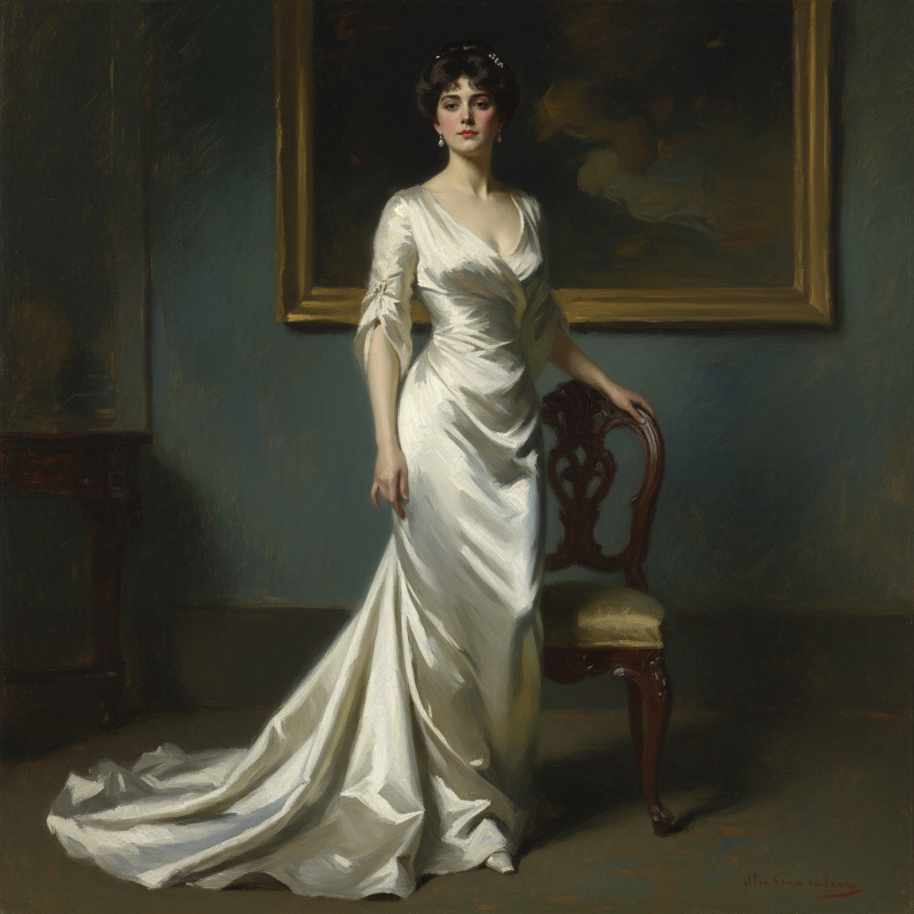

# John Singer Sargent 萨金特

> "Every time I paint a portrait I lose a friend." — John Singer Sargent

## 概述

约翰·辛格·萨金特（John Singer Sargent，1856–1925）是美国旅欧画家，被誉为"他那个时代最伟大的肖像画家"。他以惊人的笔触速度、对光线的敏锐捕捉和对上流社会的优雅描绘闻名，将印象派的光线感与学院派的精确融为一体。

萨金特的笔触如同魔术——看似随意的一笔，退后几步就变成了完美的丝绸褶皱或闪烁的珠宝。

## 核心特征

| 特征 | 描述 |
|------|------|
| 笔触魔术 | 看似随意实则精确的自信笔触 |
| 光线捕捉 | 印象派般的光线敏感度 |
| 上流社会 | 镀金时代精英的优雅肖像 |
| 速度感 | 快速的、一气呵成的绘画方式 |
| 白色运用 | 白色衣物和肌肤的极致表现 |
| 水彩大师 | 晚期水彩画同样出色 |

## 视觉特征

- **笔触**：宽阔的、自信的、一笔到位
- **光线**：戏剧性的侧光——印象派影响
- **色彩**：黑色礼服与白色肌肤的对比
- **质感**：丝绸、缎子、珠宝的一笔表现
- **背景**：深色的、模糊的——突出人物
- **姿态**：优雅的、自然的、有生命力的

## 代表作品

| 作品 | 年代 | 意义 |
|------|------|------|
| *Madame X* | 1884 | 丑闻与美的极致 |
| *Carnation, Lily, Lily, Rose* | 1885–86 | 户外光线的魔法 |
| *El Jaleo* | 1882 | 运动与激情 |
| *Lady Agnew of Lochnaw* | 1892 | 肖像画的完美 |
| *Gassed* | 1919 | 战争的残酷真实 |

## 真实作品（公共领域）

| 作品 | 来源 |
|------|------|
| *Madame X* | [Met Museum](https://www.metmuseum.org/art/collection/search/12127) |
| *Carnation, Lily, Lily, Rose* | [Tate](https://www.tate.org.uk/art/artworks/sargent-carnation-lily-lily-rose-n01615) |
| *El Jaleo* | [Isabella Stewart Gardner Museum](https://www.gardnermuseum.org/) |

> ⚠️ 本条目优先使用真实作品。

## AI生成概念图

## 与其他风格的关系

- **Impressionism** → 融合印象派光线与学院派技巧
- **Velázquez** → 直接学习委拉斯开兹的笔触
- **Portrait Painting** → 肖像画传统的最后巅峰
- **Watercolor** → 晚期水彩画的革新者
