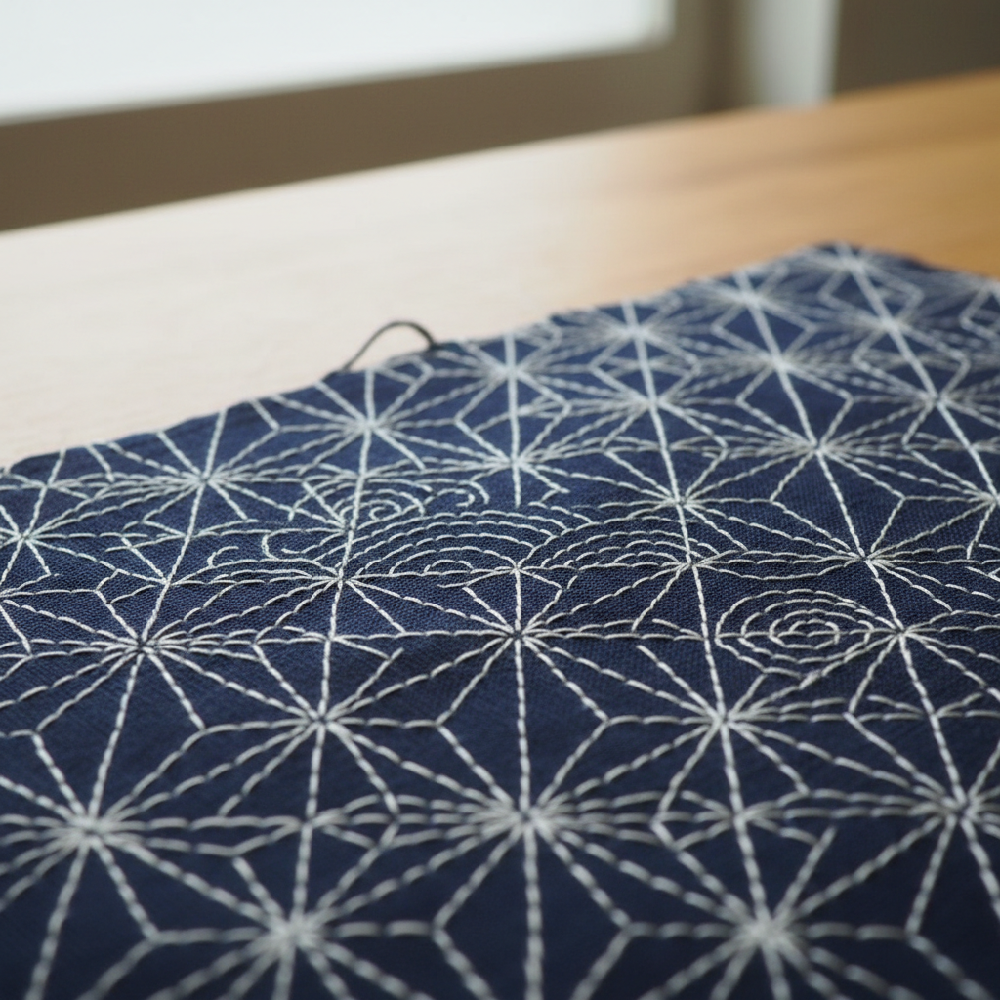

# Sashiko Art 刺子绣艺术

> "Sashiko is stitching as meditation — a single white thread running through indigo cloth in patterns that have been passed down for generations. Each stitch is the same length, each gap the same width, creating a rhythm that is both visual and physical. What began as a practical technique to reinforce worn fabric became an art form of extraordinary beauty, proving that utility and aesthetics need never be separate." — Unknown

## 概述

刺子绣艺术（Sashiko Art）是一种日本传统的装饰性缝补技法——使用白色棉线在靛蓝色织物上以规则的平针绣制几何图案。刺子绣（さしこ）最初是日本北方农民为加固和保暖衣物而发展的实用技法，后来发展为精美的装饰艺术，以其简洁的美学和冥想般的制作过程著称。

刺子绣艺术的实践包括：1）一目刺し——在网格上绣制的全面填充图案；2）模様刺し——沿着预先画好的图案线绣制；3）花十字——十字形的经典图案；4）麻の葉——麻叶图案；5）青海波——海浪图案；6）七宝——连环圆图案；7）当代刺子绣——将传统技法与现代设计结合的创作。

## 核心特征

| 特征 | 描述 |
|------|------|
| 简洁 | 极简的材料和技法 |
| 几何 | 精密的几何图案 |
| 实用 | 加固织物的功能 |
| 冥想 | 冥想般的制作过程 |
| 日本 | 日本民间传统 |
| 节奏 | 规律的针法节奏 |

## 视觉特征

- **蓝白**：靛蓝与白色的经典对比
- **几何**：精密的几何图案
- **规律**：规律的针法节奏
- **简洁**：极简的视觉效果
- **纹理**：针法创造的纹理
- **和风**：日本传统美学

## 代表作品

| 作品 | 艺术家/文化 | 年代 | 意义 |
|------|-------------|------|------|
| *Tohoku sashiko* | 日本东北 | 江户时代 | 东北地区刺子绣 |
| *Shonai sashiko* | 日本�的内 | 传统 | 庄内刺子绣 |
| *Kogin-zashi* | 日本津轻 | 传统 | 津轻小巾刺 |
| *Hishi-zashi* | 日本南部 | 传统 | 南部菱刺 |
| *Contemporary sashiko* | 当代 | 当代 | 当代刺子绣 |

## 历史时间线

| 时期 | 事件 |
|------|------|
| 江户时代 | 刺子绣在日本北方的发展 |
| 明治时代 | 刺子绣的地方传统形成 |
| 昭和时代 | 刺子绣的文化遗产认定 |
| 1980年代 | 刺子绣的国际传播 |
| 当代 | 刺子绣的全球流行和创新 |

## 中国语境

刺子绣艺术在中国有广泛的认知和实践。中国传统的"纳绣"和"绗缝"与刺子绣有技术上的相似之处——都使用平针加固织物。中国的一些少数民族（如侗族、苗族）有类似刺子绣的传统——在深色布料上用浅色线绣制几何图案。中国当代的手工艺爱好者中，刺子绣因其简洁的美学和冥想般的制作过程而非常流行——成为最受欢迎的日本手工艺之一。中国的一些设计师将刺子绣图案应用于现代产品设计——在服装、包袋和家居用品中融入刺子绣元素。中国的手工艺教育中，刺子绣作为一种入门级的刺绣技法被广泛教授——因为其技法简单但效果优美。

## AI生成概念图

## 与其他风格的关系

- **Boro** → 缝补艺术
- **Kogin** → 小巾刺
- **Temari** → 手鞠
- **Minimalism** → 极简主义
- **Japanese Art** → 日本艺术
- **Textile Art** → 纺织艺术

---

*浮光艺志 | Chronicle of Artistry*
