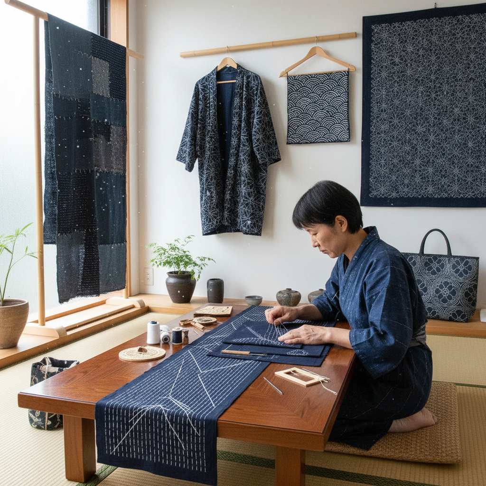

# Sashiko Stitching 刺子绣

> "Sashiko is meditation made visible — a running stitch repeated thousands of times across indigo cloth, each white dash of thread both mending and beautifying, transforming worn fabric into something stronger and more beautiful than it was when new, embodying the Japanese philosophy that repair is an act of love." — Unknown

## 概述

刺子绣（Sashiko，さしこ）是一种日本传统的装饰性加固缝纫技法——使用白色棉线在靛蓝色织物上以简单的平针（running stitch）缝制几何图案。"刺子"在日语中意为"小刺"或"小针脚"。刺子绣起源于日本江户时代（1603-1868）的农民和渔民家庭——妇女们用这种技法加固和修补磨损的衣物，同时创造出美丽的几何图案。

刺子绣有三种主要形式：模様刺し（Moyōzashi，图案刺子——在织物上缝制连续的几何图案）、一目刺し（Hitomezashi，一针刺子——在网格上每个交叉点缝一针形成图案）和运针（Sashiko quilting——用于加固多层织物）。传统的刺子绣图案包括：麻の葉（麻叶）、七宝つなぎ（七宝连）、青海波（海浪）、亀甲（龟甲）等，每种图案都有吉祥寓意。

## 核心特征

| 特征 | 描述 |
|------|------|
| 平针 | 简单的平针技法 |
| 靛蓝 | 传统靛蓝底布 |
| 白线 | 传统白色棉线 |
| 几何 | 精确的几何图案 |
| 加固 | 加固修补功能 |
| 冥想 | 冥想般的重复 |

## 视觉特征

- **靛蓝与白**：经典的靛蓝白线对比
- **几何**：精确的几何图案
- **节奏**：针脚的节奏感
- **简约**：日式的简约美学
- **手工**：手工针脚的温度
- **修补**：修补的美学（侘寂）

## 代表作品

| 作品 | 艺术家 | 年代 | 意义 |
|------|--------|------|------|
| *Traditional sashiko garments* | 日本农民 | 江户时代 | 传统刺子绣服装 |
| *Boro textiles* | 日本农民 | 江户-明治 | 修补织物 |
| *Contemporary sashiko art* | Various | 当代 | 当代刺子绣艺术 |
| *Hitomezashi samplers* | Various | 当代 | 一目刺子绣样品 |
| *Sashiko quilts* | Various | 当代 | 刺子绣绗缝 |

## 历史时间线

| 时期 | 事件 |
|------|------|
| 江户时代 | 刺子绣在日本农村的起源 |
| 明治时代 | 刺子绣的持续实践 |
| 20世纪中期 | 刺子绣作为民艺的认可 |
| 1980年代 | 刺子绣在西方的传播 |
| 当代 | 刺子绣的全球流行 |

## 中国语境

刺子绣在中国有广泛的认知和实践。中国的手工爱好者通过社交媒体（小红书、抖音）大量接触和学习刺子绣。中国的手工材料市场上有丰富的刺子绣工具和材料（刺子绣针、刺子绣线、预印图案布）。中国传统的"纳鞋底"技法与刺子绣有相似之处——都是用平针加固织物。中国的一些设计师将刺子绣元素融入现代服装和家居设计。刺子绣的"修补美学"与中国当代的可持续时尚理念契合。

## AI生成概念图

## 与其他风格的关系

- **Boro Textile** → 襤褸织物
- **Quilting** → 绗缝
- **Embroidery** → 刺绣
- **Visible Mending** → 可见修补
- **Kintsugi** → 金缮
- **Wabi-Sabi** → 侘寂美学

---

*浮光艺志 | Chronicle of Artistry*
