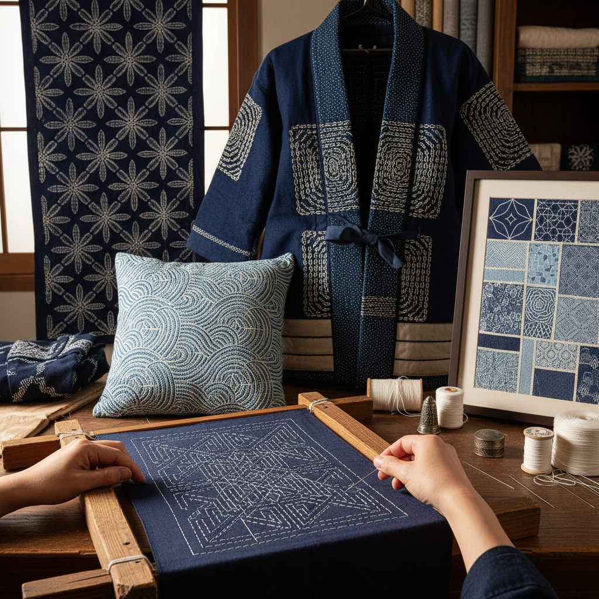

# Sashiko 刺子绣

> "Sashiko is mending made beautiful — running stitches that once held rags together became patterns of such elegance that poverty transformed into art." — Unknown

## 概述

刺子绣（Sashiko）是日本传统的装饰性缝纫技法——使用白色棉线在靛蓝色布料上以规则的跑针（running stitch）缝出几何图案。Sashiko最初是实用性的——日本北方农民用密集的缝线加固和修补破旧的衣物，同时增加保暖性。随着时间推移，这种实用的缝补发展出了精美的几何图案——麻叶（asanoha）、七宝（shippo）、青海波（seigaiha）、龟甲（kikko）等传统纹样。Sashiko的美学在于：简单针法的无限可能——仅用最基本的跑针，通过方向、间距和排列的变化，创造出令人惊叹的复杂图案。

刺子绣的哲学在于：修补即创造——将破损转化为美丽，将实用升华为艺术。

## 核心特征

| 特征 | 描述 |
|------|------|
| 跑针 | 基本的跑针技法 |
| 蓝白 | 传统蓝底白线 |
| 几何 | 几何图案为主 |
| 实用 | 源自实用修补 |
| 规则 | 规则的针距 |
| 重复 | 重复的图案单元 |

## 视觉特征

- **蓝白**：靛蓝与白线的对比
- **几何**：精美的几何图案
- **节奏**：针脚的节奏感
- **规则**：规则的间距
- **质朴**：质朴的手工感
- **密集**：密集的针脚覆盖

## 代表作品

| 作品 | 艺术家 | 年代 | 意义 |
|------|--------|------|------|
| *Tohoku sashiko garments* | 匿名 | 江户时代 | 东北地区刺子衣 |
| *Fireman's coat (hikeshi banten)* | 匿名 | 江户时代 | 消防半缠 |
| *Traditional sashiko patterns* | 匿名 | 传统 | 传统纹样集 |
| *Contemporary sashiko* | Various | 当代 | 当代刺子艺术 |
| *Sashiko quilts* | Various | 当代 | 刺子拼布 |

## 历史时间线

| 时期 | 事件 |
|------|------|
| 江户时代 | 东北农民的实用刺子 |
| 江户时代 | 消防半缠的刺子加固 |
| 明治时代 | 刺子的衰落 |
| 1970s+ | 刺子的重新发现 |
| 1990s+ | 刺子的国际化传播 |
| 当代 | 全球刺子运动的繁荣 |

## 中国语境

刺子绣在中国有对应的传统——中国民间的"纳鞋底"和"百衲衣"与Sashiko有相似的原理——都是用密集的针脚加固织物。中国的"纳绣"（用跑针在布面上缝出图案）也与Sashiko技法相同。当代中国的手工爱好者群体中，Sashiko（刺子绣）越来越流行——许多人将其作为冥想式的手工活动。中国的一些手工品牌和工作坊提供刺子绣材料包和课程。刺子绣的"修补美学"与中国传统的"惜物"精神相通。

## AI生成概念图

## 与其他风格的关系

- **Boro** → 襤褸（修补布）
- **Embroidery** → 刺绣
- **Quilting** → 拼布
- **Kogin-zashi** → 小巾刺し
- **Visible Mending** → 可见修补
- **Japanese Craft** → 日本工艺

---

*浮光艺志 | Chronicle of Artistry*
