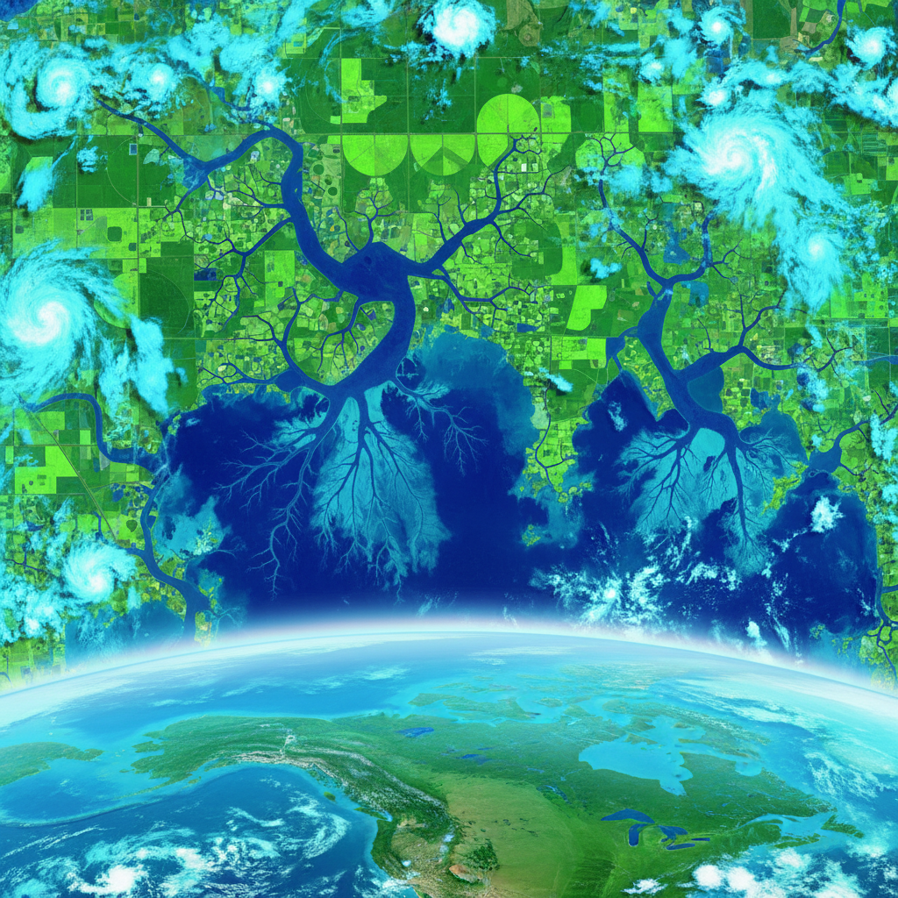

# Satellite Art 卫星艺术

> **时期：** 1970年代–至今  
> **关键词：** 地球观测、遥感美学、全球视角、数据可视化、行星尺度

## 概述

Satellite Art（卫星艺术）利用卫星遥感图像和数据进行艺术创作，将地球表面转化为抽象的视觉景观。从NASA的"地球即艺术"项目到当代艺术家对卫星数据的创意重构，卫星艺术提供了一种全新的观看方式——从太空俯瞰，人类的城市、农田和道路变成了地球表面的纹理和图案。

## 风格特征

- **鸟瞰极致**：从数百公里高空的俯视
- **抽象图案**：地表特征的几何化和色彩化
- **假彩色**：不同波段数据的色彩映射
- **时间序列**：同一地点的变化记录
- **行星尺度**：超越人类尺度的视觉体验

## 代表人物与作品

- NASA"地球即艺术"(Earth as Art)项目
- Benjamin Grant《Overview》
- 白南准（早期卫星艺术概念）
- Planet Labs卫星图像艺术

## 概念图

