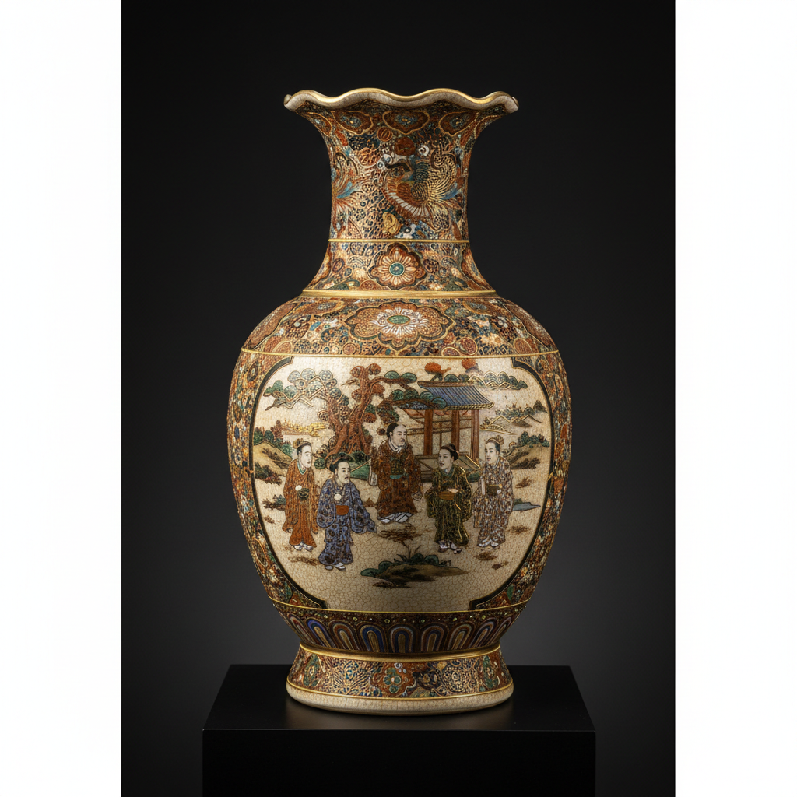

# Satsuma Art 萨摩烧艺术

> "Satsuma is gold on cream — elaborately decorated Japanese pottery covered in fine crackled cream glaze and painted with miniature scenes of warriors, courtesans, and landscapes in gold and polychrome enamels so detailed they require magnification to appreciate fully, a style that conquered the Western art market after Japan opened its doors in the Meiji era, becoming synonymous with Japanese decorative excess." — Unknown

## 概述

萨摩烧艺术（Satsuma Art）是日本�的摩藩（今鹿儿岛县）发展的一种精美的陶器艺术，以其细密的金彩装饰和奶油色开片釉著称。萨摩烧分为"白萨摩"和"黑萨摩"两大类——白萨摩以其精美的釉上彩绘闻名于世，特别是明治时期为出口而生产的华丽装饰品。萨摩烧在19世纪后半叶的国际博览会上大放异彩——成为西方人眼中日本陶瓷的代名词。

萨摩烧艺术的核心要素包括：1）奶油色釉——温暖的奶油色开片釉；2）金彩装饰——大量精细的金彩；3）微型绘画——极其精细的微型绘画；4）人物场景——武士、美人、风景等；5）出口导向——明治时期大量出口；6）博览会明星——国际博览会的明星；7）装饰华丽——极度华丽的装饰风格。

## 核心特征

| 特征 | 描述 |
|------|------|
| 奶油色釉 | 温暖奶油色开片釉 |
| 金彩装饰 | 大量精细金彩 |
| 微型绘画 | 极其精细微型绘画 |
| 人物场景 | 武士美人风景 |
| 出口导向 | 明治时期大量出口 |
| 装饰华丽 | 极度华丽装饰风格 |

## 视觉特征

- **奶油底色**：温暖的奶油色底釉
- **开片纹理**：细密的开片纹理
- **金色满布**：大量金色装饰
- **微型人物**：极其精细的人物
- **浮雕装饰**：有时带有浮雕
- **华丽繁复**：极度华丽的整体效果

## 代表作品

| 作品 | 艺术家/文化 | 年代 | 意义 |
|------|-------------|------|------|
| *沈寿官作品* | 沈寿官家族 | 各时期 | 萨摩烧名家 |
| *明治出口萨摩* | 各工坊 | 明治 | 出口精品 |
| *万博出品萨摩* | 各工坊 | 1867-1900年 | 博览会展品 |
| *白萨摩茶碗* | 鹿儿岛 | 江户 | 茶道用器 |
| *金彩人物花瓶* | 各工坊 | 明治 | 装饰花瓶 |

## 历史时间线

| 时期 | 事件 |
|------|------|
| 1598年 | 朝鲜陶工被带至萨摩 |
| 江户时代 | 萨摩烧的发展 |
| 1867年 | 巴黎万博会上大放异彩 |
| 明治时代 | 出口萨摩的繁荣 |
| 当代 | 萨摩烧的传承和收藏 |

## 中国语境

萨摩烧的起源与中国有间接关系——1592年壬辰倭乱期间，萨摩藩主岛津义弘将朝鲜陶工带回日本，这些陶工创立了萨摩烧的传统。萨摩烧的金彩装饰风格与中国的广彩有相似之处——两者都追求华丽繁复的装饰效果，都以出口为主要目的。但萨摩烧的微型绘画技法达到了令人惊叹的精细程度——这种精细度在中国陶瓷中较为少见。萨摩烧在19世纪后半叶的国际市场上与中国外销瓷形成了竞争关系——日本的"日本主义"（Japonisme）热潮使萨摩烧在西方市场上获得了巨大成功。萨摩烧的成功经验对中国陶瓷的近代化也产生了一定的启示——如何将传统工艺与国际市场需求结合。

## AI生成概念图

## 与其他风格的关系

- **Imari** → 伊万里
- **Canton Ware** → 广彩
- **Japonisme** → 日本主义
- **Meiji Art** → 明治艺术
- **Export Ceramics** → 出口陶瓷
- **Gold Decoration** → 金彩装饰

---

*浮光艺志 | Chronicle of Artistry*
