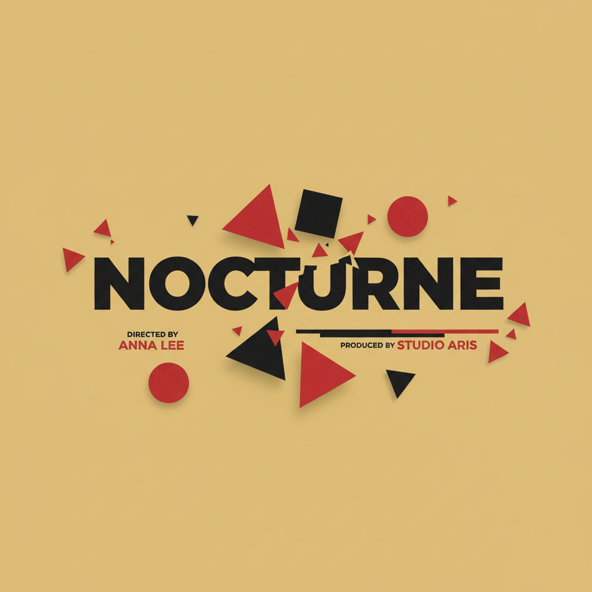

# Saul Bass 索尔·巴斯

> **时期：** 1920–1996  
> **关键词：** 电影片头设计、极简标志、剪纸美学、叙事图形

## 概述

Saul Bass 是美国平面设计师和电影制作人，电影片头设计的开创者。他为希区柯克、库布里克、斯科塞斯设计的片头序列将平面设计变成了电影叙事的一部分——简洁的剪纸形状、大胆的色块和动态排版，在几十秒内建立起整部电影的情绪。

## 风格特征

- **剪纸形状**：简化到极致的剪影和几何形状
- **动态排版**：文字的运动本身就是叙事
- **极简标志**：用最少的线条传达品牌本质
- **叙事性**：每个设计都在讲述一个故事
- **大色块**：黑、白、红等强烈色彩对比

## 代表作品

- *Vertigo*片头（1958）
- *Psycho*片头（1960）
- *AT&T 标志*（1984）
- *United Airlines 标志*

## 概念图

