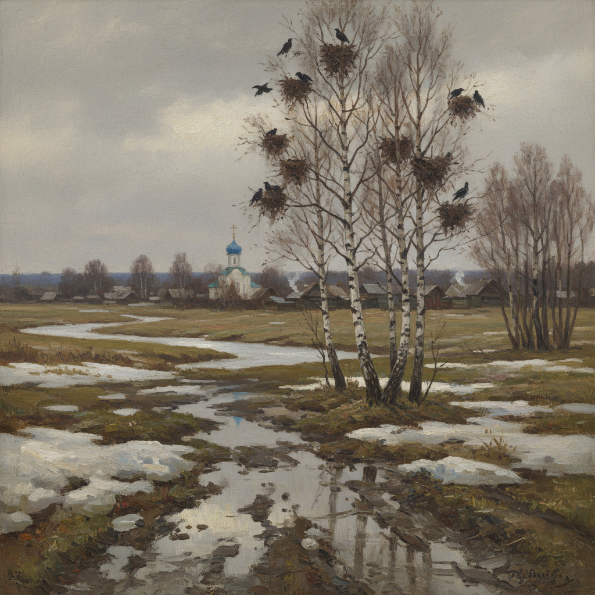

# Savrasov Art 萨夫拉索夫艺术

> "Without air there is no landscape." — Alexei Savrasov

## 概述

萨夫拉索夫艺术（Savrasov Art）是19世纪俄罗斯风景画先驱阿列克谢·孔德拉季耶维奇·萨夫拉索夫（Alexei Kondratyevich Savrasov, 1830-1897）创立的抒情自然主义风景画风格。萨夫拉索夫被誉为"俄罗斯抒情风景画之父"——他开创了以平凡的俄罗斯乡村景色表达深沉情感的传统，直接影响了列维坦等后辈大师。

萨夫拉索夫最著名的作品《白嘴鸦飞来了》（1871）描绘了早春时节白嘴鸦归来的乡村景象——融雪的泥泞、光秃的白桦、灰色的天空中透出的微光——这幅看似平凡的画作却蕴含着深沉的诗意和对春天到来的期盼。这幅画被视为俄罗斯民族风景画的里程碑——它证明了伟大的艺术不需要壮丽的风景，平凡中同样蕴含着美。

萨夫拉索夫艺术的核心要素包括：1）平凡之美——在平凡景色中发现诗意；2）季节转换——对季节变化的敏感捕捉；3）空气感——对大气和空气的精妙表现；4）乡村情怀——对俄罗斯乡村的深情；5）抒情自然——自然主义与抒情的结合；6）教育传承——作为教师培养了一代大师；7）民族觉醒——俄罗斯民族风景画的开创。

## 核心特征

| 特征 | 描述 |
|------|------|
| 平凡之美 | 在平凡景色中发现诗意 |
| 季节转换 | 对季节变化敏感捕捉 |
| 空气感 | 大气和空气精妙表现 |
| 乡村情怀 | 对俄罗斯乡村深情 |
| 抒情自然 | 自然主义与抒情结合 |
| 民族觉醒 | 俄罗斯民族风景画开创 |

## 视觉特征

- **早春融雪**：融雪时节的泥泞和湿润
- **灰色天空**：阴天中透出的微光
- **白桦树**：光秃或初绿的白桦
- **乡村教堂**：远处的乡村教堂尖顶
- **鸟群归来**：白嘴鸦等候鸟的身影
- **朴素色调**：灰、褐、淡蓝的朴素色调

## 代表作品

| 作品 | 年代 | 意义 |
|------|------|------|
| *白嘴鸦飞来了* (The Rooks Have Come) | 1871 | 俄罗斯风景画里程碑 |
| *乡村景色* (Country Road) | 1873 | 乡村的诗意 |
| *彩虹* (Rainbow) | 1875 | 自然的奇迹 |
| *伏尔加河畔* (Volga near Yuryevets) | 1871 | 河流风景 |
| *冬景* (Winter Landscape) | 1870年代 | 冬天的寂静 |
| *月夜沼泽* (Moonlit Night. Swamp) | 1870 | 夜景的诗意 |

## 历史时间线

| 时期 | 事件 |
|------|------|
| 1830年 | 出生于莫斯科 |
| 1844-1854年 | 就读莫斯科绘画雕塑学校 |
| 1857年 | 成为风景画教授 |
| 1871年 | 创作《白嘴鸦飞来了》 |
| 1870-1880年代 | 教授列维坦等学生 |
| 1897年 | 在莫斯科贫困中去世 |

## 中国语境

萨夫拉索夫在中国的知名度不如希施金和列维坦，但他的艺术理念对中国风景画有深远的启示。他"在平凡中发现诗意"的理念与中国传统美学中"平淡天真"的追求高度契合——都强调不依赖壮丽的外在景观，而是通过内在的情感和观察发现美。《白嘴鸦飞来了》在中国美术教育中被作为"以小见大"的经典案例——一幅描绘早春泥泞乡村的画作如何成为民族艺术的象征。萨夫拉索夫作为列维坦的老师，他的教育理念——带学生到户外写生、强调观察自然中的空气和光线——也通过苏联美术教育体系传入中国，影响了中国美术学院的风景写生教学。

## 概念图

## 与其他风格的关系

- **Levitan** → 列维坦（学生，抒情风景）
- **Shishkin** → 希施金（精确写实风景）
- **Peredvizhniki** → 巡回展览画派
- **Barbizon School** → 巴比松画派
- **Naturalism** → 自然主义
- **Polenov** → 波列诺夫（外光派风景）

---

*浮光艺志 | Chronicle of Artistry*
