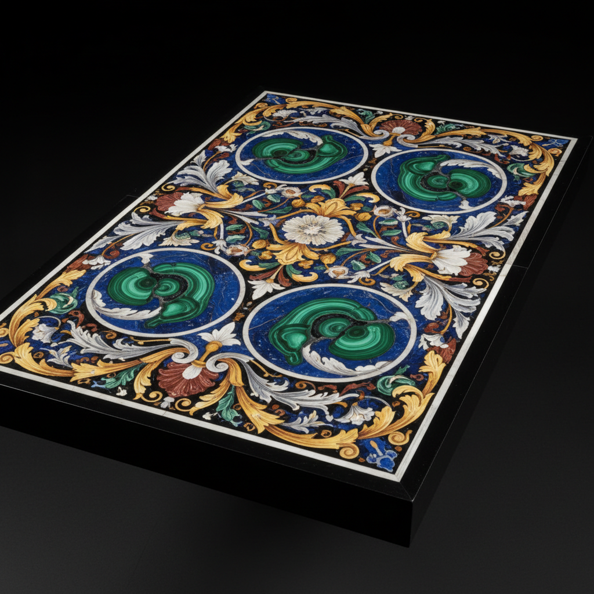

# Scagliola Art 仿大理石灰泥艺术

> "Scagliola is the art of noble deception — plaster mixed with pigments and glue is polished to such perfection that it becomes indistinguishable from the rarest marbles and pietra dura inlay. What appears to be a tabletop of lapis lazuli, malachite, and porphyry is actually colored gypsum, worked with the patience of a jeweler and the eye of a geologist to replicate stone's every vein and crystal." — Unknown

## 概述

仿大理石灰泥艺术（Scagliola Art）是一种使用着色石膏（混合颜料、胶水和石膏）模仿大理石和宝石镶嵌效果的装饰技法。Scagliola起源于意大利，是一种高度精细的工艺——能够以石膏材料完美模仿昂贵的大理石、半宝石和pietra dura（硬石镶嵌）的效果，广泛用于教堂、宫殿和家具的装饰。

仿大理石灰泥艺术的实践包括：1）石膏调配——将石膏与颜料和动物胶混合；2）纹理模仿——模仿大理石的纹理和色彩；3）镶嵌模仿——模仿宝石镶嵌的图案；4）抛光——将表面抛光至镜面光泽；5）柱面装饰——用于柱子和墙面的仿大理石；6）桌面制作——制作仿宝石镶嵌桌面；7）当代scagliola——将传统技法与现代设计结合的创作。

## 核心特征

| 特征 | 描述 |
|------|------|
| 模仿 | 模仿大理石和宝石 |
| 石膏 | 使用着色石膏 |
| 抛光 | 抛光至镜面光泽 |
| 精细 | 极其精细的工艺 |
| 欺骗 | 以假乱真的效果 |
| 经济 | 比真石材经济 |

## 视觉特征

- **光泽**：镜面般的抛光光泽
- **纹理**：逼真的石材纹理
- **色彩**：丰富的矿物色彩
- **图案**：精美的镶嵌图案
- **深度**：仿石材的深度感
- **华丽**：华丽精致的效果

## 代表作品

| 作品 | 艺术家/文化 | 年代 | 意义 |
|------|-------------|------|------|
| *Italian church columns* | 意大利 | 17-18世纪 | 意大利教堂仿大理石柱 |
| *Scagliola tabletops* | 意大利 | 17-19世纪 | 仿宝石镶嵌桌面 |
| *Bavarian palace interiors* | 德国 | 18世纪 | 巴伐利亚宫殿内饰 |
| *English country houses* | 英国 | 18-19世纪 | 英国乡村别墅装饰 |
| *Contemporary scagliola* | 国际 | 当代 | 当代仿大理石灰泥 |

## 历史时间线

| 时期 | 事件 |
|------|------|
| 古罗马 | 仿大理石灰泥的早期使用 |
| 17世纪 | 意大利scagliola的复兴 |
| 18世纪 | 技法传播到整个欧洲 |
| 19世纪 | 工业化时代的衰落 |
| 当代 | 作为传统工艺的保护和复兴 |

## 中国语境

仿大理石灰泥在中国有一定的对应传统。中国的传统建筑装饰中，仿石灰塑和仿木灰塑——与scagliola有相似的"以假乱真"理念。中国的宫殿和寺庙装饰中，彩绘仿大理石——是常见的装饰手法。中国当代的室内装饰中，仿大理石涂料和仿石材效果——延续了scagliola的精神。中国的古建筑修复中，仿石灰泥技法——用于修复历史建筑的装饰。中国的装饰材料产业中，仿大理石产品——是重要的市场类别。中国的工艺美术教育中，仿石材技法——在相关课程中有所介绍。

## AI生成概念图

## 与其他风格的关系

- **Pietra Dura** → 硬石镶嵌
- **Marble** → 大理石
- **Trompe l'oeil** → 错视画
- **Faux Finish** → 仿饰面
- **Decorative Arts** → 装饰艺术
- **Plasterwork** → 灰泥工艺

---

*浮光艺志 | Chronicle of Artistry*
