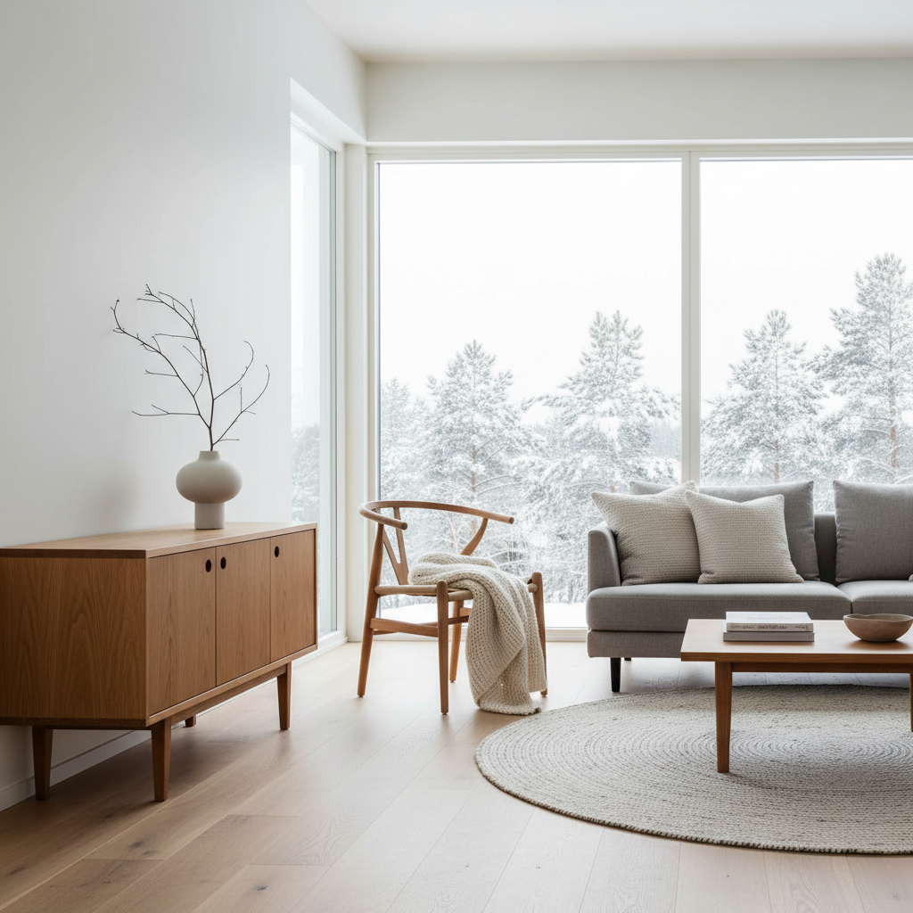

# Scandinavian Design 斯堪的纳维亚设计 | 北欧设计

> **"美丽的日常用品不应是少数人的特权。"** —— 斯堪的纳维亚设计哲学

## 概述

斯堪的纳维亚设计（Scandinavian Design）是20世纪中叶兴起于北欧五国（丹麦、瑞典、挪威、芬兰、冰岛）的设计运动与美学哲学。它将现代主义的功能理性与北欧传统手工艺的人文温度相融合，创造出简洁、实用、自然且富有人情味的设计语言，深刻影响了全球工业设计、家具设计、建筑和室内设计。

## 时间线

| 年份 | 事件 |
|------|------|
| 1845 | 瑞典成立世界首家工业设计协会 |
| 1920s | Kaare Klint 奠定丹麦家具设计基础 |
| 1930 | 斯德哥尔摩博览会：功能主义与手工艺传统首次融合 |
| 1939 | 纽约世博会确立"瑞典现代风格"国际地位 |
| 1950s | 黄金时代——Aalto、Jacobsen、Wegner、Juhl 等大师涌现 |
| 1954–1957 | "Scandinavian Design"巡回展在北美22城展出 |
| 2000s–至今 | 北欧设计复兴，IKEA、HAY、Muuto 等品牌全球化 |

## 核心理念

- **功能主义**：形式追随功能，但避免冷漠的机械感
- **民主设计**：优质设计应为大众所享，而非精英特权
- **自然材料**：偏爱木材、皮革、羊毛等天然材质
- **人体工学**：从人体结构出发，追求使用的舒适性
- **极简美学**：去除多余装饰，让材料本身说话
- **可持续性**：尊重自然，追求耐久而非一次性消费

## 代表设计师

| 设计师 | 国籍 | 代表作 |
|--------|------|--------|
| Alvar Aalto | 芬兰 | Stool 60、Savoy 花瓶、曲木技术 |
| Arne Jacobsen | 丹麦 | 蛋椅、天鹅椅、蚂蚁椅 |
| Hans Wegner | 丹麦 | The Chair（圈椅）、Y椅 |
| Finn Juhl | 丹麦 | 酋长椅、鹈鹕椅 |
| Verner Panton | 丹麦 | Panton Chair（一体成型塑料椅） |
| Maija Isola | 芬兰 | Marimekko Unikko 罂粟花图案 |
| Bruno Mathsson | 瑞典 | 曲木躺椅 |

## 视觉特征

- 简洁流畅的有机线条
- 浅色木材（橡木、白蜡木、桦木）的温暖质感
- 柔和的中性色调：白、灰、米、原木色
- 大面积留白与自然光的运用
- 功能性与雕塑感的统一
- 纺织品的几何图案与自然纹样

## 各国特色

| 国家 | 风格特征 |
|------|----------|
| 丹麦 | 有机形态、手工艺精神、"hygge"舒适感 |
| 瑞典 | 更简约功能化、民主设计、IKEA 精神 |
| 芬兰 | 自然有机、曲木创新、Marimekko 大胆图案 |
| 挪威 | 户外自然、朴素实用、与景观融合 |
| 冰岛 | 火山地貌灵感、极简与粗犷并存 |

## 与其他运动的关系

| 运动 | 关系 |
|------|------|
| 包豪斯 | 共享功能主义，但北欧更温暖人文 |
| 中世纪现代 | 时间重叠，北欧是其重要分支 |
| 日本设计 | 共享极简与自然材料哲学（Japandi 融合） |
| 极简主义 | 北欧设计是其精神先驱之一 |

## 遗产

斯堪的纳维亚设计不仅是一种风格，更是一种生活哲学：
- IKEA 将民主设计理念推向全球
- "Hygge"（丹麦式舒适）成为全球生活方式关键词
- Japandi（日式+北欧）成为当代室内设计热门趋势
- 可持续设计理念在当代获得新的生命力

## 概念图

---

*浮光艺志 | Chronicle of Artistry*
