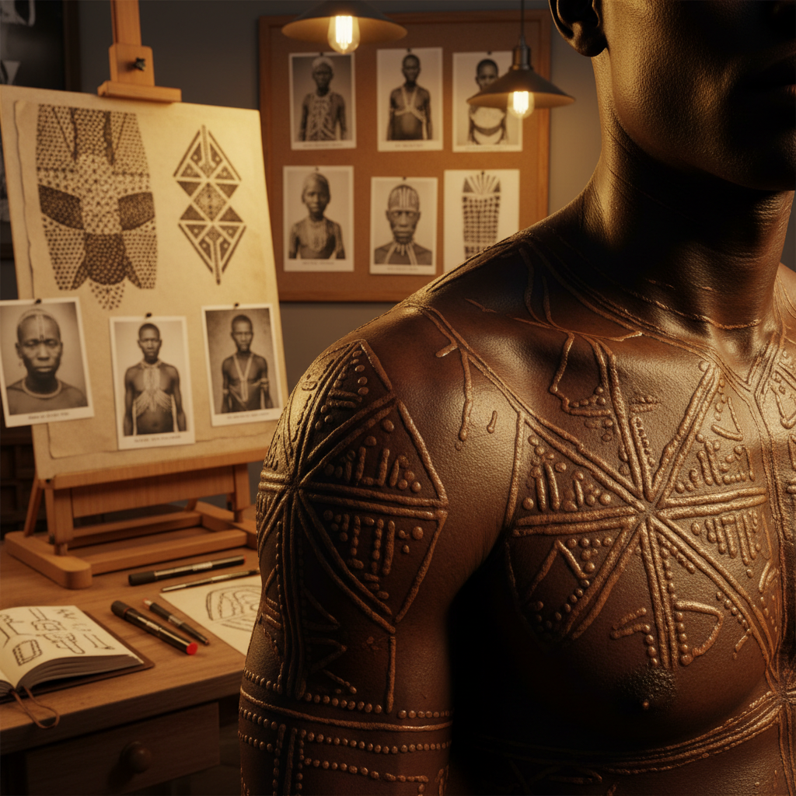

# Scarification Art 疤痕艺术

> "Scarification is writing on the body with the body itself — using the skin's own healing process as ink and canvas. Where a tattoo deposits foreign pigment, scarification trusts the flesh to create its own raised lines and textured patterns, a collaboration between artist and immune system that produces marks as unique as fingerprints. It is the oldest form of body modification, older than ink, older than metal tools." — Unknown

## 概述

疤痕艺术（Scarification Art）是通过在皮肤上制造受控伤口，利用人体自然愈合过程中形成的疤痕组织来创造永久性图案和纹饰的身体艺术形式。疤痕艺术是人类最古老的身体装饰方式之一，在非洲、大洋洲和原住民文化中有数千年的传统。

疤痕艺术的实践包括：1）切割法——用刀片在皮肤上切割图案；2）烙印法——用加热的金属在皮肤上烙印；3）磨擦法——通过摩擦去除皮肤表层；4）化学法——用化学物质造成受控灼伤；5）打包法——切割后在伤口中填入异物促进疤痕增生；6）冷冻法——用极低温造成疤痕；7）当代疤痕艺术——结合多种技法的现代创作。

## 核心特征

| 特征 | 描述 |
|------|------|
| 永久 | 永久性身体标记 |
| 触觉 | 可触摸的凸起纹理 |
| 愈合 | 依赖身体愈合过程 |
| 仪式 | 传统仪式意义 |
| 个体 | 每人愈合效果不同 |
| 身份 | 文化身份标识 |

## 视觉特征

- **凸起**：凸起的疤痕纹理
- **图案**：几何或有机图案
- **对称**：对称的身体装饰
- **纹理**：独特的皮肤纹理变化
- **色差**：与周围皮肤的色差
- **立体**：三维的触觉效果

## 代表作品

| 作品 | 艺术家/文化 | 年代 | 意义 |
|------|-------------|------|------|
| *Nuba body scarification* | 努巴族 | 古代至今 | 非洲传统疤痕艺术 |
| *Dinka scarification* | 丁卡族 | 古代至今 | 苏丹部落标识 |
| *Sepik River scarification* | 巴布亚新几内亚 | 古代至今 | 鳄鱼皮仪式 |
| *Contemporary scarification* | Various | 当代 | 现代疤痕艺术 |
| *Aboriginal cicatrisation* | 澳大利亚原住民 | 古代至今 | 原住民成年礼 |

## 历史时间线

| 时期 | 事件 |
|------|------|
| 史前 | 最早的疤痕装饰证据 |
| 古代 | 非洲和大洋洲的疤痕传统 |
| 殖民时期 | 殖民压制下的传统衰退 |
| 20世纪末 | 西方身体改造运动的兴起 |
| 当代 | 疤痕艺术的文化复兴和当代实践 |

## 中国语境

疤痕艺术在中国传统文化中并不是主流的身体装饰方式——中国传统更倾向于纹身（如刺青）和其他非永久性装饰。然而，中国历史上有一些与疤痕相关的文化实践——如古代的"刺字"（在犯人脸上刺字）虽然是惩罚而非装饰，但涉及类似的皮肤标记技术。在当代中国，随着全球化和身体改造文化的传播，一些年轻人开始接触疤痕艺术——但这仍然是非常小众的亚文化。中国当代艺术中，一些行为艺术家将身体伤痕作为创作元素——探索痛苦、记忆和身份的主题。中国社会对疤痕艺术的接受度较低——主要因为传统文化中"身体发肤受之父母"的观念。

## AI生成概念图

## 与其他风格的关系

- **Tattoo Art** → 纹身艺术
- **Body Art** → 身体艺术
- **Tribal Art** → 部落艺术
- **Performance Art** → 行为艺术
- **Ritual Art** → 仪式艺术
- **Identity Art** → 身份艺术

---

*浮光艺志 | Chronicle of Artistry*
