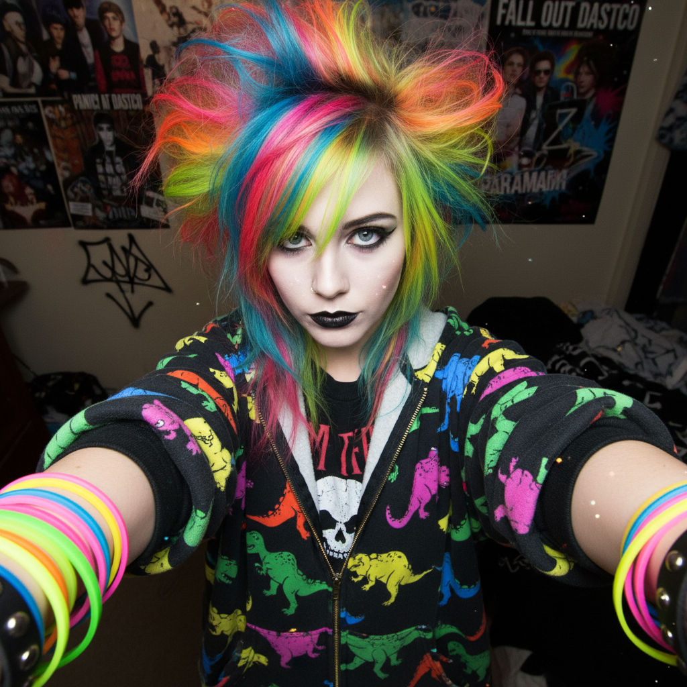

# Scene Kid 场景小孩



> **"彩虹刘海、恐龙T恤、MySpace自拍——2007年最酷的孩子长这样。"**

## 概述

| 维度 | 描述 |
|------|------|
| 时期 | 2005–2012 |
| 别名 | Scene, Scene Kid, Scene Queen |
| 核心色彩 | 霓虹粉、电光蓝、荧光绿、黑色、紫色 |
| 关键元素 | 彩色挑染、蓬松刘海、恐龙/骷髅图案、大量手环 |
| 代表人物 | Jeffree Star (早期), Audrey Kitching, Kiki Kannibal |
| 关联风格 | Emo, Pop Punk, MySpace Era, Decora |

---

## 历史脉络

| 年份 | 事件 |
|------|------|
| 2005 | Scene 文化在 MySpace 上兴起 |
| 2006 | "Scene Queen" 概念——MySpace 名人 |
| 2007 | 巅峰期——Warped Tour、Hot Topic |
| 2008 | 与 Emo 文化高度交叉 |
| 2010 | 开始衰落——Tumblr 取代 MySpace |
| 2012 | 基本消失——但留下深远影响 |
| 2022 | TikTok 上的 Scene 复兴/怀旧 |

### 核心哲学

Scene Kid 的精神是**"越夸张越好——注意力就是一切"**：
- 个性 = 外表（"你的头发就是你的身份"）
- 更多 = 更好（更多颜色、更多配饰、更多层次）
- MySpace = 舞台（"我的页面就是我的画廊"）
- 音乐 = 身份（"你听什么决定你是谁"）
- "rawr XD" = 一种态度

---

## 视觉语法

### 色彩系统

```
主色：
  霓虹粉 (#FF69B4) — 头发、配饰
  电光蓝 (#00BFFF) — 头发、眼影
  荧光绿 (#39FF14) — 配饰、图案
  黑色 (#000000) — 基底、眼线
  紫色 (#9400D3) — 头发、服装

辅色：
  白色 (#FFFFFF) — 对比
  红色 (#FF0000) — 配饰
  黄色 (#FFFF00) — 荧光

规则：
  - 越多颜色越好
  - 必须有黑色作为基底
  - 霓虹色 + 黑色 = Scene 公式
  - 头发颜色 = 最重要的元素

质感：
  光滑 — 拉直的头发
  蓬松 — 蓬起的刘海
  塑料 — 手环、配饰
  印花 — 恐龙、骷髅、星星
```

### 标志性元素

| 类别 | 元素 |
|------|------|
| 发型 | 彩色挑染、蓬松刘海、不对称剪裁 |
| 妆容 | 浓重眼线、彩色眼影、假睫毛 |
| 服装 | 紧身牛仔裤、band tee、恐龙连帽衫 |
| 配饰 | 大量硅胶手环、蝴蝶结发夹、耳洞 |
| 数字 | MySpace 页面、自拍角度、闪光GIF |
| 态度 | 夸张、注意力、音乐、社交 |

---

## 与千禧怀旧的关系

### MySpace 时代的视觉文化
- Scene = MySpace 的"原生美学"
- 自拍文化的先驱（在 Instagram 之前）
- "Top 8" = 社交地位
- 页面装饰 = 个人品牌的起源

### 与 Emo 的区别
- Emo = 更内向、更悲伤、更黑色
- Scene = 更外向、更快乐、更彩色
- 两者共享音乐（但 Scene 更偏 Pop Punk）
- "Emo 哭泣，Scene 跳舞"

---

## 中国语境

- 与中国"非主流"文化的高度对应
- 2007-2010 中国 QQ 空间的"杀马特"
- 彩色头发+夸张造型的共同语言
- 两者都是青少年亚文化的视觉表达

---

## 设计应用

| 场景 | 应用方式 |
|------|----------|
| 怀旧 | 2000s 怀旧活动+MySpace 主题 |
| 音乐 | Pop Punk/Metalcore 视觉 |
| 数字 | 闪光效果+霓虹+MySpace 风格 |
| 时尚 | 彩色+黑色+配饰堆叠+夸张 |

---

## 相关风格

← [Emo 情绪核](emo.md) | [McBling 千禧闪耀](mcbling.md) →

↑ [返回千禧怀旧目录](README.md) | [返回总目录](../README.md)
