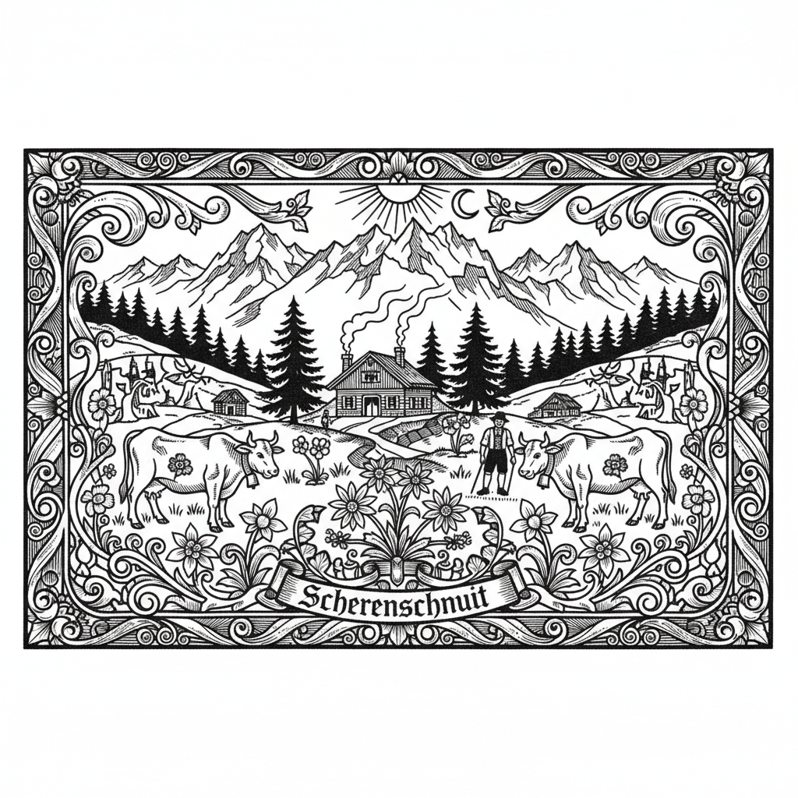

# Scherenschnitte 瑞士德式剪纸 | Scherenschnitt

> **"一把剪刀，一张黑纸——阿尔卑斯山的牧歌在剪影中永恒。"**

## 概述

Scherenschnitte（瑞士德式剪纸 / Scherenschnitt）是起源于16世纪德国和瑞士的传统剪纸艺术，德语意为"剪刀剪裁"（Scheren = 剪刀，Schnitt = 剪裁）。与中国剪纸和波兰Wycinanki不同，Scherenschnitte以黑色纸张为主，通常对折后剪裁出精细的对称图案，然后贴在白色或彩色背景上。瑞士的Scherenschnitte以阿尔卑斯山牧民生活为核心题材——赶牛上山、奶酪制作、木屋、花卉和山景。19世纪中叶，Johann Jakob Hauswirth被公认为瑞士传统剪纸的奠基者。

## 主要传统

| 传统 | 特征 |
|------|------|
| 瑞士 Scherenschnitt | 阿尔卑斯山牧民生活，黑纸对称 |
| 德国 Scherenschnitte | 民间故事，维多利亚装饰 |
| 美国宾州德裔 | 心形、郁金香、鸟类 |
| 丹麦 Papirklip | 安徒生的剪纸传统 |

## 核心特征

- **黑纸为主**：传统使用黑色纸张
- **对折剪裁**：对折后剪出对称图案
- **极精细**：现代作品细节极为精密
- **叙事性**：一幅作品讲述一个完整场景
- **白色背景**：黑色剪纸贴在白色底上
- **阿尔卑斯题材**：牧民、牛群、山景、木屋

## 常见题材

| 题材 | 特征 |
|------|------|
| Alpaufzug | 赶牛上山的队列 |
| 牧民生活 | 挤奶、制奶酪 |
| 山景 | 阿尔卑斯山和木屋 |
| 花卉 | 对称的花卉图案 |
| 动物 | 牛、山羊、鸟类 |
| 狩猎 | 猎人和野生动物 |

## 视觉特征

- 黑色剪影在白色底上
- 严格的对称构图
- 极精细的剪裁细节
- 叙事性的场景描绘
- 正负空间的精妙平衡
- 剪影的戏剧性效果

## 与其他风格的关系

| 风格 | 关系 |
|------|------|
| 中国剪纸 | 共享剪纸技法（独立发展） |
| 波兰Wycinanki | 共享欧洲剪纸传统（彩色vs黑色） |
| 日本切り絵 | 共享精细剪裁传统 |
| 剪影肖像 | 18世纪欧洲剪影传统 |
| 安徒生剪纸 | 丹麦Papirklip传统 |

## 概念图

---

*浮光艺志 | Chronicle of Artistry*
