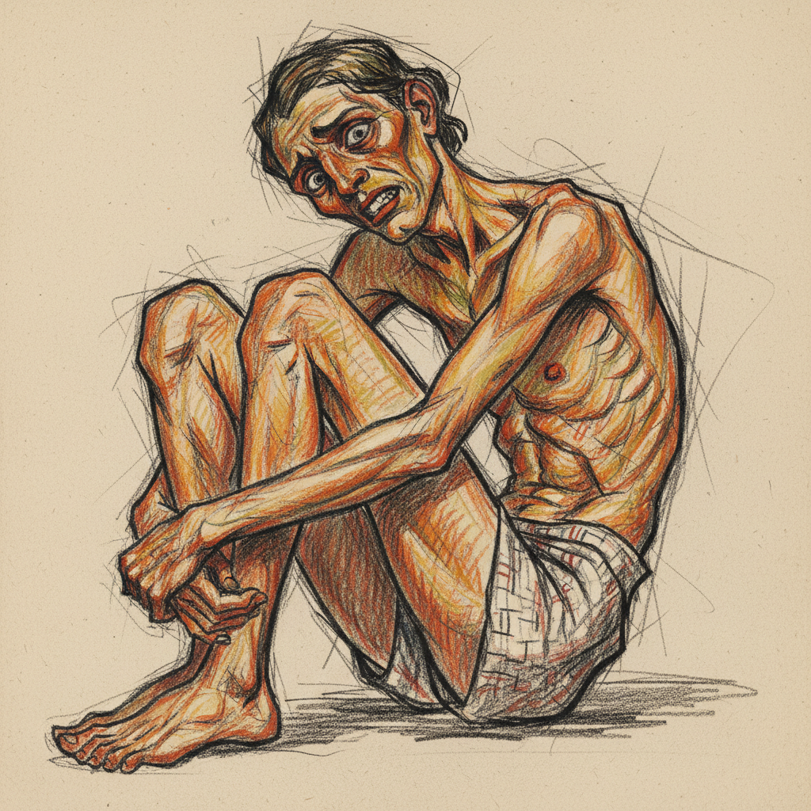

# Egon Schiele 席勒

> "Art cannot be modern. Art is primordially eternal." — Egon Schiele

## 概述

埃贡·席勒（Egon Schiele，1890–1918）是奥地利表现主义画家，以扭曲的人体、大胆的情色主题和锐利的线条闻名。他在短短28年的生命中创造了惊人数量的作品，以一种近乎残酷的诚实描绘人体的脆弱和欲望。

席勒的线条如同电流——紧张的、颤抖的、充满神经质的能量，将人体变成了情感和欲望的地图。

## 核心特征

| 特征 | 描述 |
|------|------|
| 扭曲人体 | 瘦削的、角度化的、不自然的姿态 |
| 锐利线条 | 紧张的、神经质的轮廓线 |
| 情色直白 | 大胆的裸体和性主题 |
| 自画像 | 大量扭曲的、戏剧化的自画像 |
| 空白背景 | 人物悬浮在空白空间中 |
| 病态美 | 苍白的肌肤、青紫的阴影 |

## 视觉特征

- **线条**：锐利的、颤抖的、神经质的轮廓
- **人体**：瘦削的、角度化的、关节突出
- **色彩**：苍白肌肤上的橙、红、紫斑块
- **背景**：大面积空白——人物孤立
- **姿态**：扭曲的、不自然的、暴露的
- **表情**：痛苦的、凝视的、挑衅的

## 代表作品

| 作品 | 年代 | 意义 |
|------|------|------|
| *Self-Portrait with Physalis* | 1912 | 标志性的扭曲自画像 |
| *The Embrace* | 1917 | 爱与纠缠 |
| *Death and the Maiden* | 1915 | 爱与死亡的拥抱 |
| *Portrait of Wally* | 1912 | 情人的肖像 |
| *Seated Woman with Bent Knees* | 1917 | 人体的角度化 |

## 真实作品（公共领域）

| 作品 | 来源 |
|------|------|
| *Self-Portrait with Physalis* | [Leopold Museum](https://www.leopoldmuseum.org/en) |
| *Death and the Maiden* | [Belvedere](https://www.belvedere.at/en) |
| *The Embrace* | [Belvedere](https://www.belvedere.at/en) |

> ⚠️ 本条目优先使用真实作品。

## AI生成概念图

## 与其他风格的关系

- **Expressionism** → 维也纳表现主义的代表
- **Klimt** → 从克里姆特的装饰性出发走向原始
- **Figurative Art** → 人体绘画的极端表现
- **Lucian Freud** → 弗洛伊德继承了席勒的肉体诚实
