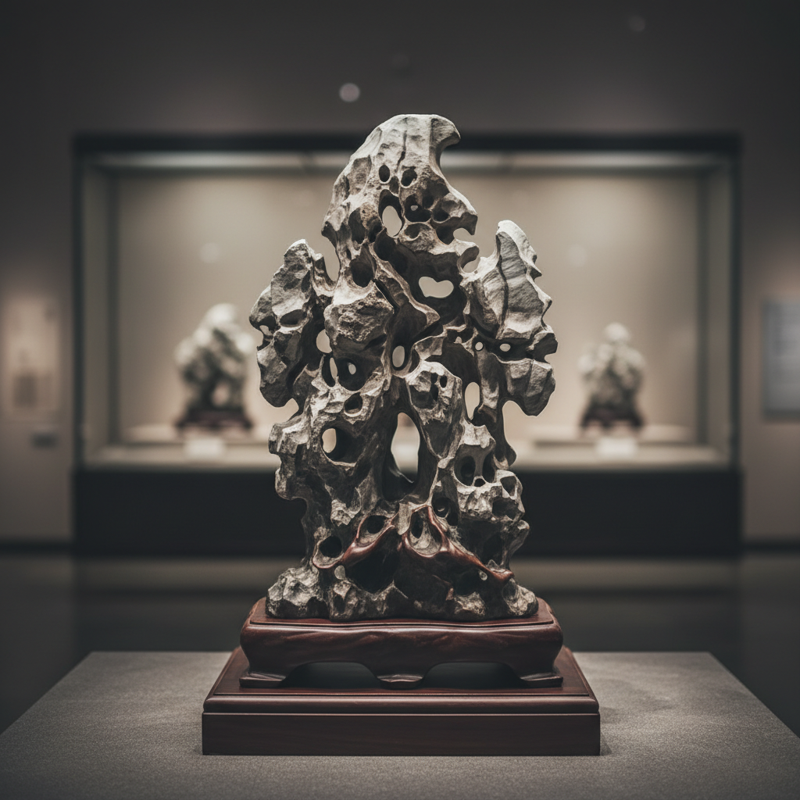

# Scholar Rock Art 供石艺术

> "The scholar rock is nature's own ceramics — stone shaped by water over millennia into forms that suggest mountains, clouds, dragons, and immortal landscapes, collected by Chinese literati who saw in each rock a portable universe, placed on carved wooden stands like precious sculptures, the rock's holes and peaks read as windows into another world, geology elevated to philosophy through the simple act of looking with cultivated eyes." — Unknown

## 概述

供石艺术（Scholar Rock Art）是一种以天然奇石或人工仿石陶瓷为核心的文人赏玩艺术。供石（也称赏石、雅石、文人石）是中国文人书房中最重要的陈设之一——文人在奇石中看到山水、云雾、仙境，将一块石头视为微缩的宇宙。陶瓷供石是对天然奇石的艺术再创造——陶艺家用陶瓷材料模拟或重新诠释奇石的形态，创造出既有自然之趣又有人工之美的作品。

供石艺术的核心要素包括：1）自然形态——模拟自然石头的形态；2）瘦透漏皱——传统赏石的四大标准；3）微缩宇宙——在方寸间见天地；4）文人趣味——文人审美的体现；5）底座设计——精心配制的底座；6）把玩性——适合手中把玩欣赏；7）想象空间——激发观者的想象。

## 核心特征

| 特征 | 描述 |
|------|------|
| 自然形态 | 模拟自然石头的形态 |
| 瘦透漏皱 | 传统赏石的审美标准 |
| 微缩宇宙 | 方寸间见天地 |
| 文人趣味 | 文人审美的体现 |
| 想象空间 | 激发观者想象 |
| 底座配制 | 精心设计的底座 |

## 视觉特征

- **奇特造型**：如山峰、云朵的奇特形态
- **孔洞穿透**：通透的孔洞和穿透
- **皱褶纹理**：丰富的表面纹理
- **瘦长挺拔**：瘦削挺拔的造型
- **底座衬托**：精美的木质底座
- **色彩沉稳**：灰、黑、白等沉稳色调

## 代表作品

| 作品 | 艺术家/文化 | 年代 | 意义 |
|------|-------------|------|------|
| *太湖石* | 中国 | 各时期 | 最经典的供石类型 |
| *灵璧石* | 中国 | 各时期 | 声如磬的名石 |
| *米芾拜石* | 米芾 | 宋代 | 文人爱石的典故 |
| *当代陶瓷供石* | 当代陶艺家 | 当代 | 陶瓷仿石创作 |
| *当代赏石* | 收藏家 | 当代 | 赏石文化的复兴 |

## 历史时间线

| 时期 | 事件 |
|------|------|
| 唐代 | 文人赏石文化的兴起 |
| 宋代 | 米芾等文人将赏石推向高峰 |
| 明清 | 赏石理论的系统化 |
| 20世纪 | 赏石文化的国际传播 |
| 当代 | 赏石与当代艺术的结合 |

## 中国语境

供石是中国文人文化最独特的产物之一——世界上没有其他文化像中国文人那样系统地欣赏和收藏石头。中国的赏石传统有完整的美学理论——"瘦、透、漏、皱"是评价太湖石的四大标准；"形、质、色、纹"是评价各类奇石的综合标准。宋代文人米芾对石头的痴迷达到了"拜石"的程度——他见到奇石会行礼膜拜。中国当代陶艺家开始用陶瓷材料创作"供石"——用陶瓷的可塑性创造出比天然石头更加理想化的形态。这种陶瓷供石既是对传统赏石文化的致敬，也是对"自然与人工"关系的当代思考。

## AI生成概念图

## 与其他风格的关系

- **Literati Art** → 文人艺术
- **Landscape Art** → 山水艺术
- **Bonsai** → 盆景
- **Meditation** → 冥想
- **Found Object** → 现成品艺术
- **Miniature Landscape** → 微缩景观

---

*浮光艺志 | Chronicle of Artistry*
