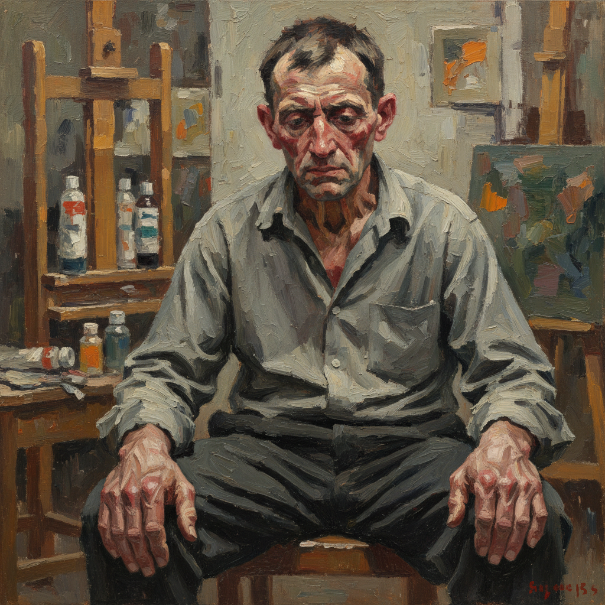

# School of London 伦敦画派

> **时期：** 1970年代–至今  
> **关键词：** 具象绘画、心理深度、肉体真实、反潮流、个人主义

## 概述

School of London（伦敦画派）是1970年代由评论家R.B.基塔伊命名的一群伦敦具象画家，在观念艺术和极简主义主导的年代坚持人物绘画。弗朗西斯·培根扭曲的肉体、卢西安·弗洛伊德无情的裸体、弗兰克·奥尔巴赫厚重的颜料——他们用各自独特的方式证明，绘画仍然是探索人类存在最有力的工具。

## 风格特征

- **具象坚持**：在抽象和观念主导时代画人
- **心理深度**：揭示人物内在精神状态
- **肉体真实**：不回避身体的脆弱和衰老
- **厚重颜料**：物质性极强的绘画表面
- **个人风格**：每位画家高度独立的语言

## 代表人物与作品

- 弗朗西斯·培根 扭曲人物
- 卢西安·弗洛伊德 裸体肖像
- 弗兰克·奥尔巴赫 厚涂头像
- R.B.基塔伊 叙事性人物

## 概念图

