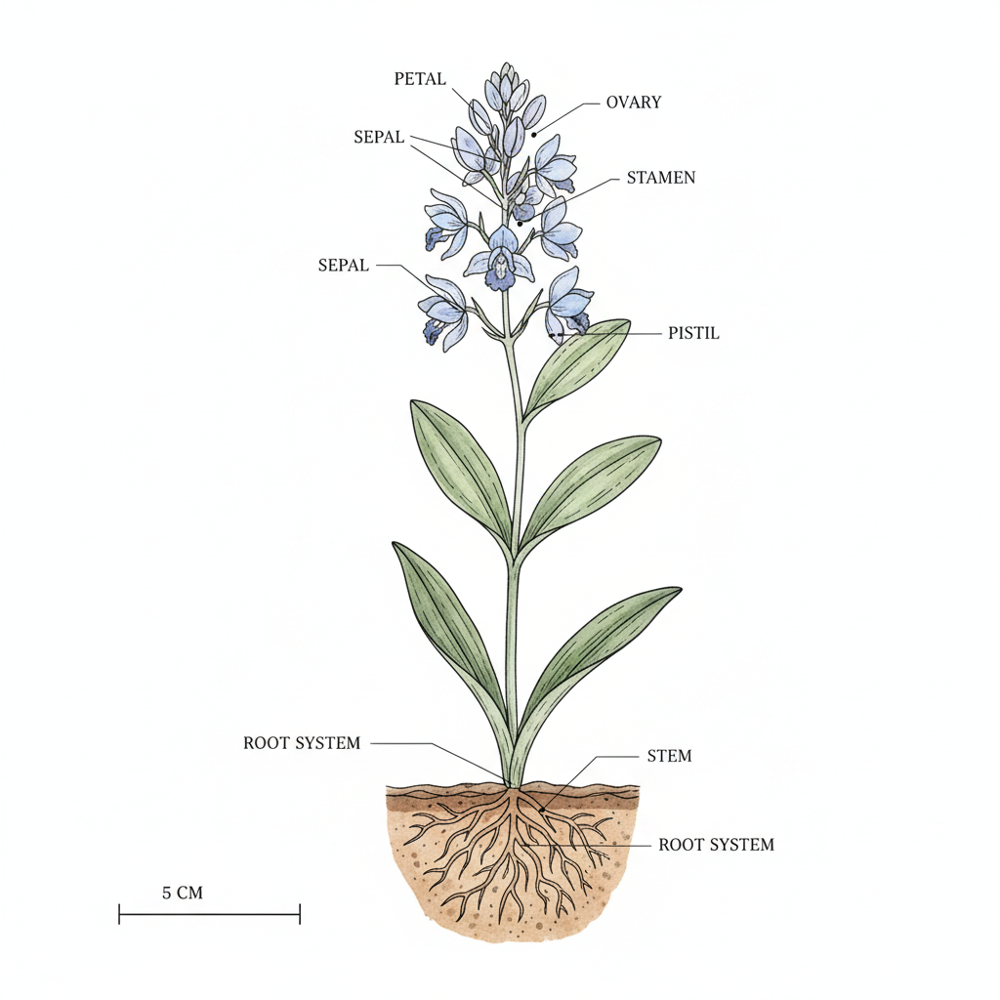

# Scientific Illustration 科学插画

> **时期：** 15世纪–至今  
> **关键词：** 精确记录、解剖描绘、自然史、信息传达、艺术与科学

## 概述

Scientific Illustration（科学插画）是为科学研究和传播服务的精确视觉记录艺术。从达·芬奇的解剖图到当代的分子可视化，科学插画要求艺术家同时具备科学素养和绘画技巧——用精确的线条和色彩传达科学信息，在美学表现和信息准确性之间找到完美平衡。

## 风格特征

- **精确性**：科学准确的形态和比例
- **清晰标注**：标签、箭头、比例尺的信息层
- **白色背景**：突出主体的干净背景
- **细节层次**：从整体到局部的多尺度描绘
- **标准化**：遵循学科规范的表现方式

## 代表人物与作品

- 达·芬奇（解剖学素描）
- 恩斯特·海克尔《自然界的艺术形态》
- 约翰·奥杜邦《美国鸟类》
- 当代医学和分子生物学可视化

## 概念图

