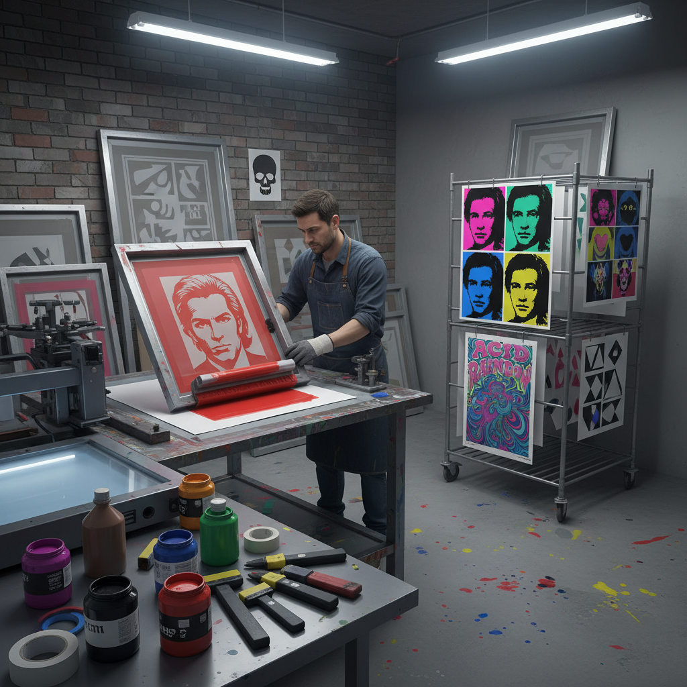

# Screen Printing Art 丝网印刷艺术

> "Screen printing is democracy made visible — the same image reproduced fifty times, a hundred times, each print identical yet each pulled by hand. It is the art of the multiple, the art of the poster, the art of the t-shirt and the protest sign. Warhol understood that repetition itself is meaning, that a soup can printed thirty-two times becomes something more than a soup can." — Unknown

## 概述

丝网印刷艺术（Screen Printing Art）是通过将油墨透过丝网模版转印到承印物上的印刷艺术形式——利用丝网上的图案区域允许油墨通过、非图案区域阻隔油墨的原理，将图像印刷到纸张、织物、金属等各种材料上。丝网印刷是波普艺术最重要的技术手段，也是当代版画和商业印刷的核心技法。

丝网印刷艺术的实践包括：1）艺术丝网版画——限量版艺术印刷品；2）波普艺术丝网印刷——安迪·沃霍尔式的重复图像；3）海报丝网印刷——音乐和文化海报；4）纺织品丝网印刷——T恤和织物印花；5）多色丝网印刷——多层套色印刷；6）照相丝网印刷——利用感光乳剂的照相制版；7）实验性丝网印刷——将丝网印刷与其他媒介结合的实验创作。

## 核心特征

| 特征 | 描述 |
|------|------|
| 复制 | 可精确复制多份 |
| 平面 | 平面的色块效果 |
| 鲜艳 | 鲜艳饱和的色彩 |
| 层叠 | 多层套色叠加 |
| 多材 | 可印在多种材料上 |
| 商业 | 艺术与商业的结合 |

## 视觉特征

- **色块**：平整的色块
- **套色**：精确的多色套印
- **网点**：半调网点效果
- **鲜艳**：高饱和度色彩
- **边缘**：锐利的图形边缘
- **重复**：重复图像的节奏

## 代表作品

| 作品 | 艺术家 | 年代 | 意义 |
|------|--------|------|------|
| *Marilyn Diptych* | Andy Warhol | 1962 | 波普丝网印刷经典 |
| *LOVE* | Robert Indiana | 1966 | 丝网印刷图标 |
| *Fillmore posters* | Various | 1960s | 迷幻摇滚海报 |
| *Obey Giant* | Shepard Fairey | 1989至今 | 街头丝网印刷 |
| *Screenprints* | Eduardo Paolozzi | 1960s | 英国波普丝网版画 |

## 历史时间线

| 时期 | 事件 |
|------|------|
| 古代 | 中国和日本的早期模版印刷 |
| 20世纪初 | 现代丝网印刷技术的发明 |
| 1960年代 | 波普艺术使丝网印刷成为艺术媒介 |
| 1970-80年代 | 朋克和独立音乐海报文化 |
| 当代 | 丝网印刷的手工复兴和数字结合 |

## 中国语境

丝网印刷艺术在中国有广泛的应用和发展。中国的丝网版画在1980年代开始兴起——一些美术院校设立了丝网版画工作室。中国当代艺术中，丝网印刷被广泛用于创作——许多当代艺术家使用丝网印刷技法创作限量版画。中国的商业丝网印刷产业规模巨大——从T恤印花到广告印刷，丝网印刷无处不在。中国的独立文化场景中，丝网印刷海报和独立出版物（zine）越来越受欢迎——一些城市出现了专门的丝网印刷工作坊。中国的美术教育中，丝网版画是版画专业的重要课程之一。中国的一些设计师将丝网印刷与传统中国元素相结合——创造出具有东方美学的丝网印刷作品。

## AI生成概念图

## 与其他风格的关系

- **Pop Art** → 波普艺术
- **Printmaking** → 版画艺术
- **Poster Art** → 海报艺术
- **Graphic Design** → 平面设计
- **Street Art** → 街头艺术
- **Textile Design** → 纺织设计

---

*浮光艺志 | Chronicle of Artistry*
