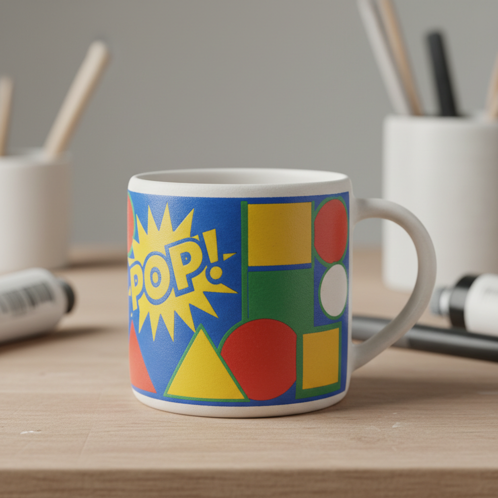

# Screen Printing Ceramics Art 丝网印刷陶瓷艺术

> "Screen printing on ceramics is graphic design fired permanent — a squeegee pushing ceramic ink through a mesh stencil onto clay or glaze, each pull depositing a precise layer of color that can be repeated identically a thousand times or overlaid in registration to build complex images, bringing the language of posters, textiles, and pop art onto the three-dimensional surface of the pot." — Unknown

## 概述

丝网印刷陶瓷艺术（Screen Printing Ceramics Art）是一种将丝网印刷技术应用于陶瓷装饰的技法。通过在丝网上制作图案模版，用刮刀将陶瓷颜料（釉下彩料、釉上彩料或化妆土）推过丝网印刷到陶瓷坯体或釉面上。丝网印刷可以在陶瓷上实现精确的图形、文字和多色套印效果，是连接平面设计与陶瓷艺术的重要桥梁。

丝网印刷陶瓷艺术的核心要素包括：1）丝网模版——在丝网上制作图案；2）陶瓷油墨——使用陶瓷级别的印刷颜料；3）刮刀推印——用刮刀将颜料推过丝网；4）精确套印——多色图案的精确对位；5）可重复——同一模版可重复印刷；6）平面转曲面——将平面图案印到曲面上；7）混合技法——可与手工装饰结合。

## 核心特征

| 特征 | 描述 |
|------|------|
| 丝网模版 | 通过丝网转印图案 |
| 精确复制 | 可精确重复同一图案 |
| 多色套印 | 可实现多色精确套印 |
| 图形文字 | 适合图形和文字装饰 |
| 平面语言 | 平面设计的视觉语言 |
| 混合可能 | 可与手工技法结合 |

## 视觉特征

- **精确图形**：清晰精确的图形边缘
- **平面色块**：均匀的平面色彩
- **文字装饰**：精确的文字印刷
- **多色叠加**：多层套印的色彩效果
- **图案重复**：精确重复的图案
- **当代感**：平面设计的当代视觉

## 代表作品

| 作品 | 艺术家/文化 | 年代 | 意义 |
|------|-------------|------|------|
| *Andy Warhol陶瓷* | Andy Warhol | 20世纪 | 波普艺术与陶瓷 |
| *Paul Scott作品* | Paul Scott | 当代 | 丝网印刷陶瓷大师 |
| *当代丝网印刷陶瓷* | 各地陶艺家 | 当代 | 丝网印刷的艺术应用 |
| *工业丝网印刷瓷砖* | 各品牌 | 当代 | 工业应用 |
| *混合媒介丝网陶瓷* | 当代陶艺家 | 当代 | 混合技法探索 |

## 历史时间线

| 时期 | 事件 |
|------|------|
| 1960年代 | 丝网印刷开始应用于陶瓷 |
| 1970年代 | 波普艺术推动丝网印刷陶瓷 |
| 1980年代 | 丝网印刷在陶瓷教育中普及 |
| 2000年代 | 数字制版技术的应用 |
| 当代 | 丝网印刷作为陶瓷艺术的重要手段 |

## 中国语境

丝网印刷在中国陶瓷工业中有广泛应用——从瓷砖装饰到日用瓷的图案印刷。中国的陶瓷产区——景德镇、佛山、潮州——都大量使用丝网印刷技术。中国当代陶艺教育中，丝网印刷是重要的装饰技术课程——它让学生能够将平面设计作品转化为陶瓷装饰。中国年轻陶艺家特别喜欢将丝网印刷与手工装饰结合——用丝网印刷实现精确的图形和文字，再用手绘添加自由的笔触，形成独特的混合风格。

## AI生成概念图

## 与其他风格的关系

- **Decal** → 贴花纸
- **Pop Art** → 波普艺术
- **Graphic Design** → 平面设计
- **Transferware** → 转印陶
- **Mixed Media** → 混合媒介
- **Industrial Ceramics** → 工业陶瓷

---

*浮光艺志 | Chronicle of Artistry*
