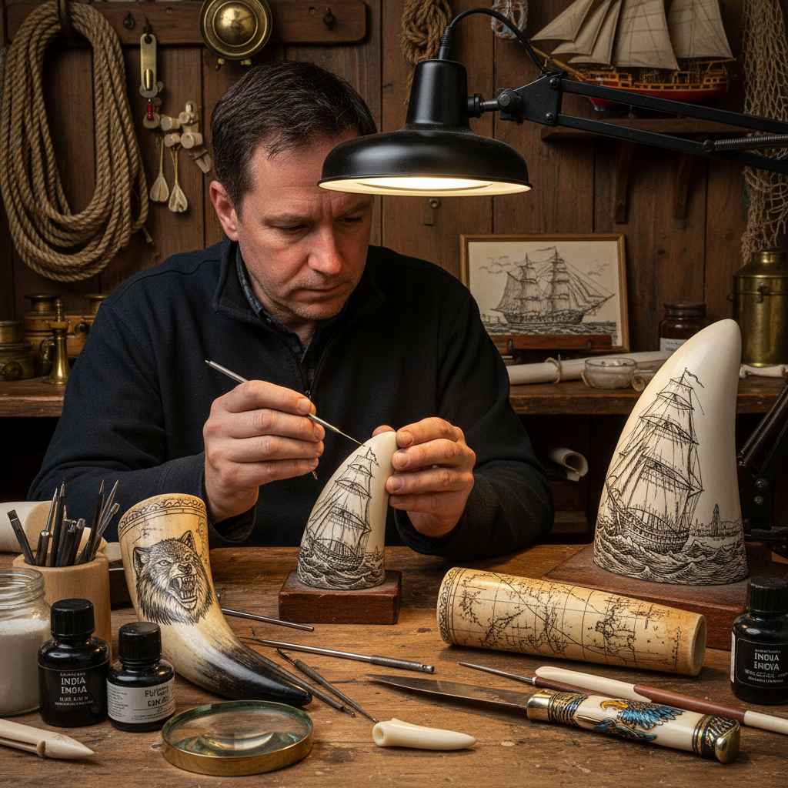

# Scrimshaw Art 骨雕刻画

> "Scrimshaw is patience carved in ivory — a sailor's needle scratching fine lines into whale tooth or bone during months at sea, each mark filled with ink or soot to reveal images of ships, whales, and sweethearts left behind, transforming the by-products of the hunt into folk art masterpieces born of loneliness and longing." — Unknown

## 概述

骨雕刻画（Scrimshaw）是一种在骨骼、象牙、鲸牙或鹿角等硬质有机材料表面刻画精细图案，然后在刻痕中填入墨水或颜料使图案显现的雕刻艺术。Scrimshaw最著名的传统来自18-19世纪的美国捕鲸业——水手们在漫长的航行中，用简单的工具（帆针、小刀）在鲸牙和鲸骨上刻画图案打发时间。

Scrimshaw的题材反映了水手的生活和思念：帆船、鲸鱼、海洋场景、家乡风景、爱人肖像、鹰和国旗等爱国图案。Scrimshaw的技法是"刻线填色"——先用尖锐工具在光滑的骨面上刻出细线，然后将墨水、灯黑或颜料擦入刻痕，擦去表面多余的颜料后，刻痕中的颜料显现出图案。当代Scrimshaw因为保护濒危物种的法律，主要使用合法的替代材料（化石象牙、鹿角、骨头、合成材料等）。

## 核心特征

| 特征 | 描述 |
|------|------|
| 刻线 | 在硬质材料上刻线 |
| 填色 | 刻痕中填入颜料 |
| 骨质 | 骨骼/牙齿材料 |
| 精细 | 极其精细的线条 |
| 航海 | 航海文化传统 |
| 民间 | 民间艺术形式 |

## 视觉特征

- **精细**：极其精细的刻线
- **单色**：通常为黑白或单色
- **光滑**：骨质的光滑表面
- **叙事**：叙事性的图案
- **古典**：古典的版画质感
- **微型**：微型的精细画面

## 代表作品

| 作品 | 艺术家 | 年代 | 意义 |
|------|--------|------|------|
| *Whaling era scrimshaw* | 美国水手 | 18-19世纪 | 捕鲸时代骨雕 |
| *Nantucket scrimshaw* | 南塔克特水手 | 19世纪 | 南塔克特骨雕 |
| *Contemporary scrimshaw* | Various | 当代 | 当代骨雕刻画 |
| *Knife handle scrimshaw* | Various | 当代 | 刀柄骨雕 |
| *Inuit scrimshaw* | 因纽特工匠 | 传统 | 因纽特骨雕 |

## 历史时间线

| 时期 | 事件 |
|------|------|
| 古代 | 骨骼雕刻的早期实践 |
| 18世纪 | 美国捕鲸业骨雕的兴起 |
| 19世纪 | Scrimshaw的鼎盛时期 |
| 20世纪 | 捕鲸禁令后的转变 |
| 当代 | 使用替代材料的当代骨雕 |

## 中国语境

骨雕刻画在中国有相关的传统——中国的骨雕和牙雕有数千年的历史。中国的象牙雕刻曾是重要的工艺美术门类，但随着象牙贸易禁令，已转向使用猛犸象牙和骨质替代材料。中国的微雕（在极小的材料上雕刻）与Scrimshaw有技法上的相似性。当代中国的一些工艺美术师在鹿角、牛骨等合法材料上进行类似Scrimshaw的刻画创作。

## AI生成概念图

## 与其他风格的关系

- **Engraving** → 雕刻
- **Pyrography** → 烙画
- **Miniature Art** → 微型艺术
- **Folk Art** → 民间艺术
- **Maritime Art** → 航海艺术
- **Ivory Carving** → 牙雕

---

*浮光艺志 | Chronicle of Artistry*
