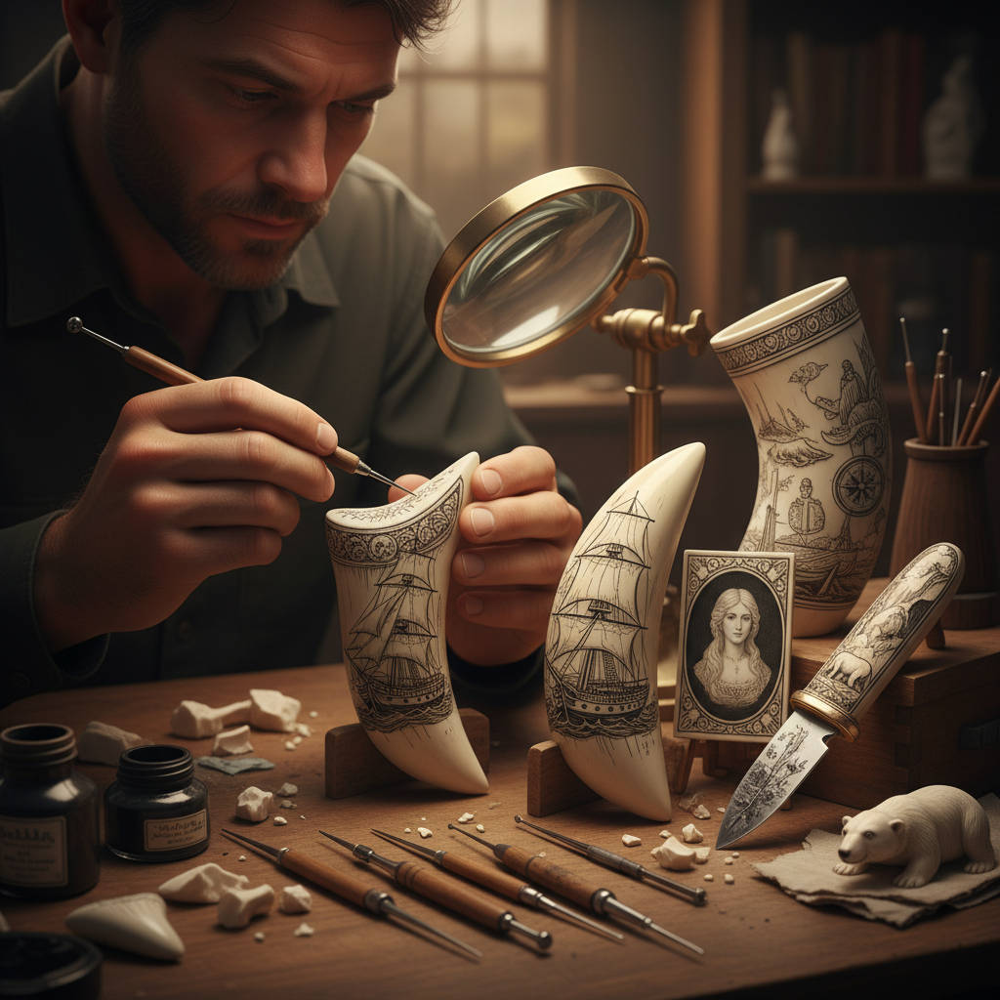

# Scrimshaw 骨雕

> "Scrimshaw is patience carved into bone — sailors turned endless ocean hours into art, etching the world they left behind onto the remains of the world they hunted." — Unknown

## 概述

骨雕（Scrimshaw）是在骨骼或象牙质材料（传统上是鲸牙、鲸骨、海象牙）表面进行雕刻和着色的艺术。这种工艺起源于18-19世纪的捕鲸船上——水手们在漫长的航海中，用小刀在鲸牙和鲸骨上刻画图案，然后用墨水或烟灰填入刻痕使图案显现。Scrimshaw的题材包括：船只、海洋生物、家乡风景、爱人肖像和装饰性花纹。由于现代对鲸类和象牙的保护，当代Scrimshaw艺术家使用替代材料——如鹿角、牛骨、猛犸象牙化石和合成材料。

骨雕的哲学在于：在等待中创造——将漫长的时间转化为精细的艺术，在最坚硬的材料上留下最细腻的痕迹。

## 核心特征

| 特征 | 描述 |
|------|------|
| 骨质 | 在骨质材料上雕刻 |
| 精细 | 极其精细的刻线 |
| 着色 | 刻痕填入颜色 |
| 耐心 | 极其耗时耐心 |
| 航海 | 航海文化的产物 |
| 永久 | 图案永久不褪 |

## 视觉特征

- **精细**：极其精细的线条
- **白底**：白色骨质底色
- **黑线**：黑色填充的刻线
- **叙事**：叙事性的图案
- **曲面**：在曲面上的构图
- **微缩**：微缩的精细画面

## 代表作品

| 作品 | 艺术家 | 年代 | 意义 |
|------|--------|------|------|
| *Nantucket whaling scrimshaw* | 匿名水手 | 19世纪 | 经典捕鲸骨雕 |
| *Frederick Myrick works* | Frederick Myrick | 1820s | 早期署名骨雕 |
| *Contemporary scrimshaw* | Various | 当代 | 当代骨雕艺术 |
| *Inuit bone carvings* | 因纽特人 | 传统 | 因纽特骨雕 |
| *Japanese netsuke* | Various | 17-19世纪 | 日本根付（类似） |

## 历史时间线

| 时期 | 事件 |
|------|------|
| 古代 | 因纽特人的骨雕传统 |
| 18世纪 | 美国捕鲸船上的骨雕兴起 |
| 19世纪 | 骨雕的黄金时代 |
| 1970s | 鲸类保护法限制传统材料 |
| 当代 | 替代材料的使用 |
| 当代 | 当代骨雕艺术的精细化 |

## 中国语境

骨雕在中国有悠久的传统——中国的牙雕（象牙雕刻）和骨雕是重要的传统工艺。北京牙雕、广州牙雕都曾是国家级非物质文化遗产。由于象牙贸易禁令，中国的牙雕艺术家转向使用猛犸象牙化石、牛骨和其他替代材料。中国的骨雕传统与西方Scrimshaw有不同的美学——中国骨雕更注重立体雕刻和镂空技法，而Scrimshaw更注重平面的线刻。当代中国的骨雕艺术家在传承传统技法的同时，也在探索新材料和新表达。

## AI生成概念图

## 与其他风格的关系

- **Engraving** → 雕刻
- **Ivory Carving** → 牙雕
- **Netsuke** → 根付
- **Maritime Art** → 航海艺术
- **Miniature Art** → 微缩艺术
- **Folk Art** → 民间艺术

---

*浮光艺志 | Chronicle of Artistry*
