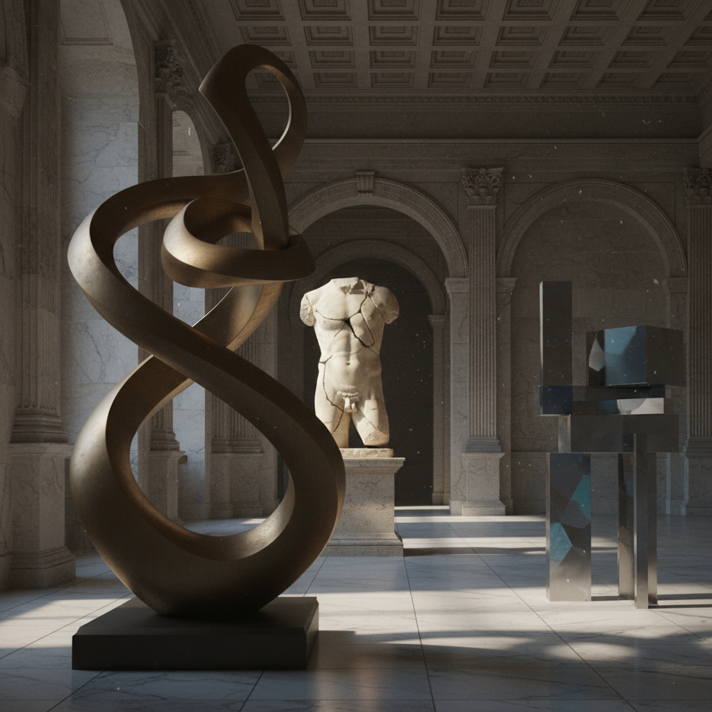

# Sculpture 雕塑艺术

> "Sculpture is the art of the intelligence." — Pablo Picasso

## 概述

雕塑（Sculpture）是人类最古老的艺术形式之一——通过雕刻、塑造、铸造、焊接、组装等方式在三维空间中创造形体。从旧石器时代的维纳斯小像到当代的装置雕塑，雕塑始终是人类表达对身体、空间和物质理解的核心媒介。

雕塑的本质是对空间的占据和对物质的转化——它不是在平面上制造空间的幻觉，而是真实地存在于空间之中。

## 核心特征

| 特征 | 描述 |
|------|------|
| 三维性 | 在三维空间中存在 |
| 物质性 | 由实在的物质材料构成 |
| 空间性 | 占据空间并与空间对话 |
| 触觉性 | 可以（至少在想象中）触摸 |
| 多视角 | 从不同角度呈现不同面貌 |
| 持久性 | 通常具有物理持久性 |

## 视觉特征

- **体量**：实体的体积和重量感
- **表面**：光滑、粗糙、抛光、锈蚀
- **空间**：实体与虚空的关系
- **光影**：真实光线在表面的变化
- **材质**：石头、金属、木头、陶瓷、树脂
- **尺度**：从微型到纪念碑级别

## 代表作品

| 作品 | 艺术家 | 年代 | 意义 |
|------|--------|------|------|
| *Venus of Willendorf* | 未知 | ~25000 BCE | 人类最早的雕塑之一 |
| *David* | Michelangelo | 1504 | 文艺复兴雕塑的巅峰 |
| *The Thinker* | Auguste Rodin | 1904 | 现代雕塑的开端 |
| *Bird in Space* | Constantin Brancusi | 1923 | 抽象雕塑的先驱 |
| *Balloon Dog* | Jeff Koons | 1994-2000 | 当代雕塑的商业化 |
| *Cloud Gate* | Anish Kapoor | 2006 | 公共雕塑的当代典范 |

## 历史时间线

| 时期 | 事件 |
|------|------|
| ~30000 BCE | 旧石器时代小型雕塑 |
| 古希腊 | 理想化人体雕塑的黄金时代 |
| 文艺复兴 | Michelangelo——雕塑的巅峰 |
| 19世纪末 | Rodin——现代雕塑的开端 |
| 1910s-20s | Brancusi——走向抽象 |
| 1960s | 极简主义雕塑——Judd、Andre |
| 1970s-80s | 后极简、大地艺术 |
| 2000s-至今 | 数字雕塑、3D打印、装置化 |

## 中国语境

中国拥有辉煌的雕塑传统——从商周青铜器到秦始皇兵马俑，从敦煌彩塑到宋代木雕，从明清佛像到当代雕塑。中国当代雕塑家如隋建国、展望、向京等在国际上享有声誉。中国的城市雕塑（城雕）是公共艺术的重要组成部分，尽管质量参差不齐。

## AI生成概念图

## 与其他风格的关系

- **Digital Sculpture** → 数字雕塑是传统雕塑的虚拟延伸
- **Installation Art** → 装置艺术扩展了雕塑的空间概念
- **Assemblage** → 集合艺术是雕塑的现成物形式
- **Kinetic Art** → 动态雕塑加入了时间维度
- **Public Art** → 公共雕塑是最可见的艺术形式
- **Minimalism** → 极简主义重新定义了雕塑的本质

---

*浮光艺志 | Chronicle of Artistry*
