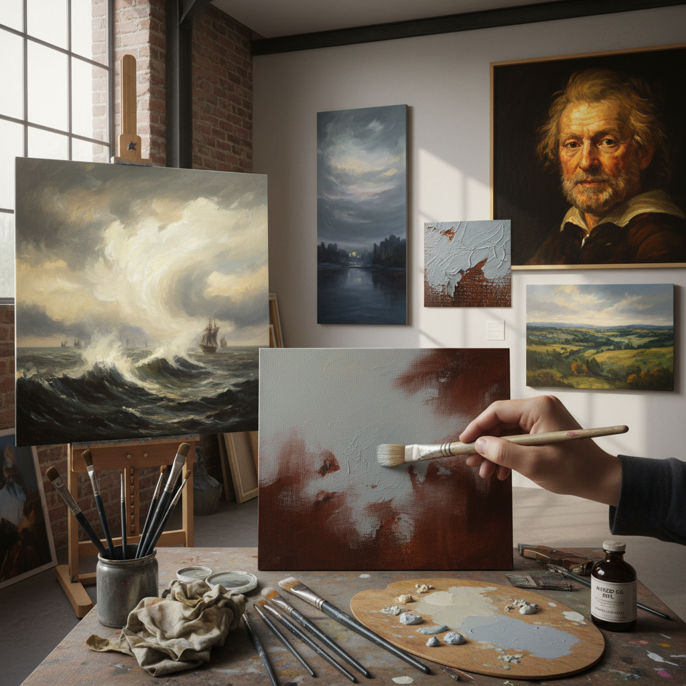

# Scumbling Technique 干擦画法

> "Scumbling is painting with breath — dragging a dry brush loaded with opaque paint lightly across a textured surface so that the color catches only on the raised points, allowing the underlayer to show through the gaps like light filtering through clouds, creating a broken, atmospheric veil of color that no amount of careful mixing could ever achieve, each passage a collaboration between the painter's hand and the canvas's own texture." — Unknown

## 概述

干擦画法（Scumbling）是一种将不透明或半不透明的颜料以干燥、轻薄的方式拖擦在已干燥的底层颜料上的绘画技法。与罩染（glazing）使用透明颜料不同，scumbling使用不透明颜料——但涂抹得极其轻薄，使底层颜色透过上层的间隙显现出来。Scumbling创造的效果是一种"破碎的"、朦胧的、大气的色彩叠加。

Scumbling的关键在于"干"和"轻"——画笔上的颜料很少且较干，轻轻拖过画面表面，颜料只附着在画布纹理的凸起处，凹处保持底层颜色。这创造了一种光学混合效果——两层颜色在视觉上混合但物理上分离。提香（Titian）、伦勃朗和特纳（Turner）都是scumbling的大师——特纳用scumbling创造了他标志性的朦胧大气效果。

## 核心特征

| 特征 | 描述 |
|------|------|
| 干擦 | 干燥的轻薄涂抹 |
| 不透明 | 使用不透明颜料 |
| 破碎 | 破碎的色彩效果 |
| 大气 | 大气朦胧的效果 |
| 纹理 | 利用画布纹理 |
| 光学混合 | 两层颜色的光学混合 |

## 视觉特征

- **朦胧**：朦胧的大气效果
- **破碎**：破碎的色彩表面
- **柔和**：柔和的色调过渡
- **纹理**：画布纹理的显现
- **层次**：底层与表层的互动
- **光感**：特殊的光感效果

## 代表作品

| 作品 | 艺术家 | 年代 | 意义 |
|------|--------|------|------|
| *Rain, Steam and Speed* | J.M.W. Turner | 1844 | 特纳的大气scumbling |
| *Late self-portraits* | Rembrandt | 1660年代 | 伦勃朗晚期的scumbling |
| *Late paintings* | Titian | 1560年代 | 提香晚期的scumbling |
| *Nocturnes* | James McNeill Whistler | 1870年代 | 惠斯勒的夜景scumbling |
| *Contemporary scumbling* | Various | 当代 | 当代干擦技法 |

## 历史时间线

| 时期 | 事件 |
|------|------|
| 文艺复兴晚期 | 提香发展scumbling技法 |
| 巴洛克 | 伦勃朗的scumbling应用 |
| 浪漫主义 | 特纳的大气scumbling |
| 印象派 | 印象派的scumbling变体 |
| 当代 | Scumbling的当代实践 |

## 中国语境

干擦画法在中国的油画教育中是重要的技法之一。中国的美术院校在油画技法课程中教授scumbling。中国的一些风景油画家使用scumbling来表现中国山水的朦胧大气效果。有趣的是，中国传统绘画中的"飞白"技法（毛笔快速拖过纸面，墨迹断续）与scumbling有技法上的相似性——都是利用"破碎"的笔触来创造特殊效果。中国画中的"干笔皴擦"也与scumbling有相通之处。

## AI生成概念图

## 与其他风格的关系

- **Glazing** → 罩染
- **Impasto** → 厚涂
- **Turner** → 特纳风格
- **Atmospheric Painting** → 大气绘画
- **Broken Color** → 破碎色彩
- **Dry Brush** → 干笔技法

---

*浮光艺志 | Chronicle of Artistry*
