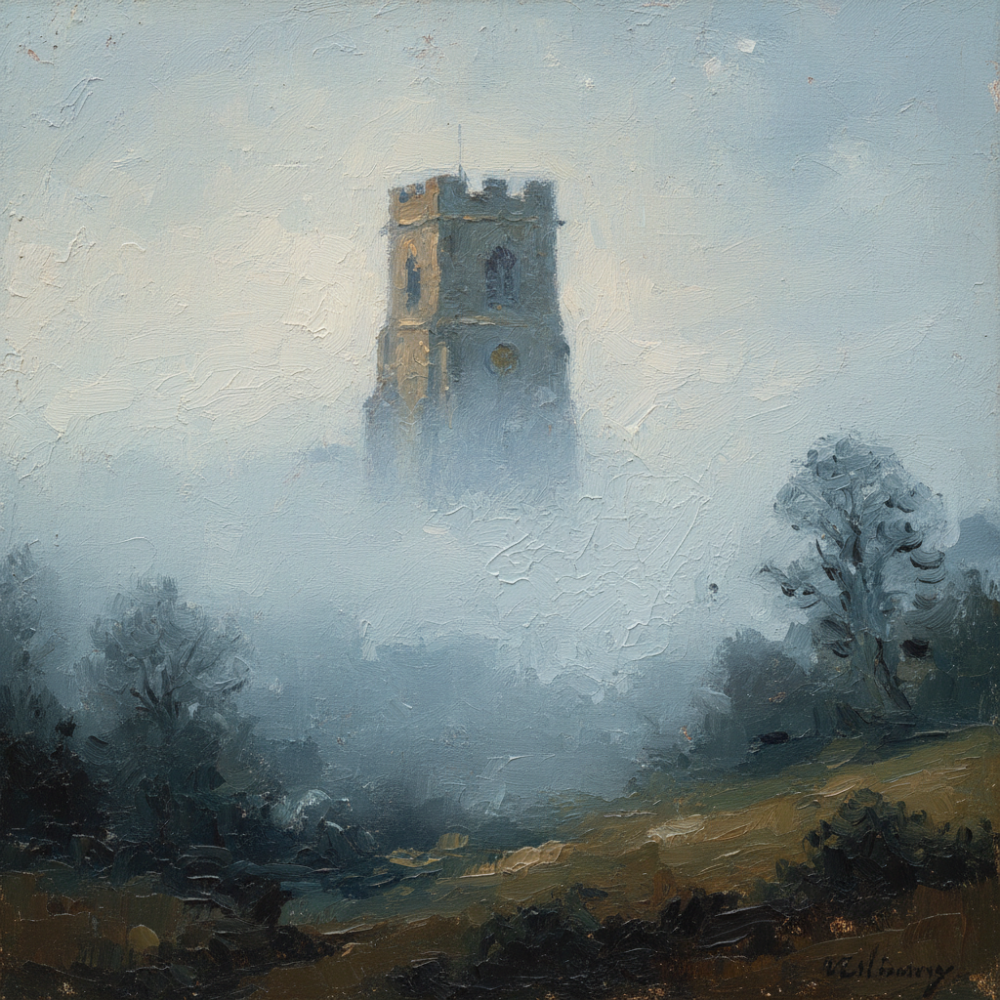

# Scumbling 擦涂法

> "I never saw an ugly thing in my life." — John Constable

## 概述

擦涂法（Scumbling）是一种将不透明或半透明的浅色颜料以干笔轻擦的方式薄薄地覆盖在深色底层上的绘画技法。与罩染法（Glazing）相反——罩染是用透明深色覆盖浅色底层，而擦涂是用不透明浅色覆盖深色底层。

这一技法能产生朦胧、柔和、如薄雾般的光学效果，常用于表现大气透视、雾气、烟霾和柔和的光线。从提香到康斯太勃尔，从透纳到莫奈，擦涂法是古典和现代绑画家工具箱中不可或缺的技法。

## 核心特征

| 特征 | 描述 |
|------|------|
| 干笔轻擦 | 用几乎干燥的画笔轻轻擦过表面 |
| 浅覆深 | 浅色不透明颜料覆盖深色底层 |
| 底层透出 | 底层颜色从缝隙中透出，产生光学混合 |
| 朦胧效果 | 产生雾气般的柔和朦胧感 |
| 大气透视 | 用于表现远处物体的空气感 |
| 光学柔化 | 不同于物理混色的视觉柔和效果 |

## 视觉特征

- **表面**：粗糙的、不均匀的薄涂层
- **效果**：朦胧、柔和、如隔着薄纱
- **底层**：深色底层从浅色涂层的缝隙中透出
- **色彩**：产生微妙的冷暖交织效果
- **光线**：柔和的、弥散的光线感
- **距离**：远处物体更加朦胧（大气透视）

## 代表人物

| 画家 | 擦涂应用 | 时期 |
|------|---------|------|
| Titian | 晚期作品的朦胧大气效果 | 威尼斯画派 |
| J.M.W. Turner | 雾气和蒸汽的表现 | 浪漫主义 |
| John Constable | 天空中的云层和光线 | 英国风景画 |
| Claude Monet | 雾中的教堂和桥梁 | 印象派 |
| Caspar David Friedrich | 远山的雾气效果 | 德国浪漫主义 |

## 技法要点

| 步骤 | 描述 |
|------|------|
| 1. 底层 | 先画好深色的底层并等待干燥 |
| 2. 干笔 | 画笔蘸取少量浅色颜料，在布或纸上擦去多余 |
| 3. 轻擦 | 以极轻的力度在表面快速擦过 |
| 4. 层叠 | 可多次轻擦，逐步建立朦胧效果 |
| 5. 控制 | 力度和颜料量决定透出程度 |

## 与其他技法的关系

- **Glazing** → 完全相反的方向——擦涂是浅覆深，罩染是深覆浅
- **Sfumato** → 共享柔和朦胧的视觉效果
- **Impasto** → 互补——厚涂底层上的擦涂效果独特
- **Dry Brush** → 干笔技法是擦涂的基础
- **Atmospheric Perspective** → 擦涂是实现大气透视的核心手段

## 概念图

---

*浮光艺志 | Chronicle of Artistry*
