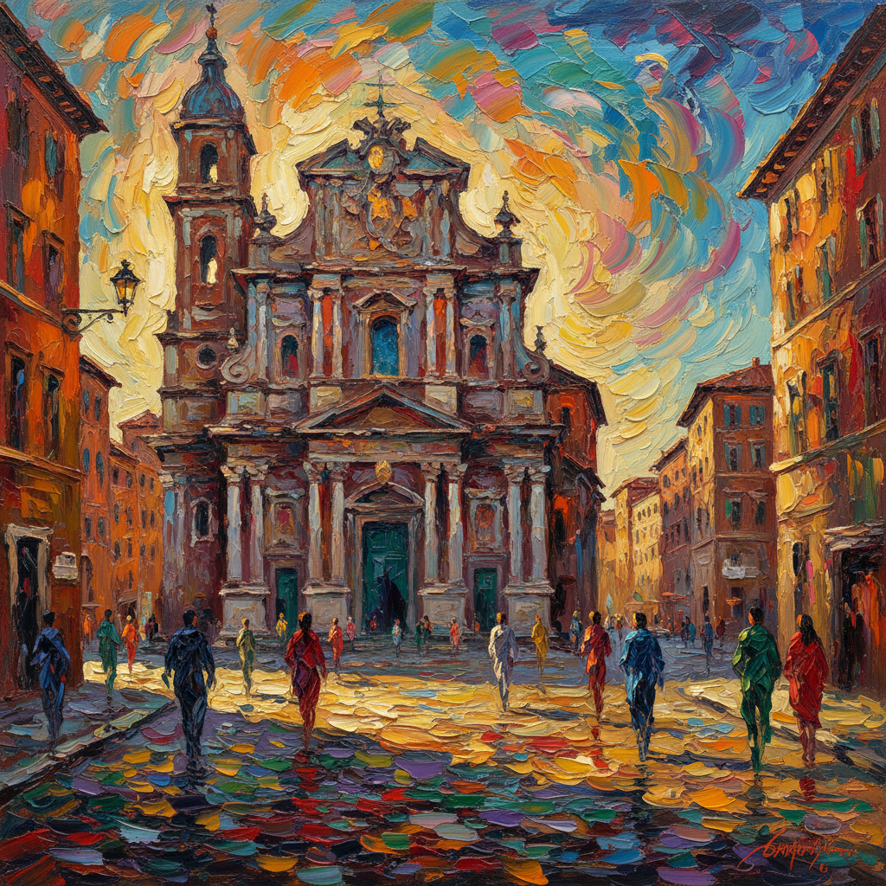

# Scuola Romana 罗马画派

> **时期：** 1928年–1945年  
> **关键词：** 表现主义色彩、罗马风景、反法西斯、巴洛克遗产、情感强度

## 概述

Scuola Romana（罗马画派）是1930年代活跃于罗马的一群画家，以马里奥·马费、罗伯托·梅利和希皮奥内为核心。他们用强烈的表现主义色彩和巴洛克式的情感强度描绘罗马的街道、教堂和人物，在法西斯时期的文化压制下保持了艺术的自由和个人表达。

## 风格特征

- **强烈色彩**：表现主义的浓烈用色
- **巴洛克遗产**：继承罗马巴洛克的戏剧性
- **城市题材**：罗马的街道、广场、教堂
- **情感表达**：内在焦虑和激情的外化
- **反官方**：拒绝法西斯的新古典主义

## 代表人物与作品

- 希皮奥内《红衣主教》
- 马里奥·马费 罗马风景
- 罗伯托·梅利 人物画
- 安东尼奥·东吉 罗马街景

## 概念图

