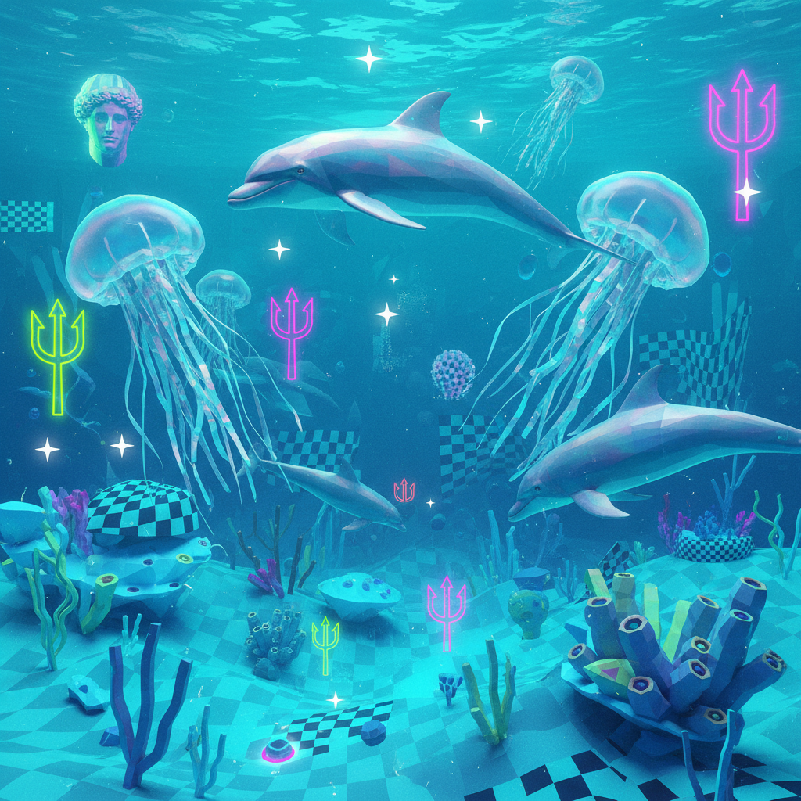
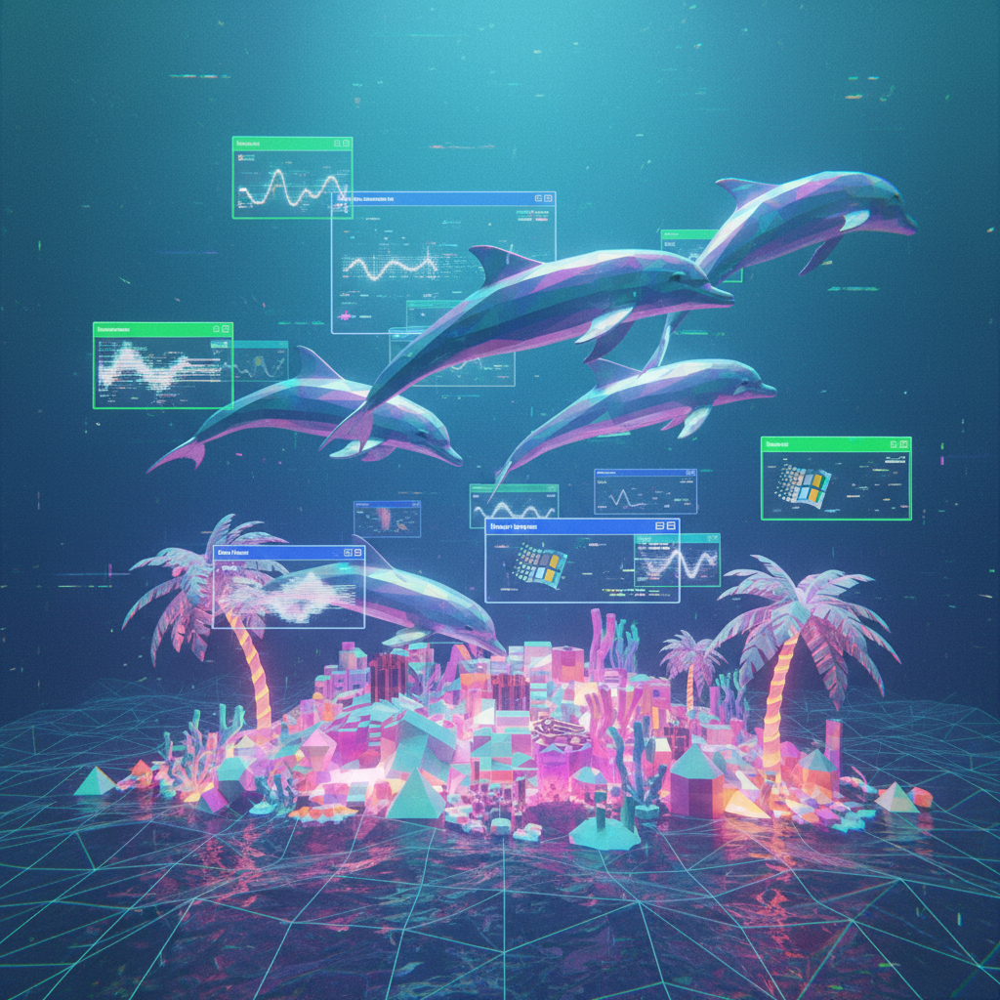

# Seapunk

> **别名**：无广泛别名（偶尔被归入 "Tumblr Aesthetics" 或 "Internet Micro-movements"）  
> **活跃年代**：2011 – 2013（原生期）；偶有回潮  
> **起源**：Twitter/Tumblr 亚文化





---

## 一句话定义

Seapunk 是 2011 年诞生于 Twitter 的互联网微美学，将**海洋意象**（海豚、珊瑚、水母）与 **90 年代网络图形**（3D 渲染、虹彩材质）和**电子舞曲文化**融合，创造出一种蓝绿色调的数字水下乌托邦。

---

## 视觉语言

| 元素 | 描述 |
|------|------|
| 色彩 | 青色（teal）、海蓝、薄荷绿、紫色渐变 |
| 海洋生物 | 海豚、鲸鱼、水母、珊瑚、贝壳 |
| 3D 渲染 | 低多边形海洋场景、虹彩球体、水面反射 |
| 90s 网络元素 | Windows 95 图标、早期 3D 软件渲染、像素化水纹 |
| 时尚 | 蓝绿色染发、渔网、贝壳饰品、全息面料 |
| 符号 | 三叉戟、波浪线、海神波塞冬 |

### 视觉配方

一张典型的 Seapunk 图片通常包含以下层次：

1. **背景**：蓝绿色渐变或低多边形海底场景
2. **主体**：3D 渲染的海豚/鲸鱼，或戴着贝壳饰品的人物
3. **纹理**：虹彩/全息材质覆盖
4. **UI 元素**：Windows 95 对话框、早期网页按钮
5. **文字**：波浪形排列的标题，或 90s 风格的像素字体

这个配方的关键在于**时间错位**：将"未来感"的 3D 渲染与"过去感"的 90s 界面元素并置，创造出一种"从未存在过的过去"的感觉。

---

## 起源故事

Seapunk 的诞生有一个精确的时刻：

> 2011 年 6 月，音乐人 Lil Internet（Julian Foxworth）在 Twitter 上发帖说他梦见了一件"朋克皮夹克，上面有海洋图案"，并创造了 #seapunk 这个标签。

这个半开玩笑的帖子迅速在 Tumblr 上演变为一个完整的视觉美学运动。从一条推文到一个亚文化，整个过程不到三个月——这在前互联网时代是不可想象的速度。

### 为什么是海洋？

海洋意象在 Seapunk 中的选择并非随机：
- **深度**：海洋代表互联网的"深层"——那些算法触及不到的地方
- **流动性**：水的流动性对应互联网身份的可塑性
- **异世界**：海底是地球上最接近"外星"的环境
- **90s 回忆**：Windows 95 的海底屏保、Lisa Frank 的海豚——海洋是 90s 数字文化的常见主题

---

## 历史时间线

| 时期 | 事件 |
|------|------|
| 2011.06 | Lil Internet 在 Twitter 创造 #seapunk |
| 2011.07-09 | Tumblr 上迅速形成视觉社区；DJ 开始制作 Seapunk 混音 |
| 2011.10 | Coral Records 厂牌成立，成为 Seapunk 音乐的核心 |
| 2012.01-06 | 风格在 Tumblr 上达到巅峰；Vice、Dazed 等媒体报道 |
| 2012.09 | Kreayshawn 在 MTV VMA 上穿着 Seapunk 风格服装 |
| 2012.11 | **Rihanna 在 SNL 表演中使用 Seapunk 视觉**——引发"主流窃取亚文化"争议 |
| 2012.12 | Azealia Banks "Atlantis" MV 采用 Seapunk 美学 |
| 2013.01 | 地下社区宣布 Seapunk "已死"；Lil Internet 本人表示"它已经结束了" |
| 2013-2014 | 影响力融入 Vaporwave 和更广泛的网络美学 |
| 2015+ | 虹彩/全息材质从 Seapunk 进入主流时尚（H&M、ASOS） |
| 2020s | 偶尔作为怀旧 meme 回潮；被视为"Tumblr 美学运动"的原型 |

---

## 文化内核

### 第一个"互联网原生"美学

Seapunk 被广泛认为是**第一个完全在互联网上诞生、传播和消亡的美学运动**。它没有实体店铺、没有杂志、没有地理中心——它只存在于 Tumblr 的 reblog 链和 SoundCloud 的播放列表中。

这使它成为了后来所有"互联网美学"的原型：
- Vaporwave（2012）
- Cottagecore（2018）
- Dark Academia（2019）
- Goblincore（2020）

所有这些都遵循了 Seapunk 建立的模式：**标签 → 视觉社区 → 音乐 → 时尚 → 媒体报道 → 主流吸收 → "死亡"**。

### 后讽刺的真诚

Seapunk 的核心张力在于：它开始于一个玩笑，但参与者逐渐认真对待它。这种"半真半假"的态度——既是 meme 又是真实的美学追求——预示了后来所有互联网美学的运作方式。

这种态度被学者称为 **"post-ironic sincerity"（后讽刺的真诚）**：
- 你知道它有点荒谬
- 但你真的觉得它很美
- 你不确定自己是在开玩笑还是认真的
- 这种不确定性本身就是体验的一部分

### 主流窃取的经典案例

Rihanna 事件成为了"主流文化如何吸收和消解亚文化"的教科书案例：

```
阶段 1：地下社区创造视觉语言（2011.06 - 2012.06）
    ↓
阶段 2：媒体"发现"并报道（2012.06 - 2012.10）
    ↓
阶段 3：主流明星未经授权使用（2012.11）
    ↓
阶段 4：原创社区感到被背叛和稀释（2012.12）
    ↓
阶段 5：风格被过度曝光后迅速"死亡"（2013.01）
```

这个循环后来在 Vaporwave、Cottagecore 等美学中反复上演，但 Seapunk 是第一个完整经历这个过程的案例。

### 速度与脆弱性

Seapunk 从诞生到"死亡"只用了约 18 个月。这种极端的速度揭示了互联网美学的一个根本特征：**它们的生命力与排他性成正比**。一旦失去"只有我们知道"的神秘感，美学运动就失去了社群凝聚力。

---

## 音乐

Seapunk 不仅是视觉风格，也是一种音乐流派：

| 特征 | 描述 |
|------|------|
| 节奏 | House/Trance 基底，120-130 BPM |
| 采样 | 水声（气泡、海浪、声纳、鲸鱼叫声） |
| 合成器 | 湿润的 pad 音色、延迟效果、混响 |
| 人声 | 经过 Auto-Tune 处理的梦幻人声 |
| 结构 | 循环、渐进、催眠式 |

代表艺术家：
- **Ultrademon**：Seapunk 音乐的核心人物
- **Zombelle**：融合 Witch House 和 Seapunk
- **Coral Records**：Seapunk 的"厂牌"
- **Fire for Effect**：早期 Seapunk DJ

---

## 与其他风格的关系

| 风格 | 关系 |
|------|------|
| **Vaporwave** | 同期诞生，共享 90s 网络怀旧，但 Vaporwave 更批判消费主义 |
| **Webcore** | 共享早期互联网视觉元素 |
| **Holographic / Iridescent** | Seapunk 推广了虹彩材质的流行 |
| **Cyber Y2K** | 共享对数字乌托邦的想象 |
| **Witch House** | 同期 Tumblr 音乐运动，但更暗黑 |
| **Frutiger Aero** | 共享水/自然元素与数字技术的融合 |

---

## 遗产

尽管 Seapunk 作为独立运动只存活了约 18 个月，但它的影响深远：

1. **证明了互联网可以独立产生美学运动**——不需要杂志、画廊或地理场景
2. **建立了"Tumblr 美学"的运作模式**——后来的 Cottagecore、Dark Academia 等都遵循类似路径
3. **虹彩/全息材质从此成为主流时尚元素**——从 H&M 到 Nike 都在使用
4. **为 Vaporwave 的视觉语言提供了基础**——3D 渲染 + 90s 界面的组合
5. **"主流窃取"叙事的模板**——后来每个亚文化都会引用 Rihanna/Seapunk 事件
6. **互联网美学研究的起点**——学术界开始认真研究在线视觉文化

---

## 争议

### "它真的是一个亚文化吗？"

批评者认为 Seapunk 从未真正成为一个"亚文化"：
- 参与者人数极少（核心圈子可能不到 100 人）
- 没有线下聚会场所
- 没有持续的音乐产出
- 更像一个"美学 meme"而非真正的文化运动

支持者则认为：互联网时代的亚文化不需要满足传统定义——**在线存在就是存在**。

### Rihanna 事件的另一面

虽然 Seapunk 社区普遍谴责 Rihanna 的"窃取"，但也有人指出：
- Seapunk 本身大量"借用"了 90s 视觉文化，并未获得原创者许可
- 互联网美学的本质就是混合和重组——谁有权声称"所有权"？
- 如果没有 Rihanna 事件，Seapunk 可能根本不会被记住

---

## 代表性视觉参考

- Coral Records 专辑封面
- Tumblr #seapunk 标签存档（2011-2012）
- Azealia Banks "Atlantis" MV
- 早期 3D 渲染海洋场景
- Windows 95 海底屏保
- Rihanna SNL "Diamonds" 表演视觉

---

## 延伸阅读

- [Aesthetics Wiki - Seapunk](https://aesthetics.fandom.com/wiki/Seapunk)
- [The Guardian: "Seapunk: the internet's latest subculture"](https://www.theguardian.com/technology/2012/dec/19/seapunk)
- [Vice: "Is Seapunk Dead?"](https://www.vice.com/en/article/seapunk-dead)
- *"Tumblr Aesthetics: Internet Subcultures in the 2010s"*（学术论文）
- 本项目相关：[Vaporwave](vaporwave.md) | [Cyber Y2K](cyber-y2k.md) | [Webcore](webcore.md) | [Glitter Graphics](glitter-graphics.md)
