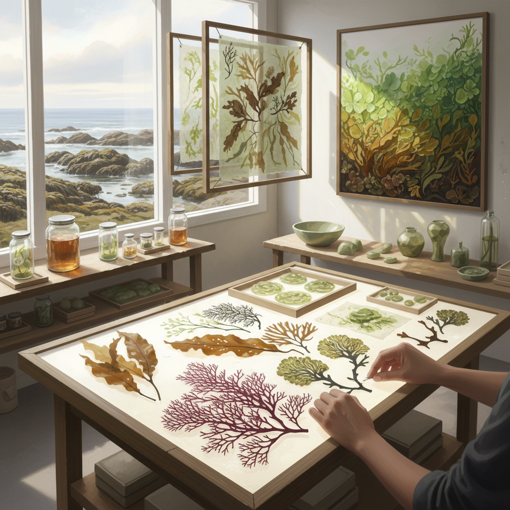

# Seaweed Art 海藻艺术

> "Seaweed art works with the forests of the ocean — vast underwater meadows that sway with the currents, that photosynthesize like trees but breathe water instead of air, that range from microscopic single cells to giant kelp forests taller than buildings. Seaweed is simultaneously ancient and modern — one of the oldest life forms on Earth, yet increasingly recognized as a material of the future for food, fuel, fabric, and art." — Unknown

## 概述

海藻艺术（Seaweed Art）是以海藻——海洋中的藻类植物——为创作材料和灵感的艺术实践。海藻种类繁多，从微小的单细胞藻类到巨大的海带森林，它们具有独特的美学品质：半透明的质地、丰富的色彩（绿、红、褐）、优雅的流动形态。

海藻艺术的实践包括：1）海藻压制——将海藻压制干燥后作为标本艺术；2）海藻纸——用海藻纤维制作纸张；3）海藻染色——用海藻提取天然染料；4）海藻雕塑——用干燥或保存的海藻创作三维作品；5）海藻生物材料——用海藻提取物（琼脂、海藻酸钠）制作生物塑料；6）海藻生态艺术——以海洋生态和海藻养殖为主题的环境艺术。

## 核心特征

| 特征 | 描述 |
|------|------|
| 海洋 | 海洋来源 |
| 透明 | 半透明质地 |
| 流动 | 水中的流动形态 |
| 色彩 | 绿红褐多色 |
| 可持续 | 可持续材料 |
| 古老 | 最古老的生物之一 |

## 视觉特征

- **透明**：半透明的薄片
- **流动**：水中飘动的形态
- **色彩**：深绿、红褐、金黄
- **纹理**：细腻的表面纹理
- **有机**：有机的分支形态
- **层次**：重叠的层次感

## 代表作品

| 作品 | 艺术家 | 年代 | 意义 |
|------|--------|------|------|
| *Seaweed pressings* | Anna Atkins | 1843 | 最早的摄影书 |
| *Algae art* | Various | 2010年代 | 藻类艺术 |
| *Seaweed biomaterials* | Various | 2020年代 | 海藻生物材料 |
| *Kelp installations* | Various | 2010年代 | 海带装置 |
| *Seaweed fashion* | Various | 2020年代 | 海藻时装 |

## 历史时间线

| 时期 | 事件 |
|------|------|
| 1843 | Anna Atkins的海藻蓝晒法 |
| 19世纪 | 维多利亚时代海藻收集 |
| 2000年代 | 海藻作为可持续材料 |
| 2010年代 | 海藻生物设计 |
| 当代 | 海藻艺术与海洋保护 |

## 中国语境

海藻艺术在中国有独特的海洋文化和产业基础。中国是世界上最大的海藻养殖国——中国的海带、紫菜、裙带菜产量居世界前列。中国沿海地区有悠久的海藻利用传统——从食用（海带、紫菜）到工业（琼脂、卡拉胶）。中国传统文化中海藻虽然不如陆地植物那样有丰富的文学意象，但在沿海民间艺术中有独特地位。中国当代的一些艺术家在探索海藻艺术：用中国海藻养殖的规模化美学创作大地艺术、将海藻提取物制成生物塑料进行雕塑创作、以及将中国沿海的海藻文化与当代环境艺术结合。

## AI生成概念图

## 与其他风格的关系

- **Bio Art** → 生物艺术
- **Eco-Art** → 生态艺术
- **Ocean Art** → 海洋艺术
- **Natural Material Art** → 自然材料艺术
- **Bioplastic Art** → 生物塑料艺术
- **Sustainable Design** → 可持续设计

---

*浮光艺志 | Chronicle of Artistry*
