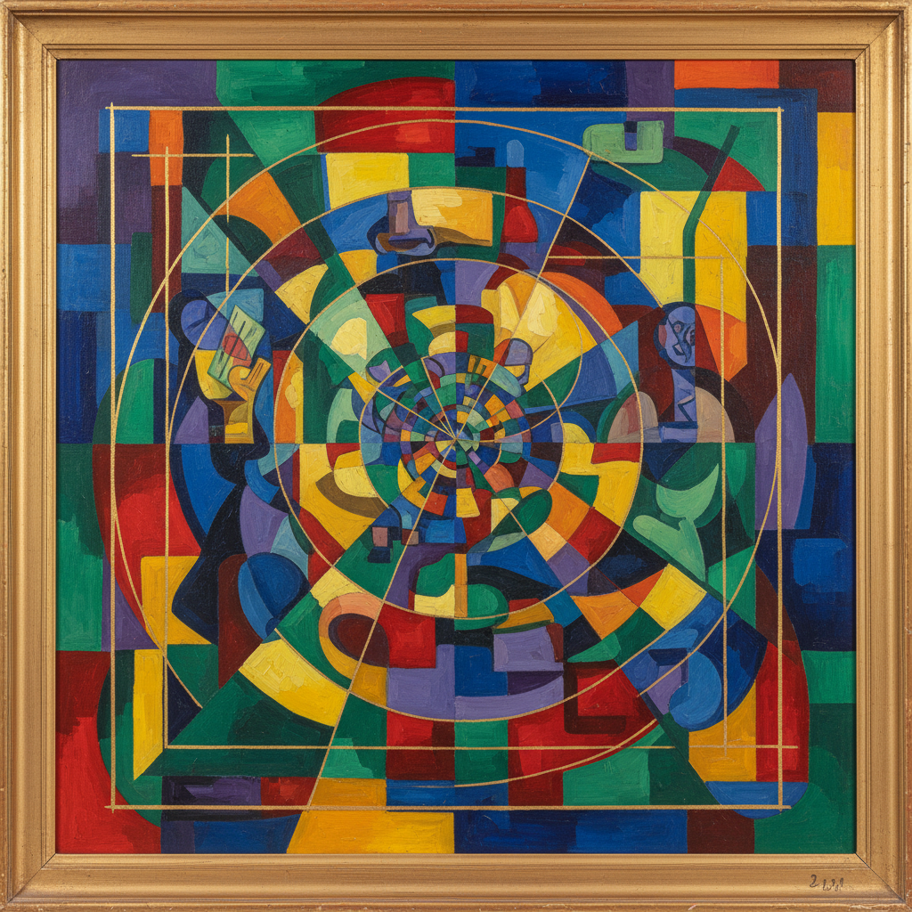

# Section d'Or 黄金分割派

> **时期：** 1911年–1914年  
> **关键词：** 数学比例、立体主义分支、黄金比例、集体展览、理性构图

## 概述

Section d'Or（黄金分割派）是1911年由一群法国立体主义画家组成的松散团体，以数学比例和黄金分割作为构图的理性基础。他们比毕加索和布拉克的分析立体主义更注重色彩和动态，试图将立体主义从封闭的画室实验推向更广泛的公众——1912年的同名展览是立体主义运动最大规模的集体亮相。

## 风格特征

- **数学构图**：基于黄金比例的画面分割
- **色彩丰富**：比分析立体主义更多彩
- **动态感**：运动和时间的表现
- **多视角**：立体主义的多角度观察
- **理性秩序**：几何结构的严谨安排

## 代表人物与作品

- 雅克·维庸《行进中的士兵》
- 马塞尔·杜尚《下楼梯的裸女》
- 阿尔贝·格莱兹《收割者》
- 让·梅青格尔《茶点时间》

## 概念图

