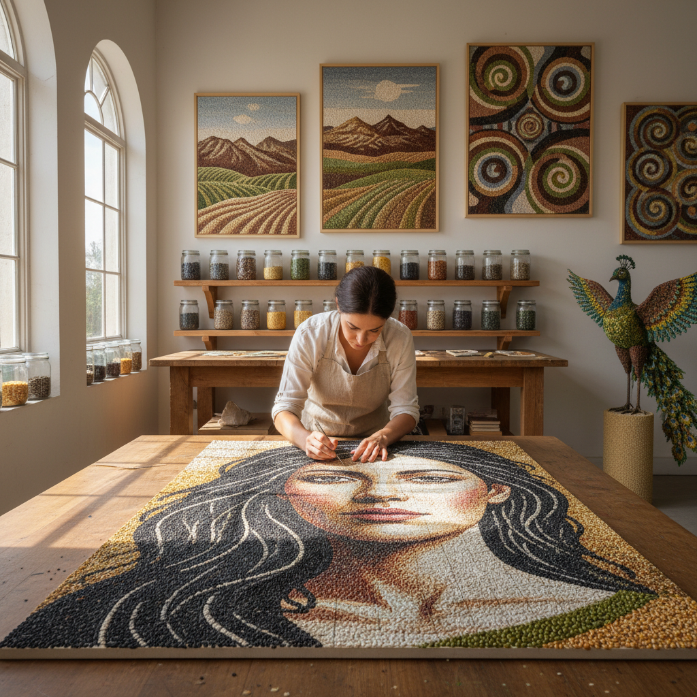

# Seed Art 种子艺术

> "Seed art works with the smallest unit of life's potential — a tiny capsule containing everything needed to become a tree, a flower, a field of grain. Every seed is a promise, a compressed future, a time capsule of genetic information waiting for the right conditions to unfold. The seed artist arranges these promises into patterns, mosaics, and sculptures, creating art from the very building blocks of the living world." — Unknown

## 概述

种子艺术（Seed Art）是以植物种子——谷物、豆类、花种、树种等——为主要创作材料的艺术实践。种子具有独特的美学品质：丰富的自然色彩、多样的形态和纹理、光滑或粗糙的表面，以及作为生命起点的象征意义。

种子艺术的实践包括：1）种子镶嵌——用不同颜色和大小的种子拼贴成图案和肖像；2）种子雕塑——用种子覆盖或填充三维形态；3）种子曼陀罗——用种子排列成对称的曼陀罗图案；4）种子炸弹——将种子混入泥球中投掷到城市空间（游击园艺）；5）种子保存艺术——以种子库和生物多样性保护为主题的艺术；6）发芽艺术——让种子在特定图案中发芽生长。

## 核心特征

| 特征 | 描述 |
|------|------|
| 生命 | 生命的潜能 |
| 多样 | 形态色彩多样 |
| 自然 | 自然材料 |
| 微小 | 微小的单元 |
| 象征 | 希望与未来 |
| 可食 | 部分可食用 |

## 视觉特征

- **色彩**：种子的自然色彩（棕、黑、白、红、绿）
- **纹理**：光滑与粗糙的对比
- **图案**：精密的镶嵌图案
- **重复**：大量重复的单元
- **有机**：有机的形态
- **微观**：微小元素的宏观效果

## 代表作品

| 作品 | 艺术家 | 年代 | 意义 |
|------|--------|------|------|
| *Sunflower Seeds* | Ai Weiwei | 2010 | 一亿颗瓷葵花籽 |
| *Minnesota State Fair seed art* | Various | 1900年代至今 | 种子镶嵌传统 |
| *Seed mandalas* | Various | 当代 | 种子曼陀罗 |
| *Seed bombs* | Various | 1970年代至今 | 种子炸弹 |
| *Seed vault art* | Various | 2010年代 | 种子库艺术 |

## 历史时间线

| 时期 | 事件 |
|------|------|
| 古代 | 种子在仪式中的使用 |
| 19世纪 | 美国州博览会种子艺术 |
| 1970年代 | 游击园艺运动 |
| 2010 | 艾未未的《葵花籽》 |
| 当代 | 种子与生物多样性艺术 |

## 中国语境

种子艺术在中国有独特的文化和农业背景。中国是世界上最重要的农业文明之一——"五谷丰登"是中国传统文化中最重要的祝愿之一。中国传统的"五谷画"——用各种谷物种子拼贴成图案——是一种历史悠久的民间艺术。艾未未2010年在伦敦泰特现代美术馆展出的《葵花籽》——一亿颗手工制作的瓷质葵花籽——是当代最著名的种子艺术作品之一，探讨了中国的集体记忆和个体价值。中国当代的一些艺术家在探索种子艺术：将中国传统五谷画与当代装置结合、用中国濒危植物的种子创作生物多样性艺术、以及将中国传统的"播种"仪式与当代行为艺术结合。

## AI生成概念图

## 与其他风格的关系

- **Bio Art** → 生物艺术
- **Mosaic Art** → 镶嵌艺术
- **Eco-Art** → 生态艺术
- **Land Art** → 大地艺术
- **Food Art** → 食物艺术
- **Natural Material Art** → 自然材料艺术

---

*浮光艺志 | Chronicle of Artistry*
