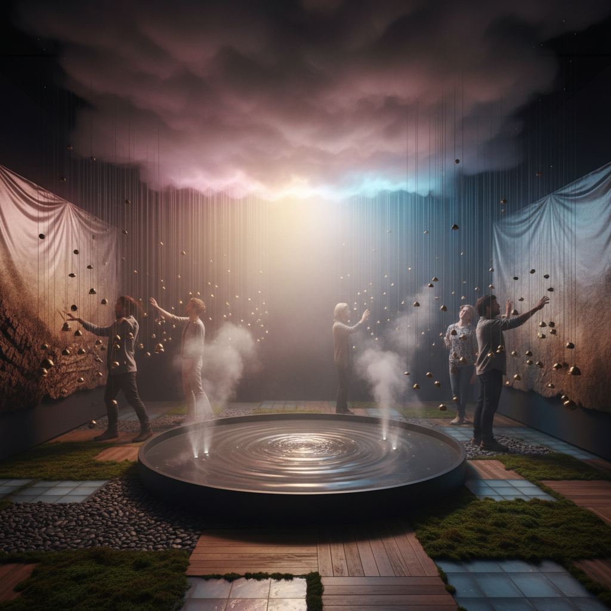

# Sensory Art 感官艺术

> "Sensory art refuses the tyranny of the eye — it insists that art can be tasted, smelled, touched, heard, and felt in the body as vibration, temperature, and pressure, that the gallery need not be a silent white box for looking but can be a total environment for experiencing, that accessibility means not just ramps and captions but fundamentally rethinking which senses art addresses, that the most profound aesthetic experiences often happen below the threshold of conscious vision, in the gut, on the skin, in the inner ear, in the memory of a smell that transports you instantly across decades." — Unknown

## 概述

感官艺术（Sensory Art）是一种强调多感官体验的艺术实践，超越视觉的主导地位，积极调动触觉、听觉、嗅觉、味觉和本体感觉。感官艺术的兴起与多个趋势相关：无障碍艺术运动（为视障人士创造可触摸的艺术）、沉浸式体验的流行、神经科学对感知的新理解、以及对"眼睛中心主义"（ocularcentrism）的批判。

感官艺术的实践范围广泛：从专为触摸设计的雕塑、到气味装置、到声音浴、到味觉表演、到温度和振动的艺术化运用。代表性的实践包括：Olafur Eliasson的环境装置（光、雾、温度）、Sissel Tolaas的气味研究、Rirkrit Tiravanija的烹饪表演、以及各种沉浸式艺术体验（如teamLab）。感官艺术也与残障艺术有密切关联——为不同感官能力的人创造平等的艺术体验。

## 核心特征

| 特征 | 描述 |
|------|------|
| 多感官 | 超越视觉的多感官 |
| 触觉 | 触觉体验的重视 |
| 沉浸 | 沉浸式的环境 |
| 身体 | 全身体的参与 |
| 无障碍 | 感官的无障碍性 |
| 体验 | 体验优先于观看 |

## 视觉特征

- **环境**：全环境的装置
- **材质**：丰富的触觉材质
- **光**：光和温度的变化
- **雾**：雾气和气味
- **水**：水和液体的使用
- **互动**：观众的身体互动

## 代表作品

| 作品 | 艺术家 | 年代 | 意义 |
|------|--------|------|------|
| *The Weather Project* | Olafur Eliasson | 2003 | 埃利亚松的人造太阳 |
| *Smell research* | Sissel Tolaas | 2000年代 | 托拉斯的气味研究 |
| *Cooking performances* | Rirkrit Tiravanija | 1990年代起 | 提拉瓦尼的烹饪 |
| *teamLab Borderless* | teamLab | 2018 | 沉浸式数字艺术 |
| *Touch tours* | Various museums | 2000年代 | 博物馆触摸导览 |

## 历史时间线

| 时期 | 事件 |
|------|------|
| 1960年代 | 感官环境的早期实验 |
| 1990年代 | 关系美学和参与式艺术 |
| 2000年代 | 沉浸式体验的兴起 |
| 2010年代 | teamLab等的全球流行 |
| 当代 | 多感官设计的主流化 |

## 中国语境

感官艺术在中国有快速的发展，特别是在沉浸式体验领域。teamLab在中国多个城市开设了永久展馆，吸引了大量观众。中国的一些本土团队也在开发类似的多感官沉浸式体验。中国传统文化中有丰富的多感官美学传统——茶道（味觉、嗅觉、触觉、视觉的综合）、香道（嗅觉的艺术化）、园林（全感官的环境设计）——这些传统为当代感官艺术提供了深厚的文化资源。中国的一些当代艺术家在探索将传统的多感官美学与当代技术结合，创造新的感官体验。

## AI生成概念图

## 与其他风格的关系

- **Installation Art** → 装置艺术
- **Immersive Art** → 沉浸式艺术
- **Sound Art** → 声音艺术
- **Light Art** → 光艺术
- **Disability Art** → 残障艺术
- **Relational Aesthetics** → 关系美学

---

*浮光艺志 | Chronicle of Artistry*
