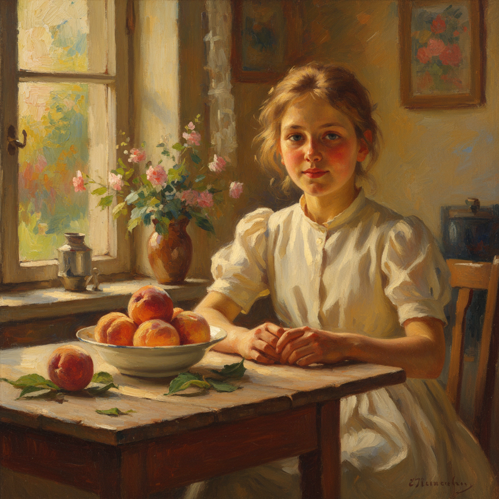

# Serov Art 谢洛夫艺术

> "I want to paint cheerful things. I will paint only cheerful things." — Valentin Serov

## 概述

谢洛夫艺术（Serov Art）是19-20世纪之交俄罗斯画家瓦连京·亚历山德罗维奇·谢洛夫（Valentin Alexandrovich Serov, 1865-1911）创立的印象主义肖像画风格。谢洛夫被誉为俄罗斯最伟大的肖像画家——他以敏锐的观察力、精湛的技法和对人物性格的深刻洞察，创作了一系列传世肖像杰作。他的艺术融合了俄罗斯现实主义传统与法国印象派的光色探索，开创了俄罗斯现代肖像画的新纪元。

谢洛夫最著名的作品《少女与桃子》（1887）描绘了一个坐在桌前的少女——阳光透过窗户洒在她的脸上和桃子上，整幅画充满了青春的活力和光的诗意。这幅画被视为俄罗斯印象主义的开山之作。他的另一杰作《骑马的尤苏波娃公主》（1905）以简洁有力的笔触捕捉了贵族女性的优雅与力量。谢洛夫晚期的作品越来越简洁和现代——预示了20世纪艺术的方向。

谢洛夫艺术的核心要素包括：1）肖像深度——对人物性格的深刻洞察；2）光色融合——印象派光色与写实的结合；3）简洁有力——越来越简洁的笔触；4）心理刻画——人物内心世界的揭示；5）现代感——预示现代艺术的简洁；6）多样性——从印象派到装饰风格的演变；7）贵族气质——对上流社会的精准描绘。

## 核心特征

| 特征 | 描述 |
|------|------|
| 肖像深度 | 对人物性格深刻洞察 |
| 光色融合 | 印象派光色与写实结合 |
| 简洁有力 | 越来越简洁的笔触 |
| 心理刻画 | 人物内心世界揭示 |
| 现代感 | 预示现代艺术简洁 |
| 多样性 | 从印象派到装饰风格 |

## 视觉特征

- **阳光人物**：阳光照射下的人物肖像
- **简洁笔触**：精准而简洁的笔触
- **色彩明亮**：明亮温暖的色调
- **眼神传神**：极其传神的眼神描绘
- **背景简化**：逐渐简化的背景处理
- **动态姿态**：自然而有生命力的姿态

## 代表作品

| 作品 | 年代 | 意义 |
|------|------|------|
| *少女与桃子* (Girl with Peaches) | 1887 | 俄罗斯印象主义开山作 |
| *阳光下的少女* (Girl in Sunlight) | 1888 | 光色的诗意 |
| *骑马的尤苏波娃公主* (Portrait of Yusupova) | 1905 | 肖像画巅峰 |
| *伊达·鲁宾斯坦* (Ida Rubinstein) | 1910 | 现代风格 |
| *欧罗巴的劫掠* (The Rape of Europa) | 1910 | 装饰风格 |
| *沙皇亚历山大三世肖像* | 1900 | 官方肖像 |

## 历史时间线

| 时期 | 事件 |
|------|------|
| 1865年 | 出生于圣彼得堡 |
| 1880-1885年 | 师从列宾学习 |
| 1887年 | 创作《少女与桃子》 |
| 1890年代 | 成为最受欢迎的肖像画家 |
| 1900-1911年 | 风格走向现代简洁 |
| 1911年 | 在莫斯科去世，年仅46岁 |

## 中国语境

谢洛夫在中国美术教育中有着重要的地位。《少女与桃子》是中国油画教学中最常被引用的肖像画范例之一——它展示了如何将印象派的光色处理与扎实的造型能力相结合。谢洛夫作为列宾的学生，代表了俄罗斯现实主义传统向现代主义过渡的关键环节——这一过渡对中国油画从苏派写实向多元化发展有重要的参考意义。他的肖像画方法——通过简洁的笔触和精准的观察捕捉人物的本质——被中国当代肖像画家广泛学习。谢洛夫证明了肖像画不仅是外貌的记录，更是性格和灵魂的揭示——这一理念深刻影响了中国当代肖像油画的创作方向。

## 概念图

## 与其他风格的关系

- **Repin** → 列宾（导师）
- **Impressionism** → 印象主义
- **Peredvizhniki** → 巡回展览画派
- **Art Nouveau** → 新艺术运动
- **Vrubel** → 弗鲁贝尔（同代人）
- **Modernism** → 现代主义（先驱）

---

*浮光艺志 | Chronicle of Artistry*
