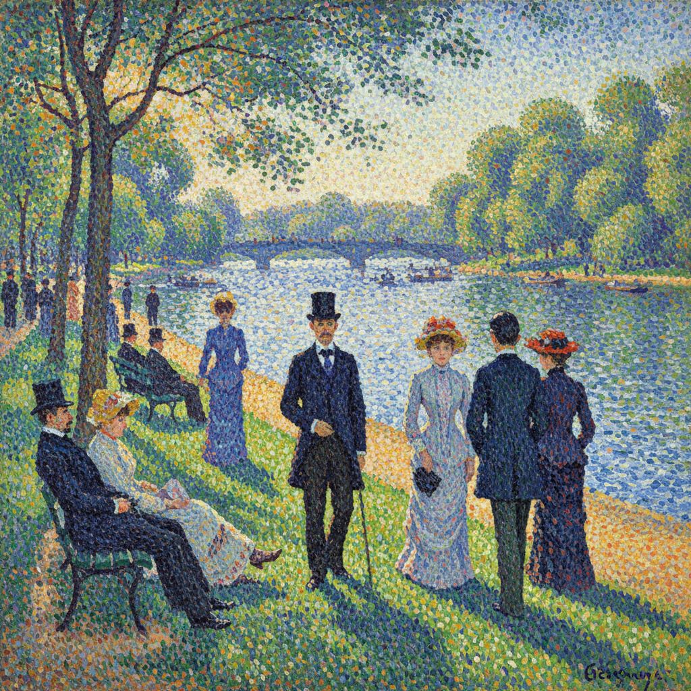

# Georges Seurat 修拉

> "Some say they see poetry in my paintings; I see only science." — Georges Seurat

## 概述

乔治·修拉（Georges Seurat，1859–1891）是法国新印象派（点彩派）的创始人，以科学化的色彩理论和精确的点状笔触彻底改变了绘画方法。他在短短31年的生命中，将印象派的直觉色彩转化为一套严格的光学系统。

修拉的革命在于：他证明了绘画可以像科学实验一样精确——每一个色点的位置、大小和色相都经过计算，在观者的视网膜上混合成预期的色彩。

## 核心特征

| 特征 | 描述 |
|------|------|
| 点彩法 | 纯色小点并置——视网膜混色 |
| 科学色彩 | 基于谢弗勒尔色彩理论的系统方法 |
| 光学混合 | 颜色在眼睛中而非调色板上混合 |
| 静态构图 | 精心计算的几何构图——冻结的时间 |
| 互补色 | 系统性地使用互补色对比 |
| 纪念碑性 | 将日常场景赋予古典的庄严感 |

## 视觉特征

- **笔触**：均匀的、规则的纯色小点
- **色彩**：光谱色的科学并置——发光效果
- **构图**：严谨的几何结构——水平与垂直
- **光线**：均匀的、弥漫的阳光
- **人物**：静止的、剪影般的——如埃及浮雕
- **氛围**：宁静的、凝固的、永恒的

## 代表作品

| 作品 | 年代 | 意义 |
|------|------|------|
| *A Sunday Afternoon on the Island of La Grande Jatte* | 1884–86 | 点彩派的宣言 |
| *Bathers at Asnières* | 1884 | 工人阶级的纪念碑 |
| *The Circus* | 1891 | 未完成的最后杰作 |
| *The Eiffel Tower* | 1889 | 现代性的象征 |
| *Models* | 1886–88 | 画室中的点彩实验 |

## 真实作品（公共领域）

| 作品 | 来源 |
|------|------|
| *La Grande Jatte* | [Art Institute Chicago](https://www.artic.edu/artworks/27992) |
| *Bathers at Asnières* | [National Gallery](https://www.nationalgallery.org.uk/paintings/georges-seurat-bathers-at-asnieres) |
| *The Circus* | [Musée d'Orsay](https://www.musee-orsay.fr/en/artworks/le-cirque-702) |

> ⚠️ 本条目优先使用真实作品。

## AI生成概念图

## 与其他风格的关系

- **Pointillism** → 点彩派的创始人
- **Impressionism** → 将印象派科学化
- **Op Art** → 光学效果影响了欧普艺术
- **Divisionism** → 分色主义的理论基础
