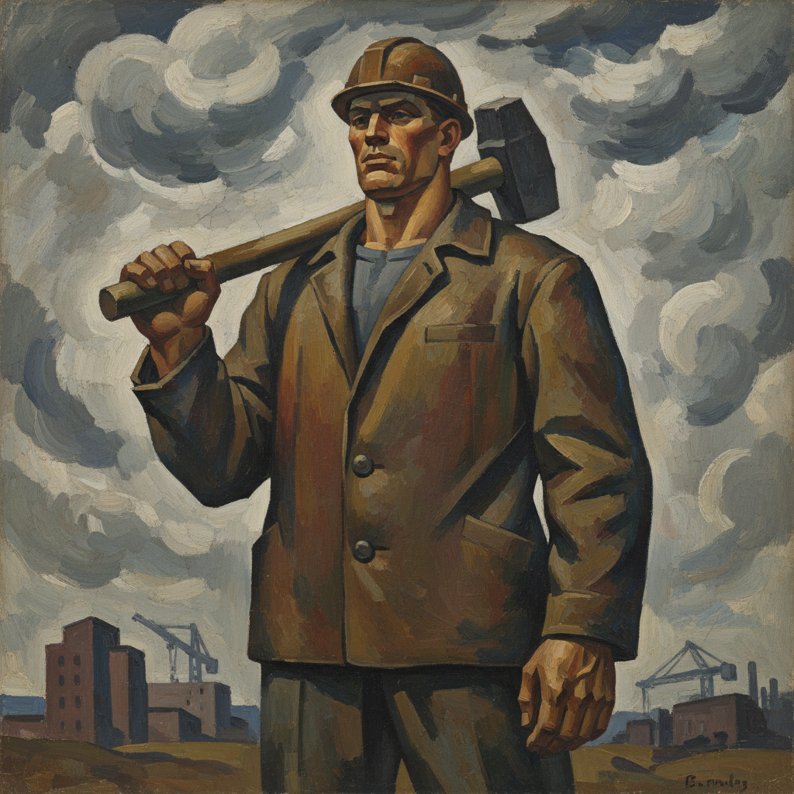

# 严厉风格 · Severe Style Art

> "我们不美化现实，我们直面它的重量。" —— 尼古拉·安德罗诺夫

## 概述

严厉风格（Severe Style / Суровый стиль）是1960年代苏联绘画中的重要艺术运动，诞生于赫鲁晓夫"解冻"时期。作为对斯大林时代粉饰太平的社会主义现实主义的反拨，严厉风格画家以简洁有力的构图、沉重的色调和英雄化的劳动者形象，表达对苏联现实的真诚关注。代表画家包括尼古拉·安德罗诺夫、帕维尔·尼科诺夫、维克托·波普科夫等。

## 核心特征

| 特征 | 描述 |
|------|------|
| 时期 | 1957年–1970年代初 |
| 地域 | 莫斯科、列宁格勒 |
| 媒介 | 油画、壁画 |
| 核心理念 | 以朴素真诚取代虚假歌颂，表达劳动的尊严与重量 |
| 色彩 | 土色、灰色、深蓝、赭石，色调沉稳厚重 |

## 视觉特征

- **简化造型**：人物形体概括有力，去除琐碎细节
- **纪念碑感**：构图庄重，人物如雕塑般矗立
- **劳动主题**：建筑工人、地质勘探者、渔民等普通劳动者
- **大面积平涂**：减少明暗过渡，强调色块对比
- **宽银幕构图**：横向展开的全景式画面

## 代表作品

| 作品 | 艺术家 | 年代 | 类型 |
|------|--------|------|------|
| 《筏工》 | 尼古拉·安德罗诺夫 | 1961 | 油画 |
| 《我们的日常面包》 | 塔季扬娜·雅布隆斯卡娅 | 1949/重绘1960s | 油画 |
| 《地质勘探者》 | 帕维尔·尼科诺夫 | 1962 | 油画 |
| 《建设者的休息》 | 维克托·波普科夫 | 1960 | 油画 |
| 《西伯利亚人》 | 维克托·伊万诺夫 | 1960s | 油画 |

## 发展时间线

| 时期 | 事件 |
|------|------|
| 1956 | 赫鲁晓夫秘密报告，文化解冻开始 |
| 1957 | 莫斯科世界青年联欢节，苏联艺术家接触西方现代艺术 |
| 1960-1962 | 严厉风格核心作品集中涌现 |
| 1962 | 马涅日展览事件，赫鲁晓夫批评前卫艺术 |
| 1960s中期 | 严厉风格成为官方认可的"进步"方向 |
| 1970s | 风格逐渐被吸收进主流社会主义现实主义 |
| 当代 | 被重新评价为苏联艺术现代化的重要节点 |

## 中国语境

严厉风格对中国油画影响深远。1960-70年代中国"红光亮"绘画与严厉风格形成鲜明对比——前者追求理想化的光明，后者追求朴素的真实。改革开放后，中国"伤痕美术"和"乡土现实主义"在精神气质上与严厉风格有共鸣，都试图以真诚的目光重新审视普通人的生存状态。罗中立《父亲》（1980）的纪念碑式构图即带有严厉风格的影响。

## AI 概念图

*AI 生成概念图：严厉风格*

## 关联词条

- [[russian-realism-art]] - 俄罗斯现实主义
- [[peredvizhniki-art]] - 巡回展览画派
- [[soviet-nonconformist-art]] - 苏联非官方艺术
- [[russian-impressionism-art]] - 俄罗斯印象主义

---

*浮光艺志 · Chronicle of Artistry*
