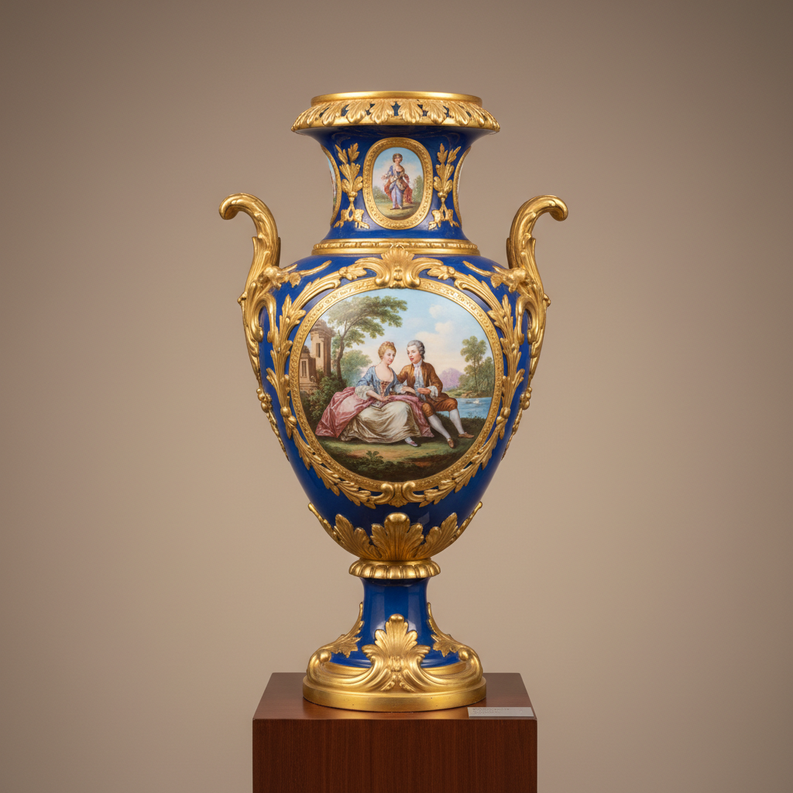

# Sevres Art 塞夫勒艺术

> "Sèvres is porcelain as royal prerogative — a factory owned by the French crown where the finest artists painted mythological scenes on bleu céleste and rose Pompadour grounds, creating objects so luxurious they served as diplomatic gifts between monarchs, each piece a statement of French cultural supremacy where craft becomes statecraft and beauty becomes power." — Unknown

## 概述

塞夫勒艺术（Sèvres Art）是法国最著名的皇家瓷器制造传统，始于1740年在万塞讷（Vincennes）建立的工厂，1756年迁至塞夫勒（Sèvres）。塞夫勒瓷器以其华丽的彩色底釉、精美的绘画装饰和奢华的金彩著称——其标志性的"天蓝色"（bleu céleste）和"蓬巴杜玫瑰色"（rose Pompadour）底釉是欧洲瓷器中最著名的色彩。塞夫勒是法国文化软实力的象征——路易十五和蓬巴杜夫人将其作为展示法国艺术优越性的工具。

塞夫勒艺术的核心要素包括：1）彩色底釉——标志性的彩色底釉；2）精美绘画——顶级画师的绘画装饰；3）奢华金彩——大量精美的金彩；4）皇家赞助——法国王室的直接赞助；5）外交礼品——作为国家外交礼品；6）软质瓷——早期为软质瓷（后转硬质）；7）艺术创新——持续的艺术创新。

## 核心特征

| 特征 | 描述 |
|------|------|
| 彩色底釉 | 标志性彩色底釉 |
| 精美绘画 | 顶级画师绘画装饰 |
| 奢华金彩 | 大量精美金彩 |
| 皇家赞助 | 法国王室直接赞助 |
| 外交礼品 | 国家外交礼品 |
| 艺术创新 | 持续艺术创新 |

## 视觉特征

- **天蓝底色**：标志性的天蓝色底釉
- **玫瑰粉色**：蓬巴杜玫瑰色
- **精美绘画**：如油画般的精美绘画
- **金彩繁复**：繁复华丽的金彩装饰
- **开光构图**：彩色底上的白色开光
- **极致奢华**：极致奢华的整体效果

## 代表作品

| 作品 | 艺术家/文化 | 年代 | 意义 |
|------|-------------|------|------|
| *天蓝色花瓶* | Sèvres | 18世纪 | 经典天蓝色 |
| *蓬巴杜玫瑰色茶具* | Sèvres | 1750年代 | 玫瑰色经典 |
| *拿破仑餐具* | Sèvres | 19世纪初 | 帝国风格 |
| *路易十六风格* | Sèvres | 18世纪末 | 新古典主义 |
| *当代塞夫勒* | Sèvres | 当代 | 当代艺术合作 |

## 历史时间线

| 时期 | 事件 |
|------|------|
| 1740年 | 万塞讷工厂建立 |
| 1756年 | 迁至塞夫勒 |
| 1759年 | 路易十五收购为皇家工厂 |
| 1768年 | 开始生产硬质瓷器 |
| 当代 | 塞夫勒国家瓷器制造厂延续 |

## 中国语境

塞夫勒与中国瓷器有复杂的历史关系。塞夫勒早期生产的是软质瓷（pâte tendre）——因为法国当时还无法烧制中国式的硬质瓷器。软质瓷虽然不如中国瓷器坚硬耐用，但其温暖的色调和对彩色底釉的亲和力反而成为了塞夫勒的优势——中国硬质瓷器很难实现塞夫勒那样均匀浓郁的彩色底釉。1768年法国发现高岭土后，塞夫勒开始生产硬质瓷器——但软质瓷的传统一直延续。塞夫勒的装饰风格完全是欧洲的——洛可可、新古典主义、帝国风格等，与中国审美截然不同。塞夫勒代表了欧洲瓷器从模仿中国走向完全独立的最终阶段——它证明了欧洲可以创造出与中国瓷器完全不同但同样伟大的陶瓷艺术。

## AI生成概念图

## 与其他风格的关系

- **Meissen** → 迈森
- **Limoges** → 利摩日
- **Rococo** → 洛可可
- **Neoclassicism** → 新古典主义
- **French Court Art** → 法国宫廷艺术
- **Soft-Paste Porcelain** → 软质瓷

---

*浮光艺志 | Chronicle of Artistry*
