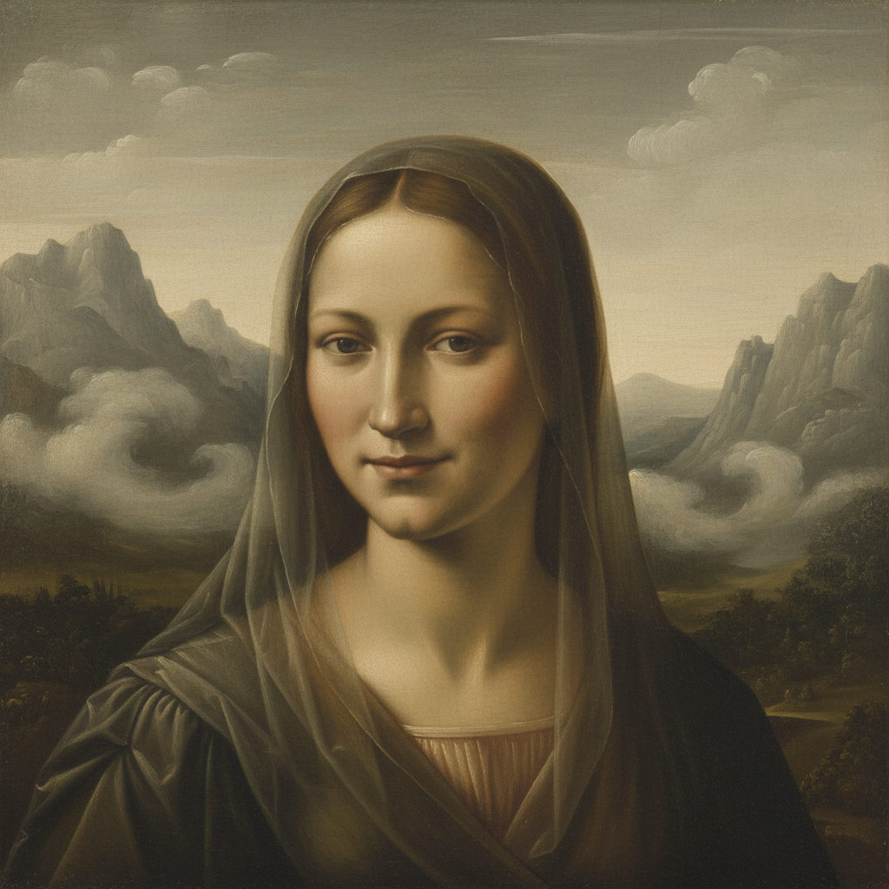

# Sfumato Painting 晕涂法绘画

> **时期：** 15世纪末–至今  
> **关键词：** 达芬奇、朦胧边界、烟雾般过渡、柔焦效果、神秘感

## 概述

Sfumato Painting（晕涂法绘画，意大利语"sfumare"意为如烟般消散）是达芬奇发明并完善的绘画技法——通过极其细腻的色调渐变让轮廓线消失，使形体之间的边界如同被薄雾笼罩。蒙娜丽莎嘴角那抹若有若无的微笑，正是晕涂法的极致体现：你越是注视，越是无法确定那条线在哪里。这种"无边界"的处理赋予画面一种梦幻般的神秘感。

## 风格特征

- **消融轮廓**：没有清晰可辨的边界线
- **烟雾过渡**：色调之间极其柔和的渐变
- **多层薄涂**：数十层透明颜料的叠加
- **朦胧氛围**：如同透过薄纱观看
- **神秘感**：模糊性带来的心理暗示

## 代表人物与作品

- 列奥纳多·达芬奇《蒙娜丽莎》《岩间圣母》
- 柯雷乔 穹顶壁画
- 安德烈亚·德尔·萨托 圣母像
- 乔尔乔内《暴风雨》

## 概念图

