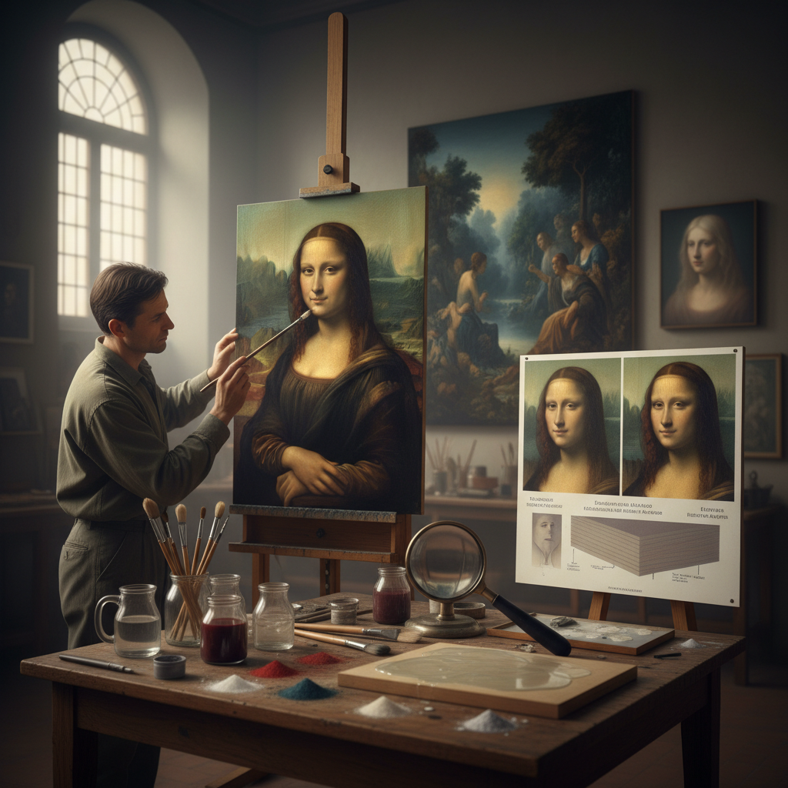

# Sfumato Technique 晕涂法

> "Sfumato is painting without edges — colors and tones blending into one another like smoke dissolving into air, boundaries between light and shadow so gradual they become invisible, creating forms that seem to breathe and shift as you look at them, the technique that gave the Mona Lisa her mysterious smile by refusing to commit to any single expression, leaving the viewer's eye to complete what the painter's brush deliberately left unresolved." — Unknown

## 概述

晕涂法（Sfumato），来自意大利语"sfumare"（如烟般消散），是一种通过极其细微和渐进的色调过渡来消除轮廓线和硬边缘的绘画技法。Sfumato的核心是让颜色和明暗之间的过渡如此柔和，以至于看不到任何明确的边界——形体仿佛笼罩在一层薄雾中。

Sfumato是列奥纳多·达·芬奇（Leonardo da Vinci）最著名的技法贡献——他在《蒙娜丽莎》中将sfumato运用到了极致。达芬奇通过叠加数十层极薄的半透明油彩罩染层来实现sfumato效果——每一层都极其稀薄，需要等待完全干燥后才能涂下一层。科学分析表明，《蒙娜丽莎》的面部有多达30-40层极薄的颜料层。Sfumato使蒙娜丽莎的嘴角和眼角处于一种模糊的状态——观者无法确定她是否在微笑，这正是这幅画神秘感的来源。

## 核心特征

| 特征 | 描述 |
|------|------|
| 无边缘 | 消除硬边缘和轮廓 |
| 渐变 | 极其柔和的色调渐变 |
| 薄层 | 多层极薄的罩染 |
| 烟雾感 | 如烟般的朦胧效果 |
| 神秘 | 创造神秘的氛围 |
| 达芬奇 | 达芬奇的标志技法 |

## 视觉特征

- **柔和**：极其柔和的过渡
- **朦胧**：朦胧的烟雾感
- **无边**：看不到明确的边缘
- **神秘**：神秘的氛围
- **深度**：大气透视的深度
- **活力**：形体似乎在呼吸

## 代表作品

| 作品 | 艺术家 | 年代 | 意义 |
|------|--------|------|------|
| *Mona Lisa* | Leonardo da Vinci | 1503-1519 | 蒙娜丽莎的sfumato |
| *Virgin of the Rocks* | Leonardo da Vinci | 1483-1486 | 岩间圣母的sfumato |
| *Saint John the Baptist* | Leonardo da Vinci | 约1513-1516 | 施洗者约翰 |
| *La Belle Ferronnière* | Leonardo da Vinci | 约1490 | 美丽的费隆妮叶 |
| *Correggio paintings* | Correggio | 16世纪 | 柯雷乔的sfumato |

## 历史时间线

| 时期 | 事件 |
|------|------|
| 15世纪末 | 达芬奇发展sfumato技法 |
| 16世纪 | Sfumato在意大利的传播 |
| 巴洛克 | Sfumato的变体应用 |
| 19世纪 | 学院派对sfumato的研究 |
| 当代 | Sfumato的科学分析和复兴 |

## 中国语境

晕涂法在中国的西方绘画教育中是重要的古典技法知识。中国的美术院校在教授文艺复兴绘画技法时会详细讲解sfumato。中国的一些写实油画家在创作中借鉴sfumato技法。有趣的是，中国传统绘画中的"没骨法"（不用轮廓线，直接用色彩渲染）与sfumato有美学上的相通之处——都追求消除硬边缘、让形体自然融入背景。中国画中的"烟云"表现也与sfumato的"如烟"理念相呼应。

## AI生成概念图

## 与其他风格的关系

- **Leonardo da Vinci** → 达芬奇
- **Chiaroscuro** → 明暗法
- **Glazing** → 罩染
- **Oil Painting** → 油画
- **Renaissance** → 文艺复兴
- **Atmospheric Perspective** → 大气透视

---

*浮光艺志 | Chronicle of Artistry*
