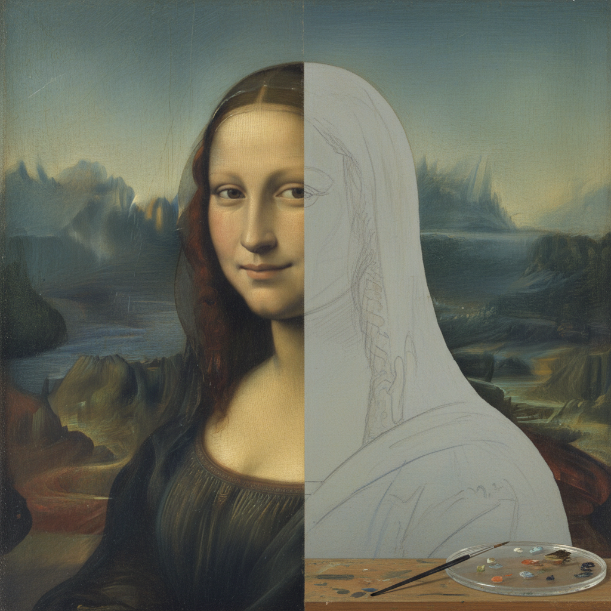

# Sfumato 晕涂法

> "Sfumato — without lines or borders, in the manner of smoke." — Leonardo da Vinci

## 概述

晕涂法（Sfumato，意大利语"如烟般消散"之意）是文艺复兴时期由达·芬奇发展到极致的绘画技法。它通过极其微妙的色调渐变，使轮廓线完全消失，形体之间的边界如同烟雾般柔和地融合在一起——没有可见的笔触，没有硬边，只有无穷细腻的过渡。

这一技法的巅峰之作是《蒙娜丽莎》——她嘴角和眼角的模糊处理创造了那个永恒的、难以捉摸的微笑。科学分析表明，达·芬奇在某些区域叠加了多达30层极薄的透明色层来实现这一效果。

## 核心特征

| 特征 | 描述 |
|------|------|
| 无边界 | 轮廓线完全消失，形体如烟般融合 |
| 极薄色层 | 多达数十层极薄的透明/半透明色层 |
| 柔和过渡 | 从亮到暗的无穷细腻渐变 |
| 大气感 | 创造空气包裹物体的感觉 |
| 神秘感 | 模糊的边界产生难以捉摸的表情 |
| 无笔触 | 完全看不到笔触痕迹 |

## 视觉特征

- **边缘**：所有边缘都是柔和的、渐变的
- **表面**：如瓷器般光滑，看不到任何笔触
- **光影**：从亮到暗的无限细腻过渡
- **色彩**：微妙的冷暖变化，常偏向蓝灰色调
- **大气**：远处物体更加模糊（大气透视）
- **表情**：面部表情因模糊而产生多义性

## 代表人物

| 画家 | Sfumato 应用 | 时期 |
|------|-------------|------|
| Leonardo da Vinci | 《蒙娜丽莎》、《岩间圣母》 | 盛期文艺复兴 |
| Correggio | 柔和的宗教画 | 帕尔马画派 |
| Andrea del Sarto | "无瑕疵的画家" | 佛罗伦萨 |
| Giorgione | 《暴风雨》的神秘大气 | 威尼斯画派 |

## 技法要点

| 步骤 | 描述 |
|------|------|
| 1. 底层 | 精确的素描底稿和灰色底层 |
| 2. 薄涂 | 极薄的透明色层，每层干燥后再加下一层 |
| 3. 融合 | 用极软的笔或手指轻轻融合边缘 |
| 4. 重复 | 反复叠加数十层，逐步建立深度 |
| 5. 耐心 | 整个过程可能需要数年 |

## 与其他技法的关系

- **Chiaroscuro** → Sfumato 是明暗法的极致柔化版本
- **Glazing** → 多层透明罩染是实现 Sfumato 的核心手段
- **Scumbling** → 擦涂法可产生类似的柔和效果
- **Grisaille** → 灰色底层是 Sfumato 的基础
- **Atmospheric Perspective** → Sfumato 是大气透视的微观应用

## 概念图

---

*浮光艺志 | Chronicle of Artistry*
