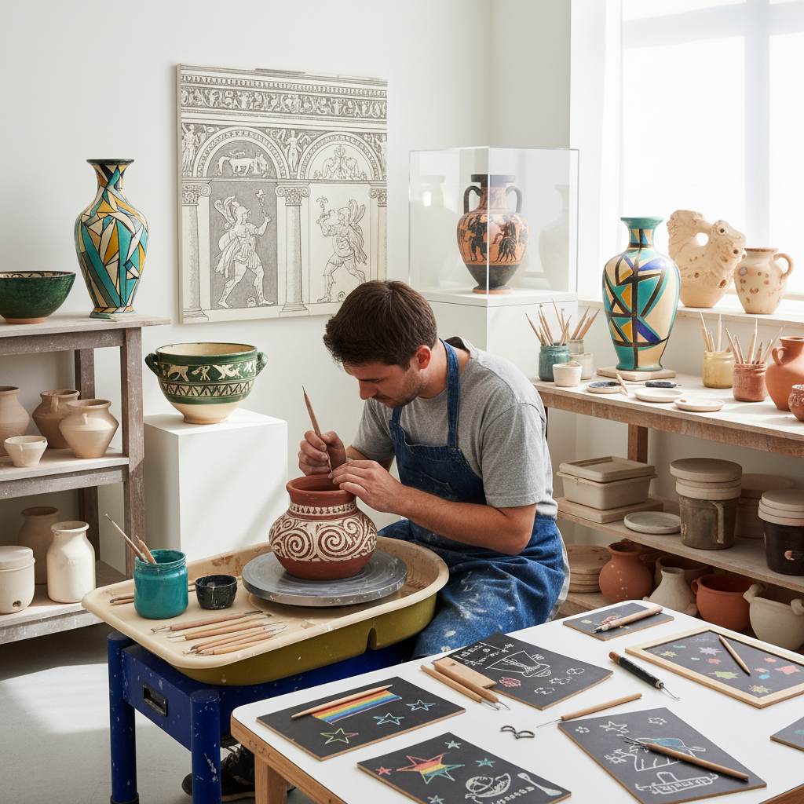

# Sgraffito Art 刮画

> "Sgraffito is revelation through removal — scratching through a layer of color to expose what lies beneath, the artist's tool becoming an eraser that draws by uncovering rather than adding, each line a small act of archaeology that reveals the hidden layer like scraping frost from a window to let light through, creating images where the negative space does the speaking." — Unknown

## 概述

刮画（Sgraffito），来自意大利语"sgraffiare"（刮擦），是一种通过刮去表层材料来露出底层不同颜色材料的装饰技法。Sgraffito可以应用于多种媒介：陶瓷（刮去表层釉料露出胎体颜色）、建筑（刮去表层灰泥露出底层不同颜色的灰泥）、绘画（刮去表层颜料露出底层颜色）和蜡笔画（刮去黑色蜡笔层露出底层彩色蜡笔）。

Sgraffito在建筑装饰中有悠久的历史——文艺复兴时期的意大利建筑外墙大量使用sgraffito装饰。在陶瓷中，sgraffito是最古老的装饰技法之一——从古希腊陶器到当代陶艺都有应用。Sgraffito的核心美学是"减法"——通过去除来创造，通过揭示来表达。

## 核心特征

| 特征 | 描述 |
|------|------|
| 刮除 | 刮去表层材料 |
| 揭示 | 揭示底层颜色 |
| 减法 | 减法的创作方式 |
| 对比 | 两层颜色的对比 |
| 线条 | 刮出的线条图案 |
| 多媒介 | 适用于多种媒介 |

## 视觉特征

- **对比**：两层颜色的对比
- **线条**：刮出的线条质感
- **图案**：装饰性的图案
- **质朴**：质朴的手工感
- **层次**：层次的揭示
- **直接**：直接的表现力

## 代表作品

| 作品 | 艺术家 | 年代 | 意义 |
|------|--------|------|------|
| *Renaissance sgraffito facades* | 意大利建筑师 | 15-16世纪 | 文艺复兴建筑刮画 |
| *Greek sgraffito pottery* | 古希腊陶工 | 公元前6-4世纪 | 古希腊刮画陶器 |
| *Islamic sgraffito ceramics* | 伊斯兰陶工 | 9-13世纪 | 伊斯兰刮画陶瓷 |
| *Contemporary sgraffito ceramics* | Various | 当代 | 当代刮画陶瓷 |
| *Sgraffito wall art* | Various | 当代 | 当代刮画壁画 |

## 历史时间线

| 时期 | 事件 |
|------|------|
| 古代 | 陶器刮画的起源 |
| 中世纪 | 伊斯兰刮画陶瓷的发展 |
| 文艺复兴 | 建筑刮画装饰的鼎盛 |
| 19-20世纪 | 刮画在艺术教育中的应用 |
| 当代 | 刮画的多元化发展 |

## 中国语境

刮画在中国有相关的传统和广泛的应用。中国的传统陶瓷中有"剔花"技法——在施釉的陶瓷表面刮去部分釉料露出胎体，与sgraffito完全相同。中国的磁州窑（宋代）以剔花装饰著称。中国的儿童美术教育中广泛使用"刮画"（在黑色蜡笔层下刮出彩色图案）作为创意活动。中国的一些当代陶艺家在创作中使用sgraffito技法。中国的建筑装饰中也有类似sgraffito的灰塑刮画传统。

## AI生成概念图

## 与其他风格的关系

- **Ceramics** → 陶瓷
- **Architecture** → 建筑装饰
- **Engraving** → 雕刻
- **Scratchboard** → 刮板画
- **Relief** → 浮雕
- **Folk Art** → 民间艺术

---

*浮光艺志 | Chronicle of Artistry*
