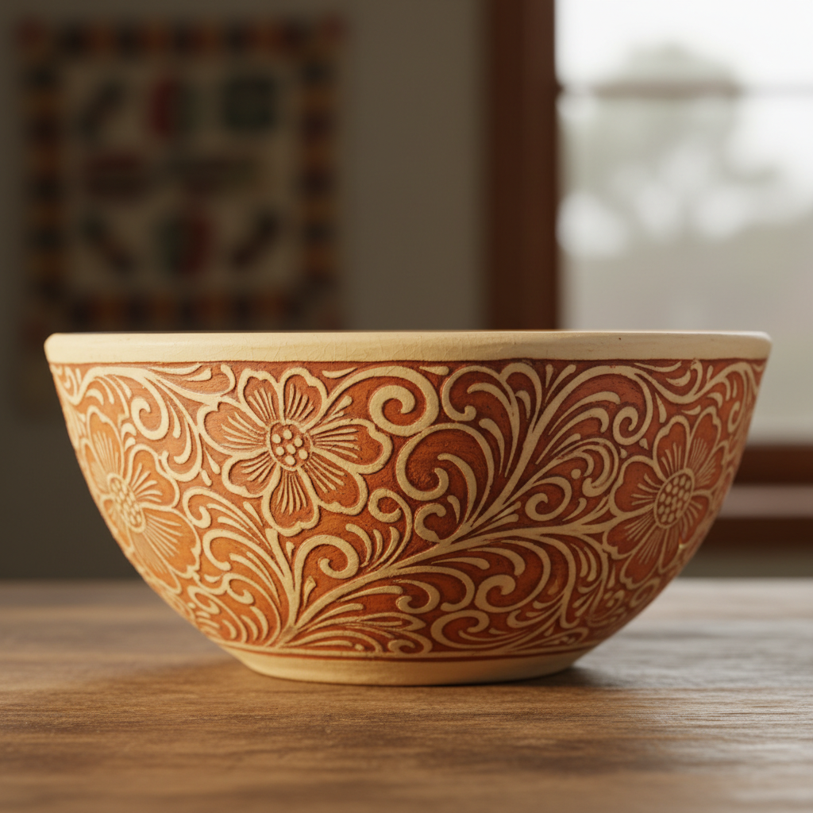

# Sgraffito Ceramic Art 刮花陶瓷艺术

> "Sgraffito ceramics is drawing by subtraction — a layer of colored slip is applied over a contrasting clay body, then scratched through with a pointed tool to reveal the color beneath, creating designs that have the spontaneous energy of a sketch combined with the permanence of fired clay, each line a small excavation that exposes the hidden ground." — Unknown

## 概述

刮花陶瓷艺术（Sgraffito Ceramic Art）是一种在陶瓷表面通过刮除表层来露出底层颜色的装饰技法——先在陶坯上涂一层与坯体颜色不同的化妆土（slip），然后用尖锐工具刮除部分表层，露出底层的颜色形成图案。刮花技法以其线条的自由流畅和色彩的强烈对比著称，是世界各地陶瓷传统中广泛使用的装饰方法。

刮花陶瓷艺术的实践包括：1）施化妆土——在坯体上涂一层对比色化妆土；2）刮花——用尖锐工具刮除表层；3）线条——刮出线条形成图案；4）面积——刮除大面积露出底色；5）多层——多层化妆土的刮花；6）釉下——在刮花后施透明釉烧制；7）当代刮花——将传统技法与现代创作结合。

## 核心特征

| 特征 | 描述 |
|------|------|
| 刮除 | 刮除表层露出底色 |
| 对比 | 两种颜色的对比 |
| 线条 | 自由流畅的线条 |
| 即兴 | 即兴的创作感 |
| 古老 | 古老的世界性技法 |
| 直接 | 直接的表现方式 |

## 视觉特征

- **对比**：强烈的色彩对比
- **线条**：自由流畅的刮花线条
- **质感**：刮花的凹凸质感
- **即兴**：即兴素描般的感觉
- **图案**：装饰性的图案
- **质朴**：质朴的陶瓷质感

## 代表作品

| 作品 | 艺术家/文化 | 年代 | 意义 |
|------|-------------|------|------|
| *Byzantine sgraffito ware* | 拜占庭 | 10-12世纪 | 拜占庭刮花陶 |
| *Italian Renaissance sgraffito* | 意大利 | 15-16世纪 | 意大利文艺复兴刮花陶 |
| *English slipware sgraffito* | 英国 | 17世纪 | 英国化妆土刮花陶 |
| *Bernard Leach sgraffito* | 英国 | 20世纪 | 伯纳德·利奇刮花陶 |
| *Contemporary sgraffito* | 国际 | 当代 | 当代刮花陶瓷 |

## 历史时间线

| 时期 | 事件 |
|------|------|
| 古代 | 刮花技法的早期使用 |
| 10世纪 | 拜占庭刮花陶的发展 |
| 文艺复兴 | 意大利刮花陶的高峰 |
| 20世纪 | 工作室陶艺中的复兴 |
| 当代 | 刮花技法的广泛实践 |

## 中国语境

刮花陶瓷在中国有悠久的传统。中国的磁州窑——以其精美的刮花装饰著称，是中国刮花陶瓷的代表。中国的宋代陶瓷——磁州窑系的刮花技法达到了很高的艺术水平。中国的吉州窑——也有精美的刮花装饰。中国当代的陶艺家——广泛使用刮花技法进行创作。中国的陶瓷教育中，刮花作为基本的装饰技法——在各大陶瓷院校中教授。中国的民间陶瓷——在各地都有刮花装饰的传统。

## AI生成概念图

## 与其他风格的关系

- **Slip Decoration** → 化妆土装饰
- **Sgrafitto** → 建筑刮花
- **Ceramic Art** → 陶瓷艺术
- **Folk Pottery** → 民间陶器
- **Studio Pottery** → 工作室陶艺
- **Cizhou Ware** → 磁州窑

---

*浮光艺志 | Chronicle of Artistry*
