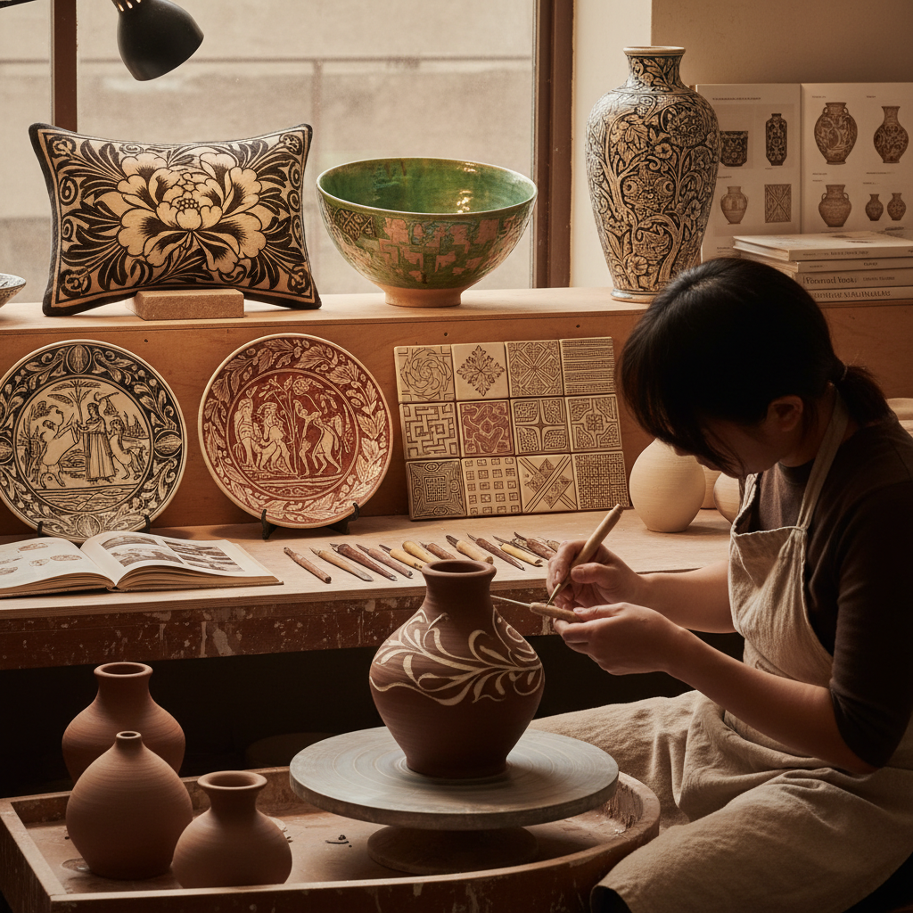

# Sgraffito Ceramics 陶瓷刮花装饰

> "Sgraffito in ceramics is drawing with absence — scratching through a layer of colored slip to reveal the contrasting clay beneath, creating images that are simultaneously carved and painted, negative and positive." — Unknown

## 概述

陶瓷刮花装饰（Sgraffito Ceramics）是一种在陶瓷表面进行装饰的技法——将一层有色泥浆（slip/化妆土）涂覆在陶坯表面，待半干后用尖锐工具刮去部分泥浆层，露出下面不同颜色的坯体，形成图案和纹饰。"Sgraffito"源自意大利语"sgraffiare"（刮擦），与建筑中的灰泥刮花（sgraffito painting）同源但应用于陶瓷领域。

陶瓷刮花装饰的历史极为悠久——在中国、伊斯兰世界、欧洲中世纪和文艺复兴时期都有丰富的传统。中国的磁州窑系统以其精美的刮花装饰闻名于世。伊斯兰陶瓷中的刮花装饰发展出极其复杂的几何和植物纹样。当代陶艺家将刮花装饰发展为精细的绘画性表现——从简单的线条到复杂的叙事性图像。

## 核心特征

| 特征 | 描述 |
|------|------|
| 刮擦 | 刮去表层露出底色 |
| 对比 | 两层颜色的对比 |
| 线条 | 线条性的表现 |
| 装饰 | 表面装饰技法 |
| 古老 | 极其古老的技法 |
| 全球 | 全球性的传统 |

## 视觉特征

- **对比**：两色的强烈对比
- **线条**：刮刻的线条
- **图案**：装饰性图案
- **质感**：刮刻的质感
- **层次**：表层与底层的层次
- **手工**：手工刮刻的痕迹

## 代表作品

| 作品 | 艺术家 | 年代 | 意义 |
|------|--------|------|------|
| *磁州窑刮花瓷器* | 中国工匠 | 宋-元 | 中国刮花传统 |
| *Islamic sgraffito ware* | 伊斯兰工匠 | 中世纪 | 伊斯兰刮花陶器 |
| *Italian sgraffito maiolica* | 意大利工匠 | 文艺复兴 | 意大利刮花传统 |
| *Contemporary sgraffito* | Various | 当代 | 当代刮花陶艺 |
| *Narrative sgraffito vessels* | Various | 当代 | 叙事性刮花作品 |

## 历史时间线

| 时期 | 事件 |
|------|------|
| 古代 | 早期刮花装饰的出现 |
| 宋代 | 中国磁州窑刮花的鼎盛 |
| 中世纪 | 伊斯兰刮花陶器的发展 |
| 文艺复兴 | 欧洲刮花陶器的传统 |
| 20世纪 | 工作室陶艺中的刮花复兴 |
| 当代 | 当代陶艺中的刮花创新 |

## 中国语境

陶瓷刮花装饰在中国有极其辉煌的历史——中国的磁州窑系统是世界上最重要的刮花陶瓷传统之一。磁州窑的白地黑花刮花装饰以其大胆的构图和流畅的线条闻名。中国的其他窑口（如吉州窑、耀州窑）也有刮花装饰传统。中国的当代陶艺教育中，刮花装饰是重要的表面装饰技法之一。中国的当代陶艺家在传承磁州窑传统的基础上进行创新。

## AI生成概念图

## 与其他风格的关系

- **Sgraffito Painting** → 灰泥刮花
- **Slip Trailing** → 泥浆拖线
- **Ceramic Glazing** → 陶瓷施釉
- **Cizhou Ware** → 磁州窑
- **Majolica** → 马约利卡
- **Engobe** → 化妆土装饰

---

*浮光艺志 | Chronicle of Artistry*
