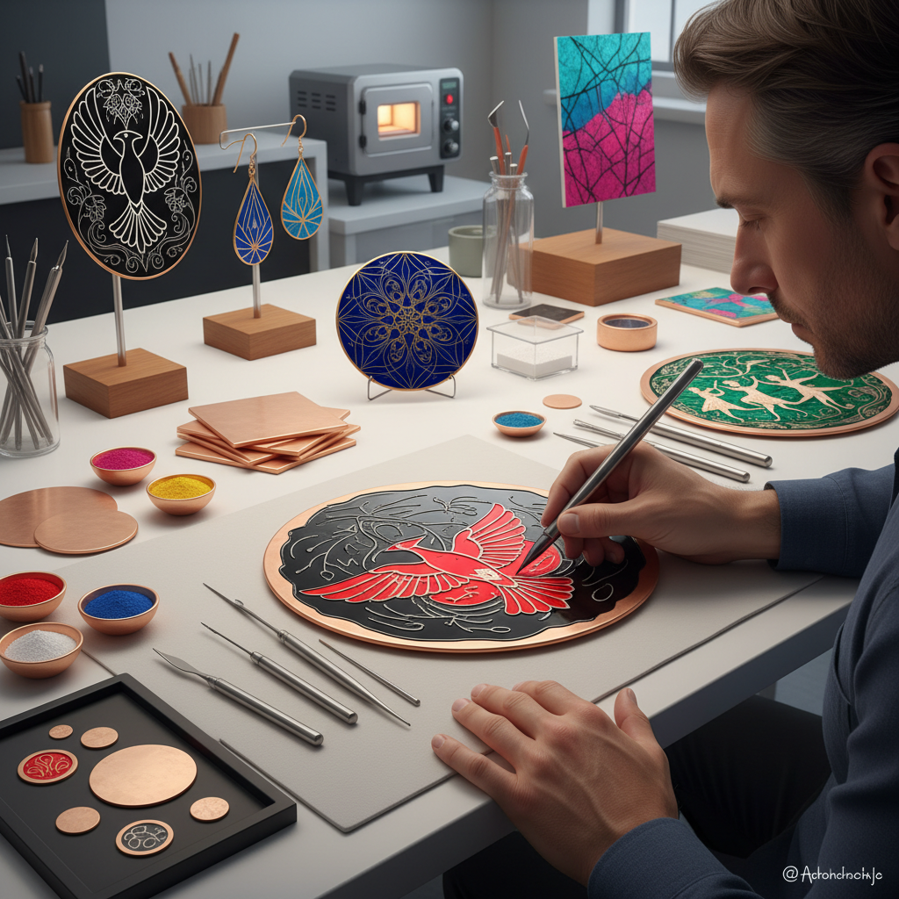

# Sgraffito Enamel 刮花珐琅

> "Sgraffito enamel is revelation through removal — the artist covers fired enamel with a contrasting layer, then scratches through to expose the color beneath, drawing with absence to create images of startling graphic clarity." — Unknown

## 概述

刮花珐琅（Sgraffito Enamel）是将Sgraffito（刮花/刻花）技法应用于珐琅工艺的装饰方法。基本过程是：先在金属基体上烧制一层珐琅（底色），然后在其上施加一层对比色的珐琅（通常是不透明的），在第二层珐琅未烧制或刚烧制时，用尖锐工具刮去部分表层，露出下方的底色，形成图案。

Sgraffito一词来自意大利语"sgraffiare"（刮擦），这种技法在陶瓷中有着悠久的历史——在珐琅中的应用则是将同样的原理移植到玻璃质珐琅层上。珐琅Sgraffito可以创造出极其精细的线条和图案——因为珐琅层很薄，刮花工具可以精确控制。这种技法特别适合创造图形化的、线条感强的设计。

## 核心特征

| 特征 | 描述 |
|------|------|
| 刮花 | 刮去表层露出底色 |
| 对比 | 两层对比色 |
| 线条 | 精细的线条效果 |
| 图形 | 图形化的设计 |
| 精确 | 精确的控制 |
| 混合 | 珐琅与刮花的结合 |

## 视觉特征

- **线条**：精细的刮花线条
- **对比**：强烈的色彩对比
- **图形**：图形化的视觉
- **精细**：精细的细节
- **层次**：两层色彩的层次
- **现代**：现代感的设计

## 代表作品

| 作品 | 艺术家 | 年代 | 意义 |
|------|--------|------|------|
| *Sgraffito enamel jewelry* | Various | 当代 | 刮花珐琅首饰 |
| *Sgraffito enamel panels* | Various | 当代 | 刮花珐琅面板 |
| *Mixed technique enamel* | Various | 当代 | 混合技法珐琅 |
| *Graphic sgraffito enamel* | Various | 当代 | 图形刮花珐琅 |
| *Experimental sgraffito* | Various | 当代 | 实验性刮花珐琅 |

## 历史时间线

| 时期 | 事件 |
|------|------|
| 古代 | Sgraffito在陶瓷中的起源 |
| 中世纪 | 意大利Sgraffito陶器 |
| 20世纪 | Sgraffito应用于珐琅 |
| 1960s | 工作室珐琅运动 |
| 当代 | Sgraffito珐琅在首饰中的流行 |
| 当代 | 当代珐琅艺术家的创新应用 |

## 中国语境

刮花珐琅在中国的珐琅艺术领域相对小众——中国传统珐琅以掐丝珐琅和画珐琅为主，Sgraffito技法较少使用。但中国的一些当代珐琅艺术家和首饰设计师开始尝试Sgraffito珐琅——这种技法的图形化效果符合当代设计的审美。中国的陶瓷传统中有丰富的Sgraffito（刻花）经验——如磁州窑的刻花装饰，这些经验可以移植到珐琅领域。

## AI生成概念图

## 与其他风格的关系

- **Sgraffito (Ceramics)** → 陶瓷刮花
- **Enameling** → 珐琅工艺
- **Painted Enamel** → 画珐琅
- **Graphic Design** → 图形设计
- **Printmaking** → 版画
- **Jewelry Making** → 首饰制作

---

*浮光艺志 | Chronicle of Artistry*
