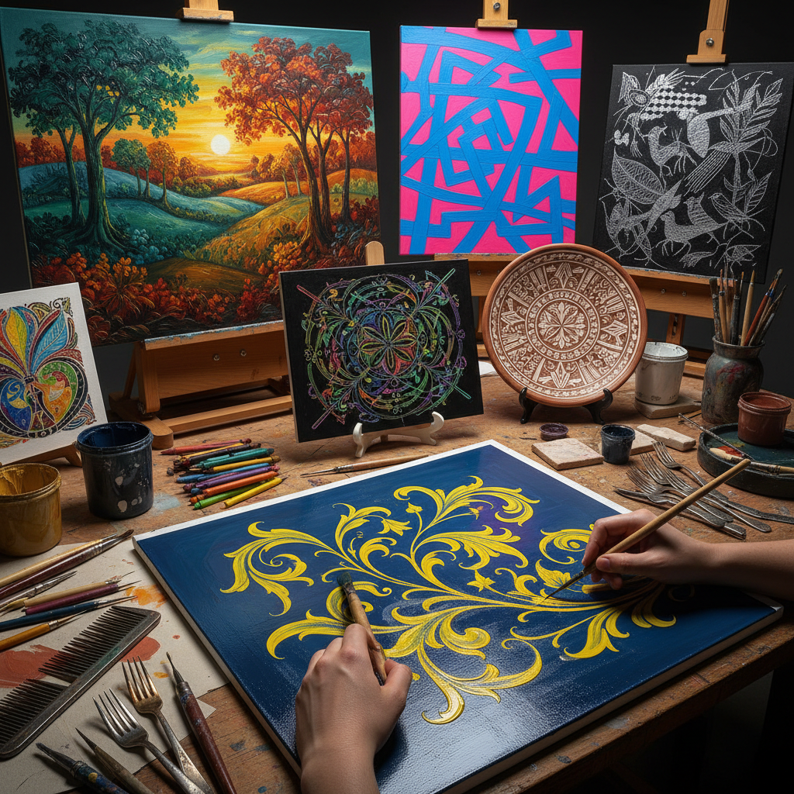

# Sgraffito Painting 刮花画

> "Sgraffito in painting is revelation through removal — scratching through a wet layer of color to expose what lies beneath, the artist draws not by adding but by taking away, creating lines of light from the darkness above." — Unknown

## 概述

刮花画（Sgraffito Painting）是一种通过刮擦湿润的颜料层来露出底层颜色的绘画技法。"Sgraffito"源自意大利语"sgraffiare"（刮擦）。在绘画中，艺术家先涂一层颜色，然后在其上涂另一层不同颜色的颜料，趁上层颜料未干时用尖锐工具（如笔杆末端、牙签、梳子、叉子等）刮擦出图案——露出底层的颜色。

刮花画可以用于多种媒介——油画、丙烯画、蜡笔画和陶瓷装饰。在油画中，刮花画可以创造精细的线条和纹理效果。在儿童美术教育中，蜡笔刮花画（先涂彩色蜡笔，再覆盖黑色蜡笔或墨水，然后刮出图案）是经典的创意活动。刮花画的魅力在于"减法"思维——通过去除而非添加来创造图像。

## 核心特征

| 特征 | 描述 |
|------|------|
| 刮擦 | 刮擦上层颜料 |
| 露底 | 露出底层颜色 |
| 减法 | 减法式的创作 |
| 线条 | 产生线条效果 |
| 多媒介 | 适用于多种媒介 |
| 即时 | 需要趁湿操作 |

## 视觉特征

- **线条**：刮擦产生的线条
- **对比**：上下层颜色的对比
- **纹理**：丰富的纹理效果
- **精细**：可以非常精细
- **动态**：动态的线条感
- **层次**：明确的层次关系

## 代表作品

| 作品 | 艺术家 | 年代 | 意义 |
|------|--------|------|------|
| *Sgraffito oil paintings* | Various | 当代 | 油画刮花 |
| *Ceramic sgraffito* | Various | 传统 | 陶瓷刮花 |
| *Wax crayon sgraffito* | Various | 当代 | 蜡笔刮花 |
| *Mixed media sgraffito* | Various | 当代 | 混合媒介刮花 |
| *Architectural sgraffito* | Various | 文艺复兴 | 建筑刮花装饰 |

## 历史时间线

| 时期 | 事件 |
|------|------|
| 古代 | 陶瓷刮花装饰的早期使用 |
| 文艺复兴 | 建筑外墙刮花装饰的流行 |
| 19世纪 | 绘画中刮花技法的发展 |
| 20世纪 | 现代艺术中的刮花应用 |
| 当代 | 儿童美术教育中的蜡笔刮花 |
| 当代 | 当代艺术中的刮花创新 |

## 中国语境

刮花画在中国的美术教育中有广泛的应用——特别是在儿童美术教育中。中国的儿童美术课程中，蜡笔刮花画是经典的创意活动之一。中国的陶瓷传统中也有刮花装饰（如磁州窑的刮花技法）。中国的当代艺术家使用刮花技法创作具有独特纹理的作品。刮花画的"减法思维"与中国传统美学中的"留白"有某种精神上的联系。

## AI生成概念图

## 与其他风格的关系

- **Grattage** → 刮擦法
- **Sgraffito Enamel** → 刮花珐琅
- **Impasto** → 厚涂
- **Oil Painting** → 油画
- **Ceramic Decoration** → 陶瓷装饰
- **Children's Art** → 儿童美术

---

*浮光艺志 | Chronicle of Artistry*
