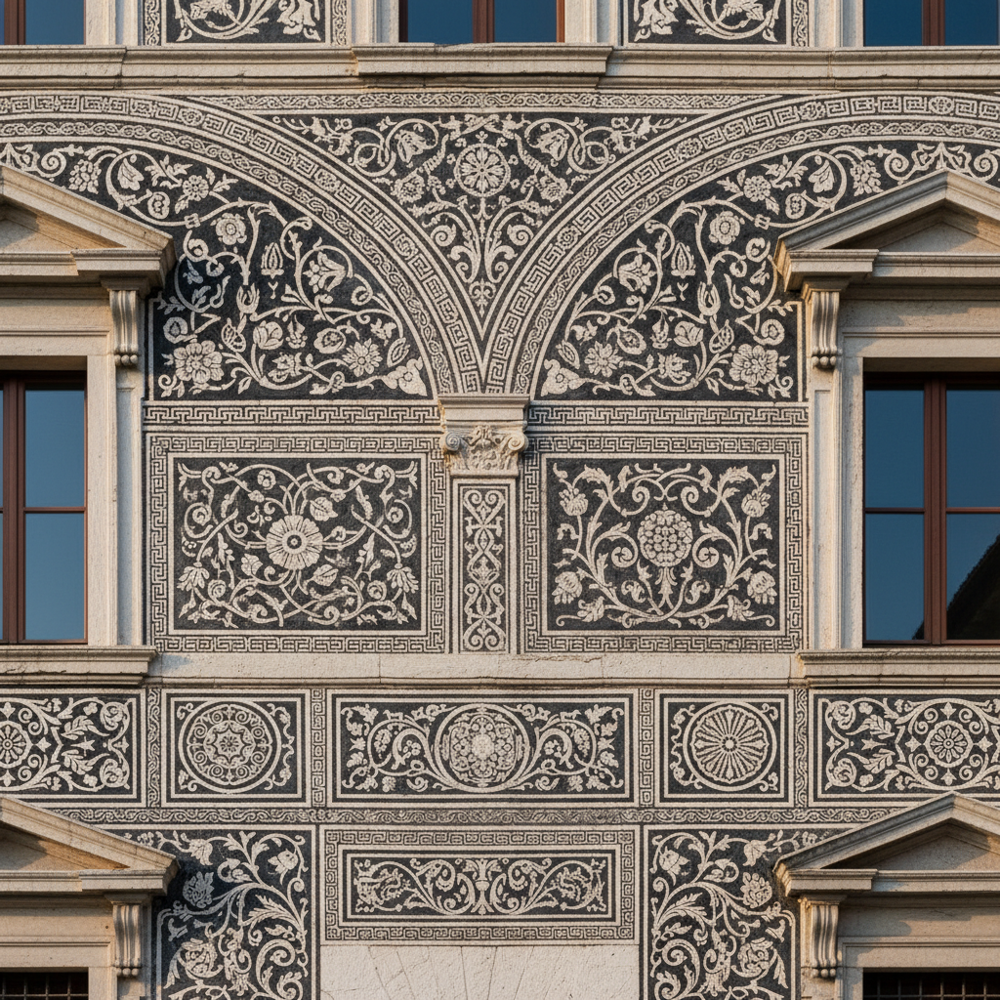

# Sgraffito 刮画法

> "To scratch is to reveal." — Traditional saying

## 概述

刮画法（Sgraffito，源自意大利语"sgraffiare"，意为"刮擦"）是一种通过刮去表层露出底层色彩的装饰技法。它广泛应用于陶瓷、壁画、玻璃和绘画中，历史可追溯至古希腊陶器。

刮画法的魅力在于"减法"——不是添加颜料，而是去除表层来创造图案，这种逆向思维产生了独特的线条质感和层次效果。

## 核心特征

| 特征 | 描述 |
|------|------|
| 减法技法 | 刮去表层露出底层 |
| 双层结构 | 至少两层不同颜色的叠加 |
| 线条锐利 | 刮刻产生的精确线条 |
| 多媒介 | 陶瓷、壁画、绘画、玻璃 |
| 建筑装饰 | 文艺复兴建筑外墙的常见技法 |
| 不可逆 | 刮去即不可恢复——需要精确控制 |

## 视觉特征

- **线条**：锐利的、刻入的线条——非画出的
- **层次**：底层色彩从表层中透出
- **质感**：粗糙的、有触感的表面
- **对比**：深色表层与浅色底层的对比
- **图案**：几何、花卉、叙事场景
- **材质感**：可见的物理刮痕

## 代表作品

| 作品 | 年代 | 意义 |
|------|------|------|
| 佛罗伦萨宫殿外墙 | 15–16世纪 | 建筑刮画的经典 |
| 古希腊黑绘陶器 | 前6世纪 | 最早的刮画技法 |
| 捷克刮画建筑 | 16世纪 | 中欧刮画传统 |
| Bernard Leach 陶瓷 | 20世纪 | 现代陶艺中的刮画 |
| 当代刮画绘画 | 现代 | 混合媒介中的刮画 |

## 真实作品（公共领域）

| 作品 | 来源 |
|------|------|
| 佛罗伦萨刮画建筑 | [Florence Museums](https://www.firenzemusei.it/) |
| 古希腊陶器 | [Met Museum](https://www.metmuseum.org/art/collection/search#!?q=greek%20vase) |
| 捷克刮画建筑 | [Czech Tourism](https://www.czechtourism.com/) |

## AI生成概念图

## 与其他风格的关系

- **Ceramics** → 陶瓷装饰的核心技法之一
- **Fresco** → 壁画技法的变体
- **Printmaking** → 与版画共享"刻"的逻辑
- **Street Art** → 当代街头艺术中的刮画复兴
