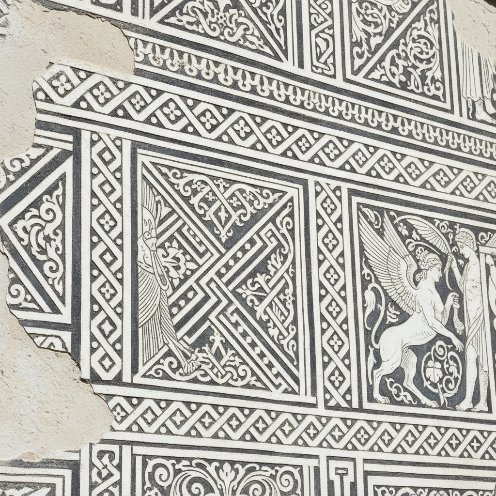

# Sgraffito Art 刮画艺术

> "Sgraffito is drawing by subtraction — a layer of colored plaster or slip is scratched through to reveal a contrasting color beneath, creating designs that are literally carved into the surface. From Renaissance palazzo facades to contemporary ceramics, sgraffito transforms walls and vessels into graphic surfaces where line is not drawn but excavated." — Unknown

## 概述

刮画艺术（Sgraffito Art）是一种通过在上层涂料（灰泥、釉料或泥浆）上刮刻，露出下层不同颜色的材料来创造图案的装饰技法。Sgraffito（源自意大利语"sgraffiare"，意为"刮"）广泛应用于建筑外墙装饰、陶瓷装饰和绘画中，以其清晰的线条和色彩对比著称。

刮画艺术的实践包括：1）底层涂布——涂布底色层；2）表层涂布——在底色上涂布不同颜色的表层；3）刮刻——在表层未完全干燥时刮刻图案；4）建筑刮画——在建筑外墙灰泥上刮刻；5）陶瓷刮画——在陶瓷泥浆或釉料上刮刻；6）多层刮画——多层不同颜色的刮刻；7）当代刮画——将传统技法与现代设计结合的创作。

## 核心特征

| 特征 | 描述 |
|------|------|
| 刮刻 | 通过刮刻露出底层 |
| 对比 | 两层颜色的对比 |
| 线条 | 清晰的刮刻线条 |
| 减法 | 减法的创作方式 |
| 多用 | 建筑和陶瓷都适用 |
| 耐久 | 耐久的装饰效果 |

## 视觉特征

- **线条**：清晰锐利的刮刻线条
- **对比**：两层颜色的强烈对比
- **图形**：图形化的视觉效果
- **纹理**：刮刻创造的纹理
- **建筑**：建筑尺度的装饰
- **质朴**：质朴有力的美感

## 代表作品

| 作品 | 艺术家/文化 | 年代 | 意义 |
|------|-------------|------|------|
| *Renaissance palazzo facades* | 意大利 | 文艺复兴 | 文艺复兴宫殿外墙 |
| *Czech sgraffito houses* | 捷克 | 16世纪 | 捷克刮画建筑 |
| *Bernard Leach ceramics* | 英国 | 20世纪 | 利奇的刮画陶瓷 |
| *African sgraffito pottery* | 非洲 | 传统 | 非洲刮画陶器 |
| *Contemporary sgraffito* | 国际 | 当代 | 当代刮画艺术 |

## 历史时间线

| 时期 | 事件 |
|------|------|
| 古代 | 刮画技法的早期使用 |
| 文艺复兴 | 意大利建筑刮画的黄金时代 |
| 16世纪 | 中欧刮画建筑的流行 |
| 20世纪 | 陶瓷刮画的现代发展 |
| 当代 | 刮画的多元化应用 |

## 中国语境

刮画在中国有一定的传统和当代应用。中国的陶瓷装饰中，刻花（在泥坯上刮刻图案）——是重要的传统装饰技法，与sgraffito技法相似。中国的耀州窑刻花瓷——是中国陶瓷刮画的杰出代表。中国的建筑装饰中，灰塑和砖雕——虽然技法不同但有相似的减法装饰理念。中国当代的陶瓷艺术家广泛使用刮画技法——将其与中国传统陶瓷美学结合。中国的美术教育中，刮画作为基础的装饰技法——在陶瓷和绘画课程中教授。中国的儿童美术教育中，刮画（蜡笔刮画）——是常见的创意活动。

## AI生成概念图

## 与其他风格的关系

- **Ceramics** → 陶瓷艺术
- **Fresco** → 壁画
- **Relief** → 浮雕
- **Architectural Decoration** → 建筑装饰
- **Graphic Art** → 图形艺术
- **Scratchboard** → 刮板画

---

*浮光艺志 | Chronicle of Artistry*
