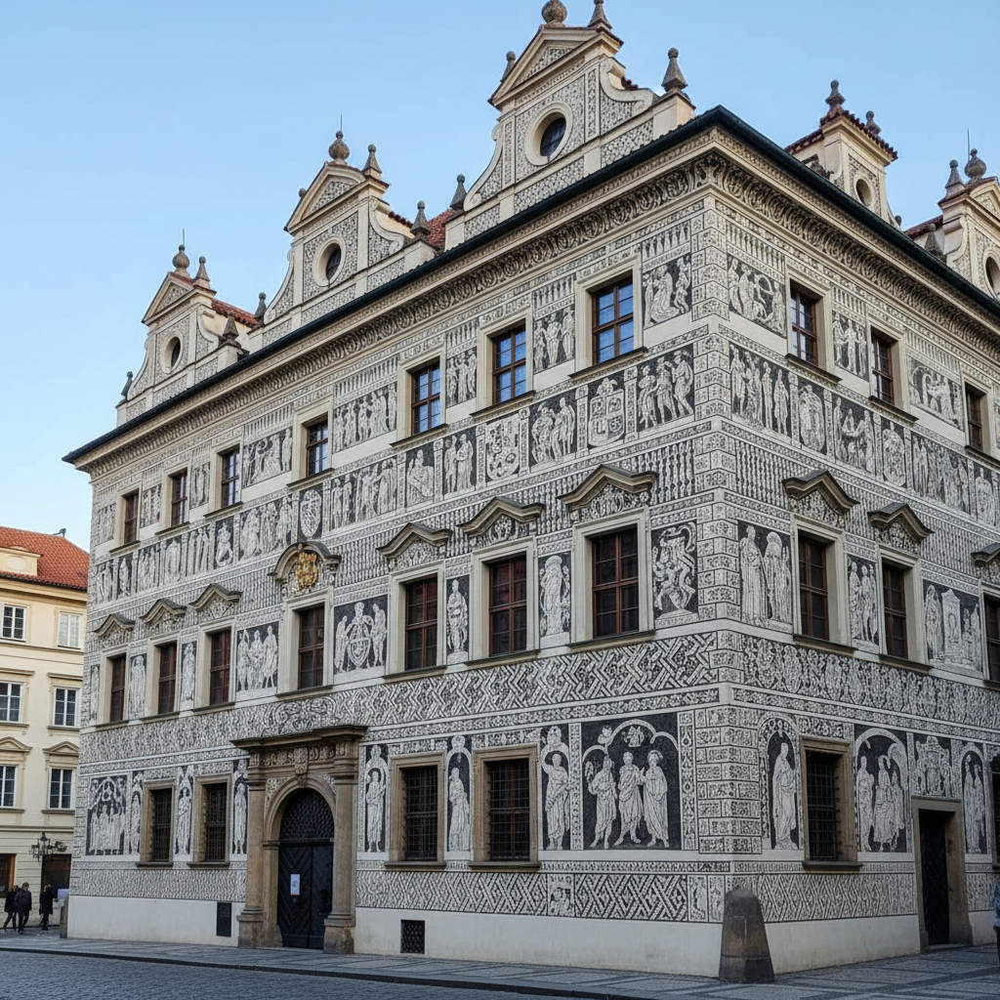

# Sgraffito Wall Art 刮画墙饰艺术

> "Sgraffito is drawing by subtraction — a wall is coated with layers of colored plaster, and the artist scratches through the upper layer to reveal the contrasting color beneath, creating designs that are literally carved into the building's skin. Unlike paint that fades and peels, sgraffito becomes part of the architecture itself, as permanent as the wall that bears it. It is decoration through revelation, art through removal." — Unknown

## 概述

刮画墙饰艺术（Sgraffito Wall Art）是一种通过在多层不同颜色的灰泥（plaster）上刮除上层露出下层颜色来创造图案的建筑装饰技法——将装饰图案直接刻入建筑表面，使其成为建筑本身的一部分。Sgraffito（意大利语"刮"的意思）在文艺复兴时期的意大利和中欧地区广泛应用，至今仍是重要的建筑装饰技法。

刮画墙饰艺术的实践包括：1）双层刮画——在两层不同颜色的灰泥上刮除；2）多层刮画——使用三层或更多颜色的灰泥；3）建筑立面装饰——整栋建筑的刮画装饰；4）室内刮画——室内墙面的刮画装饰；5）几何图案——几何和重复图案的刮画；6）叙事场景——人物和故事场景的刮画；7）当代刮画——将传统技法与现代设计结合的创作。

## 核心特征

| 特征 | 描述 |
|------|------|
| 减法 | 通过刮除创造图案 |
| 永久 | 与建筑融为一体 |
| 建筑 | 建筑装饰的传统 |
| 对比 | 色层之间的对比 |
| 耐久 | 极其耐久的装饰 |
| 规模 | 可达建筑规模 |

## 视觉特征

- **对比**：上下层颜色的对比
- **线条**：刮刻的清晰线条
- **规模**：建筑规模的装饰
- **几何**：几何和重复图案
- **永久**：与建筑融为一体
- **质感**：灰泥的质感

## 代表作品

| 作品 | 艺术家/文化 | 年代 | 意义 |
|------|-------------|------|------|
| *Florence palazzo facades* | 意大利 | 15-16世纪 | 佛罗伦萨宫殿立面 |
| *Czech sgraffito houses* | 捷克 | 16世纪 | 捷克刮画建筑 |
| *Catalan modernisme* | 西班牙 | 19-20世纪 | 加泰罗尼亚现代主义 |
| *African sgraffito walls* | 非洲 | 传统 | 非洲刮画墙 |
| *Contemporary sgraffito* | 当代 | 当代 | 当代刮画墙饰 |

## 历史时间线

| 时期 | 事件 |
|------|------|
| 古代 | 刮画技法的早期形式 |
| 文艺复兴 | 意大利刮画墙饰的黄金时代 |
| 16世纪 | 在中欧的广泛传播 |
| 19-20世纪 | 新艺术运动中的复兴 |
| 当代 | 刮画墙饰的当代应用 |

## 中国语境

刮画墙饰艺术在中国有一定的认知和应用。中国传统建筑装饰中虽然没有完全对应的sgraffito传统，但灰塑（在灰泥上进行浮雕装饰）是类似的建筑装饰技法。中国岭南建筑中的灰塑与sgraffito有技术上的相似之处——都在灰泥层上进行装饰。中国当代的建筑装饰中，sgraffito技法开始被引入——作为一种耐久和环保的墙面装饰方式。中国的一些建筑院校开始教授sgraffito技法——将其作为建筑装饰课程的一部分。中国的公共艺术项目中，sgraffito作为一种永久性的墙面装饰正在获得关注——因为其耐久性和与建筑的融合性。

## AI生成概念图

## 与其他风格的关系

- **Fresco** → 湿壁画
- **Architectural Decoration** → 建筑装饰
- **Relief Art** → 浮雕艺术
- **Street Art** → 街头艺术
- **Renaissance Art** → 文艺复兴艺术
- **Ceramics** → 陶瓷艺术（陶瓷刮花）

---

*浮光艺志 | Chronicle of Artistry*
