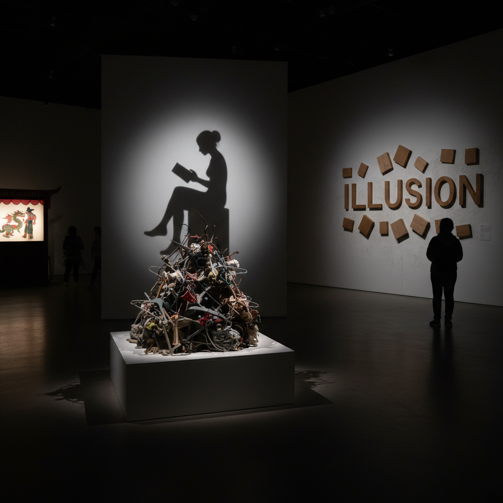

# Shadow Art 影子艺术

> "Shadow art reveals the secret life of objects — it shows that everything has a hidden self, a dark twin that stretches and distorts with the angle of light, that can be more expressive than the object itself, that tells truths the solid form conceals. The shadow artist understands that between light and darkness lies an entire world of meaning, that absence can be more powerful than presence, and that the most profound art sometimes exists only as the space where light cannot reach." — Unknown

## 概述

影子艺术（Shadow Art）是以影子——物体阻挡光线时在表面形成的暗区——为主要创作媒介的艺术实践。影子是光的缺失，是物体的投影，是二维的、短暂的、随光源变化而变化的。影子艺术利用这些特性创造出令人惊叹的视觉效果。

影子艺术的实践包括：1）影子雕塑——看似随意的物体组合，但其投影形成有意义的图像；2）皮影戏——用剪影在幕布上表演故事；3）影子绘画——用光源和物体创造影子构图；4）建筑影子——设计建筑使其影子形成特定图案；5）身体影子——用人体姿态创造影子图像；6）数字影子——用投影技术创造虚拟影子效果。

## 核心特征

| 特征 | 描述 |
|------|------|
| 光暗 | 光与暗的对比 |
| 投影 | 三维到二维的投影 |
| 变化 | 随光源变化 |
| 惊奇 | 意想不到的图像 |
| 缺失 | 光的缺失 |
| 时间 | 随时间变化 |

## 视觉特征

- **剪影**：清晰的剪影轮廓
- **对比**：强烈的明暗对比
- **变形**：影子的拉伸变形
- **叠加**：多重影子的叠加
- **边缘**：影子的柔和边缘
- **惊喜**：物体与影子的反差

## 代表作品

| 作品 | 艺术家 | 年代 | 意义 |
|------|--------|------|------|
| *Shadow sculptures* | Tim Noble & Sue Webster | 1990年代 | 垃圾影子雕塑 |
| *Shadow art* | Kumi Yamashita | 2000年代 | 精密影子艺术 |
| *Shadow installations* | Various | 2010年代 | 影子装置 |
| *Chinese shadow puppetry* | 传统 | 2000年前 | 中国皮影戏 |
| *Building shadows* | Various | 当代 | 建筑影子设计 |

## 历史时间线

| 时期 | 事件 |
|------|------|
| 公元前2世纪 | 中国皮影戏起源 |
| 18世纪 | 欧洲剪影肖像 |
| 1990年代 | 当代影子雕塑 |
| 2000年代 | 数字投影影子艺术 |
| 当代 | 互动影子装置 |

## 中国语境

影子艺术在中国有极其悠久的历史——中国皮影戏是世界上最古老的影子艺术形式之一，有超过两千年的历史。皮影戏在2011年被列入联合国教科文组织非物质文化遗产名录。中国皮影的制作工艺极其精细——用驴皮或牛皮雕刻、着色，通过灯光投射在白色幕布上表演。中国各地有不同的皮影流派——陕西皮影、河北皮影、四川皮影等各有特色。中国传统文化中"影"有丰富的象征意义——"形影不离"、"如影随形"。中国当代的一些艺术家在探索影子艺术：将中国传统皮影的美学与当代装置结合、用现代光源技术创造新的影子体验、以及将中国传统的"光影"哲学与当代影子雕塑对话。

## AI生成概念图

## 与其他风格的关系

- **Light Art** → 光艺术
- **Sculpture** → 雕塑
- **Shadow Puppetry** → 皮影戏
- **Installation Art** → 装置艺术
- **Silhouette Art** → 剪影艺术
- **Projection Art** → 投影艺术

---

*浮光艺志 | Chronicle of Artistry*
