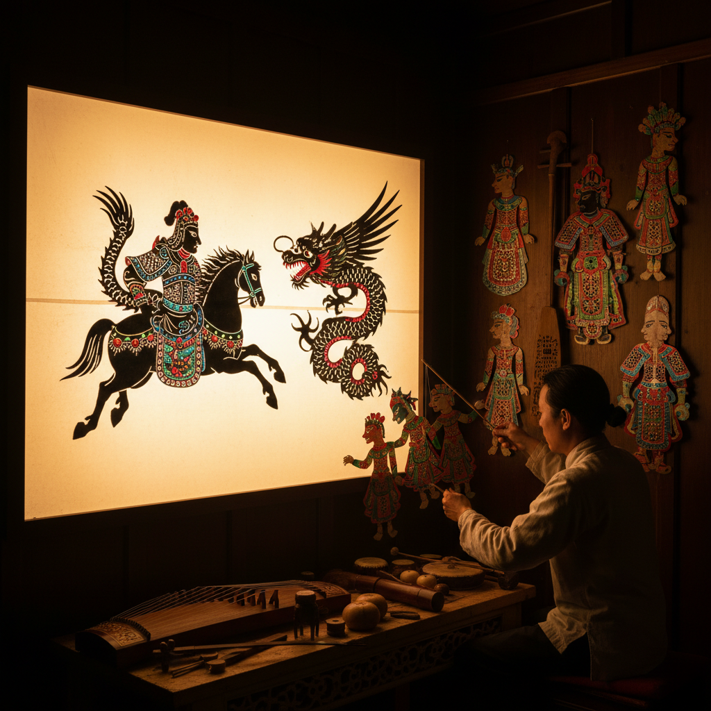

# Shadow Puppet Art 皮影艺术

> "Behind the illuminated screen, the puppeteer's hands bring flat figures to life — leather or paper silhouettes, jointed and painted, dance and fight and love in a world of pure light and shadow. Shadow puppetry is cinema before cinema existed: projected storytelling, special effects achieved with colored gelatin and clever articulation, narrative art performed live with the intimacy of theater and the magic of animation." — Unknown

## 概述

皮影艺术（Shadow Puppet Art）是利用光源将平面人偶的影子投射到半透明幕布上进行表演的艺术形式——是世界上最古老的动画和投影艺术之一。皮影戏结合了雕刻、绘画、音乐、文学和表演，是一种综合性的传统艺术。

皮影艺术的实践包括：1）传统皮影戏——用皮革或纸板制作的关节人偶在幕布后表演故事；2）皮影雕刻——精细的皮影人物制作工艺；3）当代皮影——将传统皮影与现代技术结合的创新表演；4）皮影动画——将皮影美学融入动画制作；5）皮影装置——将皮影元素融入当代艺术装置；6）影子剧场——用人体或物体创造影子表演；7）数字皮影——用数字技术模拟和扩展皮影效果。

## 核心特征

| 特征 | 描述 |
|------|------|
| 光影 | 光与影的艺术 |
| 叙事 | 讲述故事 |
| 平面 | 二维的剪影 |
| 精细 | 精细的雕刻 |
| 活态 | 活态的表演 |
| 综合 | 多种艺术的综合 |

## 视觉特征

- **剪影**：清晰的黑色剪影
- **透光**：彩色半透明区域
- **关节**：可活动的关节
- **精细**：极其精细的镂空
- **光晕**：光源周围的光晕
- **幕布**：白色半透明幕布

## 代表作品

| 作品 | 艺术家 | 年代 | 意义 |
|------|--------|------|------|
| *中国皮影戏* | 传统 | 2000年+ | 世界非遗 |
| *Wayang Kulit* | 印尼传统 | 古代至今 | 印尼皮影 |
| *Karagöz* | 土耳其传统 | 中世纪至今 | 土耳其皮影 |
| *当代皮影* | Various | 当代 | 现代皮影创新 |
| *影子剧场* | Various | 当代 | 当代影子表演 |

## 历史时间线

| 时期 | 事件 |
|------|------|
| 西汉 | 中国皮影戏的起源传说 |
| 唐宋 | 皮影戏的成熟和繁荣 |
| 元明 | 皮影戏传播到中亚和欧洲 |
| 18世纪 | 欧洲的影子剧场 |
| 当代 | 皮影艺术的现代化和数字化 |

## 中国语境

皮影艺术是中国最重要的传统艺术形式之一。中国皮影戏有超过2000年的历史，2011年被联合国教科文组织列入人类非物质文化遗产代表作名录。中国各地有不同的皮影流派——陕西皮影以精细著称、河北皮影以唱腔见长、四川皮影以幽默闻名。中国皮影的制作工艺极其精细——选皮、制皮、画稿、过稿、镂刻、敷彩、发汗熨平、缀结合成，每一步都需要高超的技艺。中国当代的一些艺术家和设计师在探索皮影的现代化——将皮影美学融入动画、游戏、时装设计和当代艺术装置。中国的皮影博物馆和传承人在努力保护和传承这一珍贵的文化遗产。

## AI生成概念图

## 与其他风格的关系

- **Silhouette Art** → 剪影艺术
- **Paper Cutting** → 剪纸艺术
- **Animation** → 动画艺术
- **Theater Art** → 戏剧艺术
- **Light Art** → 光艺术
- **Storytelling Art** → 叙事艺术

---

*浮光艺志 | Chronicle of Artistry*
