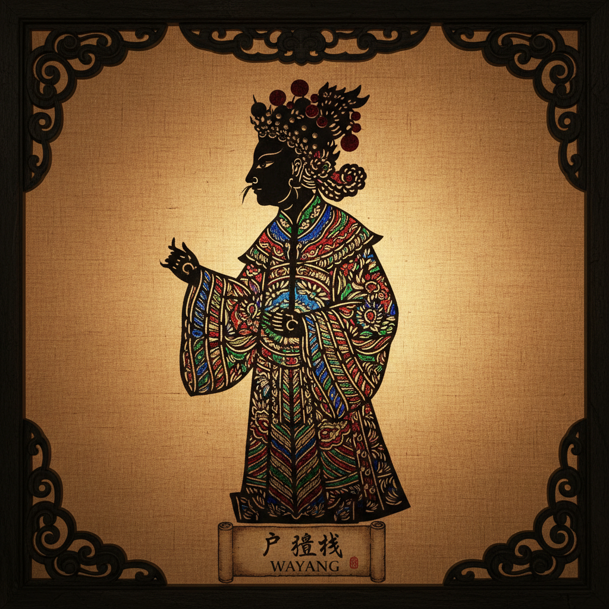

# Shadow Puppet 皮影戏 | Wayang / 影絵

> **"光与影的剧场——一张牛皮、一盏油灯，就能演绎整部史诗。"**

## 概述

皮影戏（Shadow Puppet / Wayang / 影絵 かげえ / Karagöz）是亚洲和中东的传统表演艺术，用半透明的皮革或纸板制作的人物剪影，在白色幕布后方借助灯光投射出活动的影像。中国皮影戏有2000年以上的历史（汉代起源），印尼的Wayang Kulit（皮革影戏）被列入UNESCO非物质文化遗产，土耳其的Karagöz和希腊的Karagiozis也各有独特传统。皮影人物的制作本身就是精湛的视觉艺术——镂空雕刻、彩色渲染、关节活动设计。

## 主要传统

| 地区 | 名称 | 特征 |
|------|------|------|
| 中国 | 皮影戏 | 牛皮/驴皮，彩色透光 |
| 印尼 | Wayang Kulit | 水牛皮，史诗题材 |
| 土耳其 | Karagöz | 骆驼皮，喜剧 |
| 泰国 | Nang Yai | 大型皮影 |
| 柬埔寨 | Sbek Thom | 大型皮影，吴哥题材 |
| 日本 | 影絵 | 纸制，简约 |

## 核心特征

- **透光材料**：半透明皮革或纸板
- **镂空雕刻**：精细的镂空图案
- **关节活动**：可活动的关节连接
- **灯光投影**：油灯或电灯的光源
- **叙事性**：讲述史诗和民间故事
- **音乐伴奏**：配合传统音乐

## 视觉特征

- 精细的镂空剪影轮廓
- 彩色透光的宝石般效果
- 光影的戏剧性对比
- 侧面轮廓的程式化造型
- 装饰性的花纹镂空
- 动态的关节活动

## 与其他风格的关系

| 风格 | 关系 |
|------|------|
| 剪纸 Paper Cutting | 共享镂空剪切技法 |
| 动画 Animation | 皮影是动画的远祖 |
| 电影 Cinema | 光影投射的原理 |
| Scherenschnitte | 共享剪影美学 |
| 当代光影艺术 | 皮影的现代转化 |

## 概念图

---

*浮光艺志 | Chronicle of Artistry*
