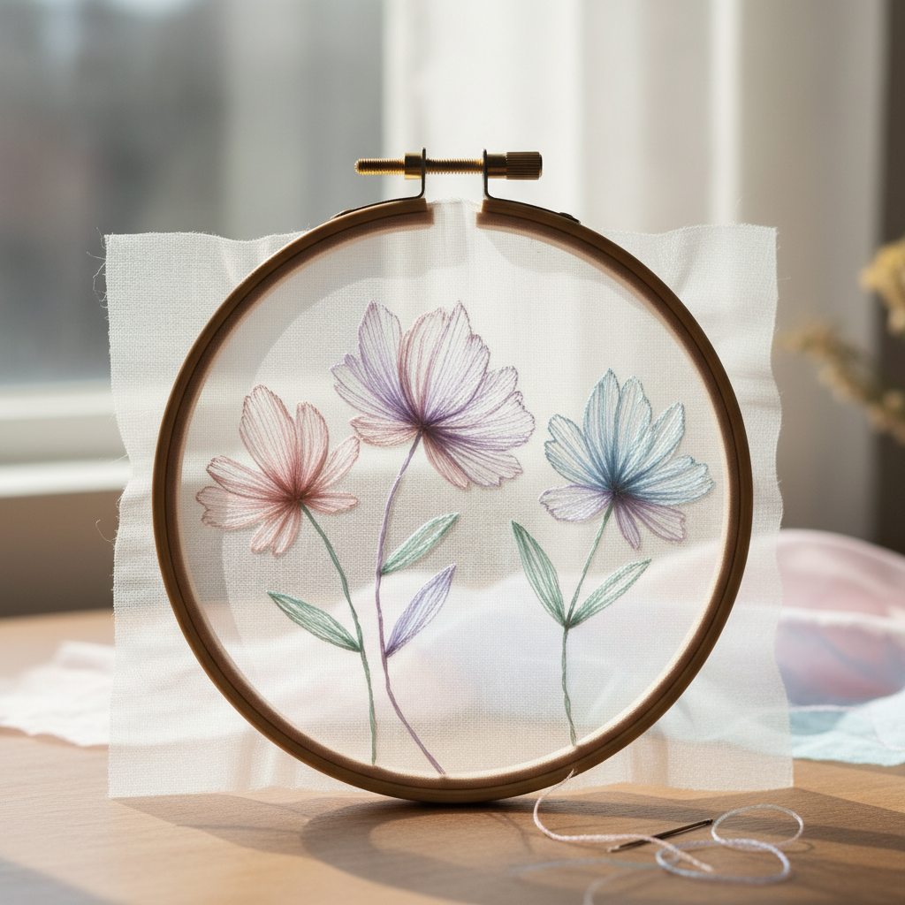

# Shadow Work Art 影绣艺术

> "Shadow work is embroidery's most ethereal technique — stitches are worked on the reverse side of sheer fabric so that the thread shows through as a soft, shadowy color on the front. The effect is of watercolor washed into cloth, a gentle blush of color that seems to float within the translucent weave rather than sitting on its surface. It is embroidery that whispers rather than shouts." — Unknown

## 概述

影绣艺术（Shadow Work Art）是一种在透明或半透明织物的背面进行刺绣，使绣线透过织物在正面呈现出柔和、朦胧色彩效果的刺绣技法——利用织物的透明性创造出水彩般的柔和色彩。影绣是白色刺绣（whitework）的一个分支，以其精致、含蓄和梦幻般的效果著称。

影绣艺术的实践包括：1）封闭式人字针——在背面用人字针填充，正面呈现柔和色块；2）印度影绣（Chikan）——印度的传统影绣技法；3）轮廓影绣——在背面绣制轮廓线；4）填充影绣——大面积的背面填充；5）组合技法——影绣与正面刺绣的组合；6）彩色影绣——使用多种颜色的影绣；7）当代影绣——将传统技法与现代设计结合的创作。

## 核心特征

| 特征 | 描述 |
|------|------|
| 透明 | 利用织物透明性 |
| 朦胧 | 柔和朦胧的效果 |
| 背面 | 在背面进行刺绣 |
| 精致 | 极其精致的技法 |
| 含蓄 | 含蓄内敛的美感 |
| 轻盈 | 轻盈飘逸的质感 |

## 视觉特征

- **朦胧**：柔和朦胧的色彩
- **透明**：透过织物的光影
- **轻盈**：轻盈飘逸的感觉
- **水彩**：水彩般的色彩效果
- **含蓄**：含蓄内敛的美感
- **梦幻**：梦幻般的整体感

## 代表作品

| 作品 | 艺术家/文化 | 年代 | 意义 |
|------|-------------|------|------|
| *Indian Chikan work* | 印度 | 17世纪至今 | 印度奇坎绣 |
| *Edwardian blouses* | 英国 | 20世纪初 | 爱德华时代衬衫 |
| *Christening gowns* | 欧洲 | 19世纪至今 | 洗礼袍 |
| *Philippine shadow work* | 菲律宾 | 传统 | 菲律宾影绣 |
| *Contemporary shadow work* | 当代 | 当代 | 当代影绣 |

## 历史时间线

| 时期 | 事件 |
|------|------|
| 古代 | 影绣在印度的起源 |
| 17世纪 | 印度奇坎绣的发展 |
| 19世纪 | 影绣在欧洲的流行 |
| 20世纪初 | 爱德华时代的黄金时代 |
| 当代 | 影绣的艺术化复兴 |

## 中国语境

影绣艺术在中国有独特的传统形式。中国苏绣中的"双面绣"在某种程度上与影绣有相似的透明效果——在薄纱上绣制使两面都可观赏。中国传统的纱绣（在纱罗织物上的刺绣）利用了织物的透明性——创造出类似影绣的朦胧效果。中国的一些地区有在薄绢上绣制的传统——利用绢的半透明性创造独特的视觉效果。中国当代的一些刺绣艺术家开始探索影绣技法——将其与中国传统的薄纱刺绣结合。中国的高级定制服装中，影绣效果被用于创造精致的装饰——在透明面料上营造若隐若现的美感。

## AI生成概念图

## 与其他风格的关系

- **Whitework** → 白色刺绣
- **Chikan** → 奇坎绣
- **Drawn Thread Work** → 抽线绣
- **Textile Art** → 纺织艺术
- **Watercolor** → 水彩艺术
- **Embroidery** → 刺绣艺术

---

*浮光艺志 | Chronicle of Artistry*
