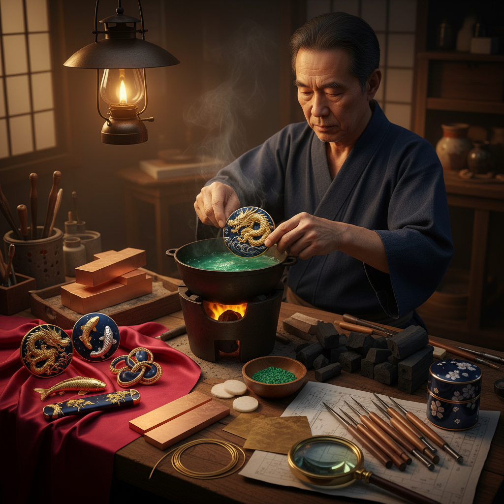

# Shakudo Art 赤铜艺术

> "Shakudo is darkness made precious — an alloy of gold and copper that, when treated with traditional Japanese patination solutions, develops a surface of deepest blue-black with a subtle violet sheen, like the night sky just after sunset. This 'black gold' was the supreme background metal of Japanese sword fittings, against which gold, silver, and shibuichi inlays glowed like stars." — Unknown

## 概述

赤铜艺术（Shakudo Art）是使用日本传统合金"赤铜"（金铜合金）进行创作的金属工艺艺术——赤铜是一种含少量金（通常2-7%）的铜合金，经过传统的"煮色"（niiro）着色处理后呈现出深邃的蓝黑色或紫黑色，被誉为"黑金"。赤铜是日本金属工艺中最珍贵和最具特色的合金之一。

赤铜艺术的实践包括：1）刀装具——日本刀的鍔、目贯、小柄等配件；2）煮色着色——传统的化学着色工艺；3）高肉彫——高浮雕的赤铜雕刻；4）色絵——与金银等金属的色彩搭配；5）当代珠宝——利用赤铜独特色调的现代首饰；6）器物——赤铜制作的花瓶、香炉等器物。

## 核心特征

| 特征 | 描述 |
|------|------|
| 黑金 | 含金的黑色合金 |
| 深邃 | 深邃的蓝黑色调 |
| 珍贵 | 含金的珍贵合金 |
| 着色 | 传统煮色工艺 |
| 对比 | 与金银的强烈对比 |
| 日本 | 日本独有的合金 |

## 视觉特征

- **蓝黑**：深邃的蓝黑色
- **光泽**：微妙的紫色光泽
- **深度**：极深的色彩深度
- **对比**：与金色的戏剧性对比
- **质感**：丝绒般的表面质感
- **高贵**：极其高贵的视觉效果

## 代表作品

| 作品 | 艺术家/文化 | 年代 | 意义 |
|------|-------------|------|------|
| *Goto family menuki* | 後藤家 | 15-19世纪 | 後藤派赤铜金工 |
| *Yokoya school tsuba* | 横谷派 | 17-18世纪 | 横谷派赤铜 |
| *Natsuo works* | 加納夏雄 | 19世纪 | 明治金工大师 |
| *Contemporary shakudo* | 当代 | 当代 | 当代赤铜创作 |
| *Mixed metal jewelry* | 当代珠宝 | 当代 | 赤铜混合金属首饰 |

## 历史时间线

| 时期 | 事件 |
|------|------|
| 奈良时代 | 赤铜合金的早期使用 |
| 室町时代 | 刀装具赤铜的发展 |
| 江户时代 | 赤铜金工的黄金时代 |
| 明治维新 | 从武器到艺术品的转型 |
| 当代 | 赤铜在全球金属工艺中的复兴 |

## 中国语境

赤铜艺术虽然是日本特有的金属工艺，但与中国有深厚的历史渊源。中国古代的鎏金技术和铜合金技术是东亚金属工艺的基础——日本的赤铜传统可能受到中国大陆金铜合金技术的启发。中国传统的"宣德炉"使用特殊的铜合金配方——其深沉的色泽与赤铜有相似的审美追求。中国的铜器着色传统（如"养铜"）与日本的煮色有相通之处——都追求通过化学和时间赋予金属深沉的色彩。中国当代的一些金属工艺师开始研究和实践赤铜技法——将其独特的蓝黑色调引入中国当代金属艺术。中国的一些收藏家对日本古代赤铜刀装具有浓厚兴趣——高品质的赤铜金工在拍卖市场上价值不菲。

## AI生成概念图

## 与其他风格的关系

- **Shibuichi** → 四分一艺术
- **Mokume-gane** → 木目金艺术
- **Japanese Metalwork** → 日本金工
- **Gold Art** → 黄金艺术
- **Patina Art** → 铜绿艺术
- **Sword Art** → 刀剑艺术

---

*浮光艺志 | Chronicle of Artistry*
